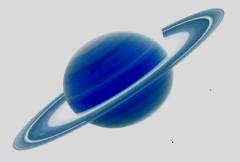

## S_Invert

Inverts the colors of the source clip, so black becomes
white, and white becomes black. This can optionally also invert
luma, chroma, RGB and alpha channels independently and do some basic
color correction on the inverted result.

In the Sapphire Adjust effects submenu.

### Inputs:

- **Source**: The current layer. The clip to be processed.

- **Mask**: Defaults to None. Interpolate between the result and the Source input. White areas use the result of the effect. Black areas use the Source clip.

### Parameters:

- **Load Preset** (Push-button)
  Brings up the Preset Browser to browse all available presets for this effect.

- **Save Preset** (Push-button)
  Brings up the Preset Save dialog to save a preset for this effect.

- **Mocha Project** (Default: 0, Range: 0 or greater)
  Brings up the Mocha window for tracking footage and generating masks.

- **Blur Mocha** (Default: 0, Range: 0 or greater)
  Blurs the Mocha Mask by this amount before using. This can be used to soften the edges or quantization artifacts of the mask, and smooth out the time displacements.

- **Mocha Opacity** (Default: 1, Range: 0 to 1)
  Controls the strength of the Mocha mask. Lower values reduce the intensity of the effect.

- **Invert Mocha** (Check-box, Default: off)
  If enabled, the black and white of the Mocha Mask are inverted before applying the effect.

- **Resize Mocha** (Default: 1, Range: 0 to 2)
  Scales the Mocha Mask. 1.0 is the original size.

- **Resize Rel X** (Default: 1, Range: 0 to 2)
  The relative horizontal size of the Mocha Mask.

- **Resize Rel Y** (Default: 1, Range: 0 to 2)
  The relative vertical size of the Mocha Mask.

- **Shift Mocha** (X & Y, Default: [0 0], Range: any)
  Offsets the position of the Mocha Mask.

- **Dilate Mocha** (Default: 0, Range: -100 to 100)
  Dilates or erodes the Mocha Mask by this pixel amount before using.

- **Dilation Quality** (Popup menu, Default: Fast)
  Selects whether Dilate Mocha adusts quickly in default Fast mode or looks better in High quality mode.
  - **Fast**: Dilate Mocha in Fast mode for quick adjustments.
  - **High**: Dilate Mocha in High quality mode for a better looking mask shape.

- **Bypass Mocha** (Check-box, Default: off)
  Ignore the Mocha Mask and apply the effect to the entire source clip.

- **Show Mocha Only** (Check-box, Default: off)
  Bypass the effect and show the Mocha Mask itself.

- **Combine Masks** (Popup menu, Default: Union)
  Determines how to combine the Mocha Mask and Input Mask when both are supplied to the effect.
  - **Union**: Uses the area covered by both masks together.
  - **Intersect**: Uses the area that overlaps between the two masks.
  - **Mocha Only**: Ignore the Input Mask and only use the
Mocha Mask.

- **Invert Luma** (Check-box, Default: on)
  Inverts the brightness if this is enabled. Unselect to invert only the chroma.

- **Invert Chroma** (Check-box, Default: on)
  Inverts the chroma if this is enabled. Unselect to invert only the luma.

- **Invert Red** (Check-box, Default: off)
  Inverts the red channel if this is enabled. If Invert Luma/Chroma are also selected, the red channel is un-inverted.

- **Invert Green** (Check-box, Default: off)
  Inverts the green channel if this is enabled. If Invert Luma/Chroma are also selected, the green channel is un-inverted.

- **Invert Blue** (Check-box, Default: off)
  Inverts the blue channel if this is enabled. If Invert Luma/Chroma are also selected, the blue channel is un-inverted.

- **Invert Alpha** (Check-box, Default: off)
  Inverts the alpha channel if an alpha channel exists.

- **Remult By Alpha** (Check-box, Default: off)
  Scales the new RGB colors by the alpha channel if an alpha channel exists. This can prevent adding the inverted colors to transparent areas when compositing over a background clip.

- **Scale Lights** (Default: 1, Range: 0 or greater)
  Scales the result by this value. Increase for a brighter result.

- **Tint Lights** (Default rgb: [1 1 1])
  Scales the result by this color, thus tinting the lighter regions.

- **Tint Darks** (Default rgb: [0 0 0])
  Adds this color to the darker regions of the result. Set this to a dark red-orange color for a negative-film effect look.

- **Offset Darks** (Default: 0, Range: -8 to 2)
  Adds this gray value to the darker regions of the result. This can be negative to increase contrast.

- **Saturation** (Default: 1, Range: -2 to 8)
  Scales the chroma saturation of the result. If this is zero you will see only color from the tint colors.

- **Mask Use** (Popup menu, Default: Luma)
  Determines how the Mask input channels are used to make a monochrome mask.
  - **Luma**: the luminance of the RGB channels is used.
  - **Alpha**: only the Alpha channel is used.

- **Blur Mask** (Default: 0.05, Range: 0 or greater)
  Blurs the Matte input by this amount before using. This can provide a smoother transition between the matted and unmatted areas. It has no effect unless the Matte input is provided.

- **Invert Mask** (Check-box, Default: off)
  If on, inverts the Matte input so the effect is applied to areas where the Matte is black instead of white. This has no effect unless the Matte input is provided.

