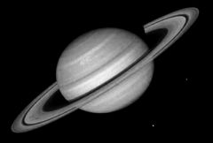

## S_Monochrome

Generates a monochrome version of the source clip using adjustable weights
for the red, green, and blue channels. This can simulate the use of a
color filter applied to the lens of a black and white camera. For example,
use more red weight to darken blue sky areas of the input. The weights are
scaled so they sum to 1 before being used to reduce overall brightness
changes when they are adjusted.

In the Sapphire Adjust effects submenu.

### Inputs:

- **Source**: The current layer. The clip to be processed.

- **Mask**: Defaults to None. Interpolate between the result and the Source input. White areas use the result of the effect. Black areas use the Source clip.

### Parameters:

- **Load Preset** (Push-button)
  Brings up the Preset Browser to browse all available presets for this effect.

- **Save Preset** (Push-button)
  Brings up the Preset Save dialog to save a preset for this effect.

- **Mocha Project** (Default: 0, Range: 0 or greater)
  Brings up the Mocha window for tracking footage and generating masks.

- **Blur Mocha** (Default: 0, Range: 0 or greater)
  Blurs the Mocha Mask by this amount before using. This can be used to soften the edges or quantization artifacts of the mask, and smooth out the time displacements.

- **Mocha Opacity** (Default: 1, Range: 0 to 1)
  Controls the strength of the Mocha mask. Lower values reduce the intensity of the effect.

- **Invert Mocha** (Check-box, Default: off)
  If enabled, the black and white of the Mocha Mask are inverted before applying the effect.

- **Resize Mocha** (Default: 1, Range: 0 to 2)
  Scales the Mocha Mask. 1.0 is the original size.

- **Resize Rel X** (Default: 1, Range: 0 to 2)
  The relative horizontal size of the Mocha Mask.

- **Resize Rel Y** (Default: 1, Range: 0 to 2)
  The relative vertical size of the Mocha Mask.

- **Shift Mocha** (X & Y, Default: [0 0], Range: any)
  Offsets the position of the Mocha Mask.

- **Dilate Mocha** (Default: 0, Range: -100 to 100)
  Dilates or erodes the Mocha Mask by this pixel amount before using.

- **Dilation Quality** (Popup menu, Default: Fast)
  Selects whether Dilate Mocha adusts quickly in default Fast mode or looks better in High quality mode.
  - **Fast**: Dilate Mocha in Fast mode for quick adjustments.
  - **High**: Dilate Mocha in High quality mode for a better looking mask shape.

- **Bypass Mocha** (Check-box, Default: off)
  Ignore the Mocha Mask and apply the effect to the entire source clip.

- **Show Mocha Only** (Check-box, Default: off)
  Bypass the effect and show the Mocha Mask itself.

- **Combine Masks** (Popup menu, Default: Union)
  Determines how to combine the Mocha Mask and Input Mask when both are supplied to the effect.
  - **Union**: Uses the area covered by both masks together.
  - **Intersect**: Uses the area that overlaps between the two masks.
  - **Mocha Only**: Ignore the Input Mask and only use the
Mocha Mask.

- **Weight Red** (Default: 0.3, Range: -1 to 1)
  The relative contribution of the source's red channel. To simulate a black and white exposure using a red filter, set this to 1 and set the green and blue weights to 0.

- **Weight Green** (Default: 0.5, Range: -1 to 1)
  The relative contribution of the source's green channel.

- **Weight Blue** (Default: 0.2, Range: -1 to 1)
  The relative contribution of the source's blue channel

- **Brightness** (Default: 1, Range: 0 or greater)
  Scales the brightness of the result.

- **Mix With Source** (Default: 0, Range: 0 to 1)
  Interpolates between the result (0) and the original source (1).

- **Mask Use** (Popup menu, Default: Luma)
  Determines how the Mask input channels are used to make a monochrome mask.
  - **Luma**: the luminance of the RGB channels is used.
  - **Alpha**: only the Alpha channel is used.

- **Blur Mask** (Default: 0.05, Range: 0 or greater)
  Blurs the Matte input by this amount before using. This can provide a smoother transition between the matted and unmatted areas. It has no effect unless the Matte input is provided.

- **Invert Mask** (Check-box, Default: off)
  If on, inverts the Matte input so the effect is applied to areas where the Matte is black instead of white. This has no effect unless the Matte input is provided.

