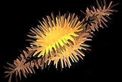

## S_AutoPaint

Generates a 'paint-brushed' version of the source clip. Use the Frequency
and Stroke Length parameters to adjust the density and shape of the brush
strokes. You can set Jitter Frames to 1 if you want to re-randomize the brush stroke
pattern for each frame.

In the Sapphire Stylize effects submenu.

### Inputs:

- **Source**: The current layer. The clip to be processed.

- **Mask**: Defaults to None. Interpolate between the result and the Source input. White areas use the result of the effect. Black areas use the Source clip.

### Parameters:

- **Load Preset** (Push-button)
  Brings up the Preset Browser to browse all available presets for this effect.

- **Save Preset** (Push-button)
  Brings up the Preset Save dialog to save a preset for this effect.

- **Mocha Project** (Default: 0, Range: 0 or greater)
  Brings up the Mocha window for tracking footage and generating masks.

- **Blur Mocha** (Default: 0, Range: 0 or greater)
  Blurs the Mocha Mask by this amount before using. This can be used to soften the edges or quantization artifacts of the mask, and smooth out the time displacements.

- **Mocha Opacity** (Default: 1, Range: 0 to 1)
  Controls the strength of the Mocha mask. Lower values reduce the intensity of the effect.

- **Invert Mocha** (Check-box, Default: off)
  If enabled, the black and white of the Mocha Mask are inverted before applying the effect.

- **Resize Mocha** (Default: 1, Range: 0 to 2)
  Scales the Mocha Mask. 1.0 is the original size.

- **Resize Rel X** (Default: 1, Range: 0 to 2)
  The relative horizontal size of the Mocha Mask.

- **Resize Rel Y** (Default: 1, Range: 0 to 2)
  The relative vertical size of the Mocha Mask.

- **Shift Mocha** (X & Y, Default: [0 0], Range: any)
  Offsets the position of the Mocha Mask.

- **Dilate Mocha** (Default: 0, Range: -100 to 100)
  Dilates or erodes the Mocha Mask by this pixel amount before using.

- **Dilation Quality** (Popup menu, Default: Fast)
  Selects whether Dilate Mocha adusts quickly in default Fast mode or looks better in High quality mode.
  - **Fast**: Dilate Mocha in Fast mode for quick adjustments.
  - **High**: Dilate Mocha in High quality mode for a better looking mask shape.

- **Bypass Mocha** (Check-box, Default: off)
  Ignore the Mocha Mask and apply the effect to the entire source clip.

- **Show Mocha Only** (Check-box, Default: off)
  Bypass the effect and show the Mocha Mask itself.

- **Combine Masks** (Popup menu, Default: Union)
  Determines how to combine the Mocha Mask and Input Mask when both are supplied to the effect.
  - **Union**: Uses the area covered by both masks together.
  - **Intersect**: Uses the area that overlaps between the two masks.
  - **Mocha Only**: Ignore the Input Mask and only use the
Mocha Mask.

- **Style** (Popup menu, Default: Van Gogh)
  Selects the style of brush strokes.
  - **Van Gogh**: the stroke directions align with the edges found within the image.
  - **Hairy Paint**: the strokes are perpendicular to the edges within the image.
  - **Pointalize**: the strokes are cellular pointy shapes with no direction.

- **Frequency** (Default: 50, Range: 0.1 or greater)
  The density of brush strokes in the frame. Increase for smaller strokes.

- **Stroke Length** (Default: 2, Range: any)
  Determines the length of the brush strokes along the directions of edges in the source clip. If this is negative you can switch from VanGogh to HairyPaint styles and vice versa.

- **Stroke Align** (Default: 0.2, Range: 0 or greater)
  Increase to smooth out the directions of the strokes so nearby strokes are more parallel.

- **Smooth Colors** (Default: 0, Range: 0 or greater)
  Blurs the source by this amount before generating the brush strokes. Increase to cause the colors of nearby strokes to be more consistent.

- **Seed** (Default: 0, Range: 0 or greater)
  Used to initialize the random number generator. The actual seed value is not significant, but different seeds give different results and the same value should give a repeatable result.

- **Jitter Frames** (Integer, Default: 0, Range: 0 or greater)
  If this is 0, the locations of the strokes will remain the same for every frame processed. If it is 1, the locations of the stokes are re-randomized for each frame. If it is 2, they are re-randomized every second frame, and so on.

- **Sharpen** (Default: 1, Range: any)
  The amount of post-process sharpening applied.

- **Sharpen Width** (Default: 0.1, Range: 0 or greater)
  The width at which to apply the post-process sharpening filter, relative to the stroke sizes. Higher values affect wider areas from the edges, lower values only affect areas near sharp edges.

- **Opacity** (Popup menu, Default: Normal)
  Determines the method used for dealing with opacity/transparency.
  - **All Opaque**: Use this option to render slightly faster when
the input image is fully opaque with no transparency (alpha=1).
  - **Normal**: Process opacity normally.
  - **As Premult**: Process as if the image is already in
premultiplied form (colors have been scaled by opacity). This option
also renders slightly faster than Normal mode, but the results will
also be in premultiplied form, which is sometimes less correct.

- **Mix With Source** (Default: 0, Range: 0 to 1)
  Interpolates between the result (0) and the original source (1).

- **Mask Use** (Popup menu, Default: Luma)
  Determines how the Mask input channels are used to make a monochrome mask.
  - **Luma**: the luminance of the RGB channels is used.
  - **Alpha**: only the Alpha channel is used.

- **Blur Mask** (Default: 0.05, Range: 0 or greater)
  Blurs the Matte input by this amount before using. This can provide a smoother transition between the matted and unmatted areas. It has no effect unless the Matte input is provided.

- **Invert Mask** (Check-box, Default: off)
  If on, inverts the Matte input so the effect is applied to areas where the Matte is black instead of white. This has no effect unless the Matte input is provided.

