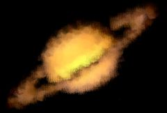

## S_Brush:Chalk

Simulates the look of a chalk drawing by layering brush strokes of different sizes and directions. This effect can be used with one of the following brushes: felt tip, splat, water color, stipple, pencil, pastel, sponge, splodge, round, or cubes. In addition, there are controls for adjusting shape, size, orientation, density, lighting, and shading.

In the Sapphire Stylize effects submenu.
In the S_Brush Plugin.

### Inputs:

- **Source**: The current layer. The clip to be processed.

- **Matte**: Defaults to None. If provided, the source brush colors are scaled by this input. A monochrome matte can be used to choose a subset of Source areas that will generate brushes. A color matte can be used to selectively adjust the brush colors in different regions. The matte is applied to the source before the brushes are generated so it will not clip the resulting brushes.

### Parameters:

- **Load Preset** (Push-button)
  Brings up the Preset Browser to browse all available presets for this effect.

- **Save Preset** (Push-button)
  Brings up the Preset Save dialog to save a preset for this effect.

- **Mocha Project** (Default: 0, Range: 0 or greater)
  Brings up the Mocha window for tracking footage and generating masks.

- **Blur Mocha** (Default: 0, Range: 0 or greater)
  Blurs the Mocha Mask by this amount before using. This can be used to soften the edges or quantization artifacts of the mask, and smooth out the time displacements.

- **Mocha Opacity** (Default: 1, Range: 0 to 1)
  Controls the strength of the Mocha mask. Lower values reduce the intensity of the effect.

- **Invert Mocha** (Check-box, Default: off)
  If enabled, the black and white of the Mocha Mask are inverted before applying the effect.

- **Resize Mocha** (Default: 1, Range: 0 to 2)
  Scales the Mocha Mask. 1.0 is the original size.

- **Resize Rel X** (Default: 1, Range: 0 to 2)
  The relative horizontal size of the Mocha Mask.

- **Resize Rel Y** (Default: 1, Range: 0 to 2)
  The relative vertical size of the Mocha Mask.

- **Shift Mocha** (X & Y, Default: [0 0], Range: any)
  Offsets the position of the Mocha Mask.

- **Dilate Mocha** (Default: 0, Range: -100 to 100)
  Dilates or erodes the Mocha Mask by this pixel amount before using.

- **Dilation Quality** (Popup menu, Default: Fast)
  Selects whether Dilate Mocha adusts quickly in default Fast mode or looks better in High quality mode.
  - **Fast**: Dilate Mocha in Fast mode for quick adjustments.
  - **High**: Dilate Mocha in High quality mode for a better looking mask shape.

- **Bypass Mocha** (Check-box, Default: off)
  Ignore the Mocha Mask and apply the effect to the entire source clip.

- **Show Mocha Only** (Check-box, Default: off)
  Bypass the effect and show the Mocha Mask itself.

- **Combine Masks** (Popup menu, Default: Union)
  Determines how to combine the Mocha Mask and Input Mask when both are supplied to the effect.
  - **Union**: Uses the area covered by both masks together.
  - **Intersect**: Uses the area that overlaps between the two masks.
  - **Mocha Only**: Ignore the Input Mask and only use the
Mocha Mask.

- **Matte Use** (Popup menu, Default: Luma)
  Determines how the Matte input channels are used to make a monochrome matte.
  - **Luma**: the luminance of the RGB channels is used.
  - **Alpha**: only the Alpha channel is used.

- **Invert Matte** (Check-box, Default: off)
  If on, inverts the Matte input so the effect is applied to areas where the Matte is black instead of white. This has no effect unless the Matte input is provided.

- **Shape** (Popup menu, Default: Match To Style)
  The shape of the brush.
  - **Match To Style**: use the brush shape that matches the current paint style. Round matches to Oil and Sponge matches to Chalk.
  - **Felt Tip**: an opaque, triangular shape.
  - **Splat**: a shape of sparsely packed fine dots.
  - **Water Color**: a coarse, blobby shape.
  - **Stipple**: a soft, rectangular shape with holes.
  - **Pencil**: a long, thin shape.
  - **Pastel**: a long, funnel shape, like a comet.
  - **Sponge**: a very coarse, rectangular shape.
  - **Splodge**: a soft, misty, rectangular shape.
  - **Round**: a soft oval shape with coarse trails, like a jellyfish.
  - **Cubes**: a square shape.

- **Max Size** (Default: 1.5, Range: 0 to 10)
  Sets the maximum brush size. No brushes will be larger than this size.

- **Size Range** (Default: 0.01, Range: 0 to 1)
  Scales the range of the brush sizes measured from the maximum brush size.

- **Angle** (Default: 60, Range: 0 to 360)
  Rotates the orientation of the brushes.

- **Vary Angle** (Default: 20, Range: 0 to 360)
  Randomly rotates the brushes up to this amount in one direction.

- **Contour Alignment** (Default: 0.5, Range: 0 to 1)
  Interpolates between the brush stroke direction being fully aligned to the angle param (0) and the contours of the original source (1). Vary angle offsets the stroke in both directions from this interpolated direction.

- **Layers** (Integer, Default: 3, Range: 1 to 5)
  The number of layers to paint.

- **Density** (Default: 80, Range: 1 to 100)
  Sets the overall density of brush strokes per layer.

- **Rel X Density** (Default: 1, Range: 0 or greater)
  Scales the density of brush strokes in the X-direction.

- **Rel Y Density** (Default: 0.8, Range: 0 or greater)
  Scales the density of brush strokes in the Y-direction.

- **Vary Position** (Default: 1, Range: 0 to 10)
  Shifts the brush positions randomly in all directions. A value of zero places all the brushes on a regular grid.

- **Contrast** (Default: 0.05, Range: 0 to 10)
  Scales the contrast of the individual brushes.

- **Chalkiness** (Default: 0.6, Range: 0 to 1)
  Scales the details of the brush from a sparsely drawn, coarse stroke to a fully drawn, smooth stroke.

- **Blending** (Default: 0.6, Range: 0 to 1)
  Scales the transparency of the individual brushes, causing layered brushes to look blended.

- **Smooth Colors** (Default: 0.08, Range: 0 to 1)
  Blurs the source to smooth the color palette and help reduce some brush stroke jitter.

- **Use Source Color** (Default: 0.8, Range: 0 to 1)
  Interpolates between the paint color param (0) and the original source color (1).

- **Paint Color** (Default rgb: [1 1 1])
  The paint color to use.

- **Bg Opacity** (Default: 1, Range: 0 to 1)
  Scales the opacity of the background before combining with the brushes. If 0, the result will contain only the brush image over alpha.

- **Seed** (Default: 0.123, Range: 0 or greater)
  Used to initialize the random number generator. The actual seed value is not significant, but different seeds give different results and the same value should give a repeatable result.

- **Crop To Source Alpha** (Check-box, Default: off)
  Crops the effect to the bounds of the source alpha.

- **Soft Borders** (Check-box, Default: off)
  If enabled, transparent borders are added to the input image before processing. This allows the result to include soft edges beyond the original image size. When off, the effect only occurs within the frame and the result will retain an edge at the borders.

- **Opacity** (Popup menu, Default: Normal)
  Determines the method used for dealing with opacity/transparency.
  - **All Opaque**: Use this option to render slightly faster when
the input image is fully opaque with no transparency (alpha=1).
  - **Normal**: Process opacity normally.
  - **As Premult**: Process as if the image is already in
premultiplied form (colors have been scaled by opacity). This option
also renders slightly faster than Normal mode, but the results will
also be in premultiplied form, which is sometimes less correct.

