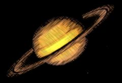

## S_Crosshatch

Simulates a pen-sketch crosshatched look using overlapping strokes.
The source is divided into four bands based on luma; each band from dark to light gets
a different pattern of strokes.

In the Sapphire Stylize effects submenu.

### Inputs:

- **Source**: The current layer. The clip to be processed.

- **Mask**: Defaults to None. Interpolate between the result and the Source input. White areas use the result of the effect. Black areas use the Source clip.

### Parameters:

- **Load Preset** (Push-button)
  Brings up the Preset Browser to browse all available presets for this effect.

- **Save Preset** (Push-button)
  Brings up the Preset Save dialog to save a preset for this effect.

- **Mode** (Popup menu, Default: CrosshatchPencil)
  Selects pencil or chalk modes.
  - **CrosshatchPencil**: Simulates dark pencil or pen strokes on white paper.
  - **CrosshatchChalk**: Simulates white chalk strokes on dark paper.

- **Mocha Project** (Default: 0, Range: 0 or greater)
  Brings up the Mocha window for tracking footage and generating masks.

- **Blur Mocha** (Default: 0, Range: 0 or greater)
  Blurs the Mocha Mask by this amount before using. This can be used to soften the edges or quantization artifacts of the mask, and smooth out the time displacements.

- **Mocha Opacity** (Default: 1, Range: 0 to 1)
  Controls the strength of the Mocha mask. Lower values reduce the intensity of the effect.

- **Invert Mocha** (Check-box, Default: off)
  If enabled, the black and white of the Mocha Mask are inverted before applying the effect.

- **Resize Mocha** (Default: 1, Range: 0 to 2)
  Scales the Mocha Mask. 1.0 is the original size.

- **Resize Rel X** (Default: 1, Range: 0 to 2)
  The relative horizontal size of the Mocha Mask.

- **Resize Rel Y** (Default: 1, Range: 0 to 2)
  The relative vertical size of the Mocha Mask.

- **Shift Mocha** (X & Y, Default: [0 0], Range: any)
  Offsets the position of the Mocha Mask.

- **Dilate Mocha** (Default: 0, Range: -100 to 100)
  Dilates or erodes the Mocha Mask by this pixel amount before using.

- **Dilation Quality** (Popup menu, Default: Fast)
  Selects whether Dilate Mocha adusts quickly in default Fast mode or looks better in High quality mode.
  - **Fast**: Dilate Mocha in Fast mode for quick adjustments.
  - **High**: Dilate Mocha in High quality mode for a better looking mask shape.

- **Bypass Mocha** (Check-box, Default: off)
  Ignore the Mocha Mask and apply the effect to the entire source clip.

- **Show Mocha Only** (Check-box, Default: off)
  Bypass the effect and show the Mocha Mask itself.

- **Combine Masks** (Popup menu, Default: Union)
  Determines how to combine the Mocha Mask and Input Mask when both are supplied to the effect.
  - **Union**: Uses the area covered by both masks together.
  - **Intersect**: Uses the area that overlaps between the two masks.
  - **Mocha Only**: Ignore the Input Mask and only use the
Mocha Mask.

- **Stroke Frequency** (Default: 100, Range: 1 to 500)
  Increase for smaller, finer strokes; decrease for broader strokes.

- **Stroke Length** (Default: 10, Range: 0.1 or greater)
  Average length of the strokes, compared to their width.

- **Stroke Strength** (Default: 0.55, Range: 0 to 1)
  Overall size and strength; decrease for fewer, smaller strokes. At zero, strokes will vanish. Increase for bolder, more overlapping strokes. At one, there will be strokes everywhere, so you won't see the stroke pattern.

- **Stroke Softness** (Default: 0.1, Range: 0.001 to 1)
  Softness of the edges of each stroke. Decrease for hard-edged pen strokes; increase for a softer chalk-like look.

- **Stroke Angle** (Default: 45, Range: any)
  Angle of the strokes, in degrees; zero makes strokes horizontal and vertical.

- **Stroke Shift** (X & Y, Default: [0 0], Range: any)
  Shift the overall stroke pattern; this can help match the stroke pattern to overall camera movement in the clip.

- **Animate Speed** (Default: 1, Range: 0 to 5)
  Strokes normally change subtly over time; this controls the speed of that animation. Set to zero for static strokes that don't move.

- **Threshold Darks** (Default: 0.15, Range: 0 to 1)
  The darkest areas get double overlapping strokes (or pure black in chalk mode); source areas with luma darker than this threshold are considered in the darkest band and get those double strokes. Increasing this (or any threshold) will darken the overall result since more of the image will fall into the darkest band.

- **Threshold Mids** (Default: 0.35, Range: 0 to 1)
  Midtones are divided into darker-mids and brighter-mids; this threshold sets the luma value that separates those two bands. The darker mids get darker and denser strokes.

- **Threshold Brights** (Default: 0.6, Range: 0 to 1)
  The brightest areas get the lightest strokes (normally just white, unless you are in chalk mode); areas brighter than this threshold are considered brights.

- **Thresholds Add** (Default: 0, Range: any)
  This adds or subtracts from all the thresholds; increase to darken the overall result (because it raises the thresholds), decrease to lighten the overall result (because it lowers the thresholds).

- **Mix Threshold** (Default: 0.005, Range: 0 to 0.1)
  Softens the borders between the dark/mid/light luma bands.

- **Strokes Use Source** (Default: 0, Range: 0 to 1)
  Increase to use more of the source color to color the strokes. Zero means use the stroke color; one means use the color of the underlying source clip. In between strokes, the background color shows through; if you have Back Style set to Source the strokes will disappear when this is set to one.

- **Stroke Color** (Default rgb: [0 0 0])
  The color to use for the strokes. In pencil mode this defaults to black; in chalk mode, it defaults to white.

- **Posterize Amount** (Default: 0, Range: 0 to 1)
  Posterizes the source, giving a more cartoony look with areas of solid color. This only has an effect when using the source to colorize the strokes or when using the source as the background.

- **Posterize Smooth** (Default: 0, Range: 0 to 1)
  When posterizing, smooth the edges of the solid-color areas. This avoids aliasing and usually looks better.

- **Posterize Phase** (Default: 0, Range: any)
  Adjusts the phase of the posterization. Use this to position the areas of flat color and avoid edges in the middle of areas you'd like to keep flat.

- **Edge Strength** (Default: 0, Range: 0 or greater)
  Adds cartoon-like edges to the look.

- **Edge Width** (Default: 0.002, Range: 0 or greater)
  Adjusts the width of the edge strokes; increasing this also softens the edges.

- **Edge Threshold** (Default: 0.5, Range: 0 or greater)
  Increase this to remove minor, insignificant edge strokes, giving a bolder look.

- **Edge Color** (Default rgb: [0 0 0])
  Sets the color for the edge strokes.

- **Suppress Small Edges** (Default: 0.5, Range: 0 or greater)
  Increase to suppress small, minor edges.

- **Edge Sharpen** (Default: 0, Range: 0 or greater)
  Sharpens the edge strokes.

- **Back Style** (Popup menu, Default: Solid Color)
  What to use as the background, underneath the pen strokes.
  - **Source**: Use the source as the background.
This gives a much more colorful look, as if the strokes are drawn over the original clip.
You may want to adjust Stroke Color when using this.
  - **Solid Color**: Use the specified Solid Color background.

- **Solid Color** (Default rgb: [1 1 1])
  The color to use for the the background, when in Solid Color mode.

- **Pre Blur Bg** (Default: 0, Range: 0 or greater)
  Blur the source before using it as background, or to color the strokes. This can help reduce sparkling due to a noisy or grainy source.

- **Use Source Alpha** (Default: 1, Range: 0 to 1)
  Cut out the strokes using the alpha of the source. At one, strokes are suppressed where the source alpha is zero; that is, they are cut out by the alpha. At zero, the strokes are drawn everywhere, even where the source alpha is zero. Set to zero if you want the stroke texture everywhere in the frame. When the source is fully opaque, this has no effect.

- **Saturation** (Default: 1, Range: 0 or greater)
  Increase or decrease the overall saturation of the output.

- **Scale Lights** (Default: 1, Range: 0 or greater)
  Scales the brightness of the result by this amount.

- **Offset Darks** (Default: 0, Range: any)
  Adds this gray value to the darker regions of the source. This can be negative to increase contrast.

- **Tint Lights** (Default rgb: [1 1 1])
  Scales the result by this color, thus tinting the lighter regions.

- **Tint Darks** (Default rgb: [0 0 0])
  Adds this color to the darker regions of the result.

- **Mix With Source** (Default: 0, Range: 0 to 1)
  Interpolates between the result (when set to 0) and the original source (when set to 1). 0.7 can give a nice effect by blending some of the source in with the strokes.

- **Seed** (Default: 0.123, Range: 0 or greater)
  Initialize the random number generator for the strokes. Different values give different random stroke patterns.

- **Opacity** (Popup menu, Default: Normal)
  Determines the method used for dealing with opacity/transparency.
  - **All Opaque**: Use this option to render slightly faster when
the input image is fully opaque with no transparency (alpha=1).
  - **Normal**: Process opacity normally.
  - **As Premult**: Process as if the image is already in
premultiplied form (colors have been scaled by opacity). This option
also renders slightly faster than Normal mode, but the results will
also be in premultiplied form, which is sometimes less correct.

- **Mask Use** (Popup menu, Default: Luma)
  Determines how the Mask input channels are used to make a monochrome mask.
  - **Luma**: the luminance of the RGB channels is used.
  - **Alpha**: only the Alpha channel is used.

- **Blur Mask** (Default: 0.05, Range: 0 or greater)
  Blurs the Matte input by this amount before using. This can provide a smoother transition between the matted and unmatted areas. It has no effect unless the Matte input is provided.

- **Invert Mask** (Check-box, Default: off)
  If on, inverts the Matte input so the effect is applied to areas where the Matte is black instead of white. This has no effect unless the Matte input is provided.

