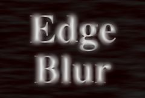

## S_EdgeBlur

Finds the edges within the Matte clip, and blurs the
Source clip at those edges. Use the Show Edges option to view
which areas will receive the blur while adjusting the edge parameters.
Then adjust Blur Width to control the amount of blur.

In the Sapphire Blur+Sharpen effects submenu.

### Inputs:

- **Source**: The current layer. The clip to be processed.

- **Edge_Source**: Defaults to None. The clip used to determine the edge locations where the Source should be blurred. If this input is not connected, the main Source clip is used instead to determine the edges.

### Parameters:

- **Load Preset** (Push-button)
  Brings up the Preset Browser to browse all available presets for this effect.

- **Save Preset** (Push-button)
  Brings up the Preset Save dialog to save a preset for this effect.

- **Mocha Project** (Default: 0, Range: 0 or greater)
  Brings up the Mocha window for tracking footage and generating masks.

- **Blur Mocha** (Default: 0, Range: 0 or greater)
  Blurs the Mocha Mask by this amount before using. This can be used to soften the edges or quantization artifacts of the mask, and smooth out the time displacements.

- **Mocha Opacity** (Default: 1, Range: 0 to 1)
  Controls the strength of the Mocha mask. Lower values reduce the intensity of the effect.

- **Invert Mocha** (Check-box, Default: off)
  If enabled, the black and white of the Mocha Mask are inverted before applying the effect.

- **Resize Mocha** (Default: 1, Range: 0 to 2)
  Scales the Mocha Mask. 1.0 is the original size.

- **Resize Rel X** (Default: 1, Range: 0 to 2)
  The relative horizontal size of the Mocha Mask.

- **Resize Rel Y** (Default: 1, Range: 0 to 2)
  The relative vertical size of the Mocha Mask.

- **Shift Mocha** (X & Y, Default: [0 0], Range: any)
  Offsets the position of the Mocha Mask.

- **Dilate Mocha** (Default: 0, Range: -100 to 100)
  Dilates or erodes the Mocha Mask by this pixel amount before using.

- **Dilation Quality** (Popup menu, Default: Fast)
  Selects whether Dilate Mocha adusts quickly in default Fast mode or looks better in High quality mode.
  - **Fast**: Dilate Mocha in Fast mode for quick adjustments.
  - **High**: Dilate Mocha in High quality mode for a better looking mask shape.

- **Bypass Mocha** (Check-box, Default: off)
  Ignore the Mocha Mask and apply the effect to the entire source clip.

- **Show Mocha Only** (Check-box, Default: off)
  Bypass the effect and show the Mocha Mask itself.

- **Blur Width** (Default: 0.112, Range: 0 or greater)
  The width of the blur. This should normally not be much greater than the Edge Width. This parameter can be adjusted using the Blur Width Widget.

- **Edge Width** (Default: 0.112, Range: 0 or greater)
  The width of the edge area to blur within.

- **Edge Strength** (Default: 0.5, Range: 0 or greater)
  The strength of the edges determines the amount of the blurred source that replaces the edges.

- **Edge Threshold** (Default: 0, Range: 0 or greater)
  Determines which edges are blurred. Increase to remove minor edges or speckles.

- **Show** (Popup menu, Default: Result)
  Selects between output options.
  - **Result**: outputs the Source image with blurred edges.
  - **Edges**: outputs only the edge image. This can useful during the
adjustment of the edge parameters.

- **Subpixel** (Check-box, Default: on)
  Enables blurring by subpixel amounts. Use this for smoother animation of the Blur Width or Edge Width parameters.

- **Matte Use** (Popup menu, Default: Luma)
  Determines how the Matte input channels are used to make a monochrome matte.
  - **Luma**: the luminance of the RGB channels is used.
  - **Alpha**: only the Alpha channel is used.

- **Opacity** (Popup menu, Default: Normal)
  Determines the method used for dealing with opacity/transparency.
  - **All Opaque**: Use this option to render slightly faster when
the input image is fully opaque with no transparency (alpha=1).
  - **Normal**: Process opacity normally.
  - **As Premult**: Process as if the image is already in
premultiplied form (colors have been scaled by opacity). This option
also renders slightly faster than Normal mode, but the results will
also be in premultiplied form, which is sometimes less correct.

- **Show Blur Width** (Check-box, Default: on)
  Turns on or off the screen user interface for adjusting the Blur Width parameter.This parameter only appears on AE and Premiere, where on-screen widgets are supported.

