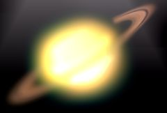

## S_FreeLens

Generates a distorted, defocused and light leaked version of the source clip to simulate the in-camera technique of holding a detached lens in front of the camera and moving it to create focus and light effects.

In the Sapphire Blur+Sharpen effects submenu.

### Inputs:

- **Source**: The current layer. The clip to process.

- **Matte**: Defaults to None. If provided, the effect is only applied on regions of the source clip specified by the bright areas of this input. Pixels outside this matte are not affected, and do not contribute to the resulting affected pixels within it. This input can be affected using the Invert Matte, or Matte Use parameters.

### Parameters:

- **Load Preset** (Push-button)
  Brings up the Preset Browser to browse all available presets for this effect.

- **Save Preset** (Push-button)
  Brings up the Preset Save dialog to save a preset for this effect.

- **Mocha Project** (Default: 0, Range: 0 or greater)
  Brings up the Mocha window for tracking footage and generating masks.

- **Blur Mocha** (Default: 0, Range: 0 or greater)
  Blurs the Mocha Mask by this amount before using. This can be used to soften the edges or quantization artifacts of the mask, and smooth out the time displacements.

- **Mocha Opacity** (Default: 1, Range: 0 to 1)
  Controls the strength of the Mocha mask. Lower values reduce the intensity of the effect.

- **Invert Mocha** (Check-box, Default: off)
  If enabled, the black and white of the Mocha Mask are inverted before applying the effect.

- **Resize Mocha** (Default: 1, Range: 0 to 2)
  Scales the Mocha Mask. 1.0 is the original size.

- **Resize Rel X** (Default: 1, Range: 0 to 2)
  The relative horizontal size of the Mocha Mask.

- **Resize Rel Y** (Default: 1, Range: 0 to 2)
  The relative vertical size of the Mocha Mask.

- **Shift Mocha** (X & Y, Default: [0 0], Range: any)
  Offsets the position of the Mocha Mask.

- **Dilate Mocha** (Default: 0, Range: -100 to 100)
  Dilates or erodes the Mocha Mask by this pixel amount before using.

- **Dilation Quality** (Popup menu, Default: Fast)
  Selects whether Dilate Mocha adusts quickly in default Fast mode or looks better in High quality mode.
  - **Fast**: Dilate Mocha in Fast mode for quick adjustments.
  - **High**: Dilate Mocha in High quality mode for a better looking mask shape.

- **Bypass Mocha** (Check-box, Default: off)
  Ignore the Mocha Mask and apply the effect to the entire source clip.

- **Show Mocha Only** (Check-box, Default: off)
  Bypass the effect and show the Mocha Mask itself.

- **Combine Masks** (Popup menu, Default: Union)
  Determines how to combine the Mocha Mask and Input Mask when both are supplied to the effect.
  - **Union**: Uses the area covered by both masks together.
  - **Intersect**: Uses the area that overlaps between the two masks.
  - **Mocha Only**: Ignore the Input Mask and only use the
Mocha Mask.

- **Shift** (X & Y, Default: [0 0], Range: 2 or less)
  Offsets the lens horizontally or vertically. Note that the image moves opposite to the lens motion. This parameter can be adjusted using the Tilt X Widget.

- **Tilt X** (Default: 12.5, Range: -45 to 45)
  Rotates the lens left or right about a vertical axis. This parameter can be adjusted using the Tilt X Widget.

- **Tilt Y** (Default: 0, Range: -45 to 45)
  Rotates the lens up or down about a horizontal axis. You can use Tilt X and Tilt Y together to rotate about an arbitrary diagonal axis. This parameter can be adjusted using the Tilt X Widget.

- **Distance** (Default: 0, Range: -0.3 to 0.5)
  Moves the lens away from or toward the camera. This parameter can be adjusted using the Distance Widget.

- **Rotate Highlights** (Default: 0, Range: -180 to 180)
  Rotates the lens about the line of sight. In a real lens this would rotate the iris, so the rotation is perceived as a rotation of any defocus highlights in the image.

- **Perspective Amount** (Default: 1, Range: 0.25 to 4)
  Controls the amount of lens telescoping while applying Tilt X and Tilt Y. Increase for more 3D perspective.

- **Wrap** (X & Y, Popup menu, Default: [ Reflect Reflect ])
  Determines the method for accessing outside the borders of the source images.
  - **No**: gives black beyond the borders.
  - **Tile**: repeats a copy of the image.
  - **Reflect**: repeats a mirrored copy. Edges are often less
visible with this method.

- **Filter** (Check-box, Default: on)
  If enabled, the image is adaptively filtered when it is resampled. This gives a better quality result when parts of the image are warped smaller.

- **Defocus Width** (Default: 0.104, Range: 0 or greater)
  Scales the overall amount of defocus blur and highlights.

- **Focal Point Offset** (X & Y, Default: [0 0], Range: 2 or less)
  Offsets the location of best focus in the image. This parameter can be adjusted using the Focal Point Offset Widget.

- **Focal Uses Mocha** (Check-box, Default: off)
  Controls whether the focal point is controlled by the Focal Point Offset parameter or follows the Focal Point Offset tracked inside of Mocha.

- **Smooth Focal Track** (Integer, Default: 0, Range: 0 or greater)
  Controls how many points to average when stabilizing the Mocha point track.

- **Chroma Distort** (Default: 0, Range: any)
  Adds some chromatic aberration around the edges of the image; red and blue wavelengths of light refract differently in real lenses, producing fringes of color where the rays strike the lens at oblique angles.

- **Rel Height** (Default: 1, Range: 0.01 or greater)
  The relative height of the iris shape. If it is not 1, circles become ellipses, etc.

- **Show** (Popup menu, Default: Result)
  Selects the type of output.
  - **Result**: Shows the final output.
  - **DepthMap**: Shows the depth map generated for the current lens position and orientation.
  - **Shape**: Shows the iris shape.

- **Highlight Shape** (Popup menu, Default: 6 sides)
  Determines the shape of the simulated camera iris.
  - **Circle**: round.
  - **3 sides**: triangle.
  - **4 sides**: square.
  - **5 sides**: pentagon.
  - **6 sides**: hexagon.
  - **7 sides**: seven-sided polygon.
  - **8 sides**: eight-sided polygon.
  - **9 sides**: nine-sided polygon.
  - **10 sides**: ten-sided polygon.
  - **11 sides**: eleven-sided polygon.
  - **12 sides**: twelve-sided polygon.

- **Highlight Roundness** (Default: 0, Range: any)
  Modifies the shape of the simulated camera iris. A value of 1 produces a circle; 0 gives a flat-sided polygon with a number of sides given by the Shape parameter. Less than 0 causes the sides to squeeze inward giving a star shape, while a value greater than 1 causes the corners to squeeze inward, giving a flowery shape. Has no effect if the Shape is set to Circle.

- **Boost Highlights** (Default: 1, Range: 0 or greater)
  The amount to increase the luma of the highlights in the source clip. Increase this parameter to blow out the highlights without affecting the darks or mid-tones.

- **Highlight Threshold** (Default: 0.9, Range: 0 or greater)
  The minimum luma value for highlights. Pixels brighter than this will be brightened according to the Boost Highlights parameter.

- **Distortion** (Check-box, Default: on)
  Enables distortion.

- **Link Distortion To Lens** (Check-box, Default: on)
  Controls whether distortion is adjusted by the lens or set manually.

- **Distortion Amount** (Default: 0, Range: -0.15 to 0.15)
  Distorts the image radially for barrel or pincushion

- **Scale Width** (Default: 1, Range: 0 or greater)
  Scales the distortion in the horizontal direction

- **Scale Height** (Default: 1, Range: 0 or greater)
  Scales the distortion in the vertical direction

- **Light Leak** (Check-box, Default: on)
  Enables light leak.

- **Link Leak To Lens** (Check-box, Default: on)
  Controls whether light leak is adjusted by the lens or set manually.

- **Leak Intensity** (Default: 0, Range: any)
  Scales the intensity of the light leak elements.

- **Leak Rel Height** (Default: 2, Range: 0 or greater)
  Controls the aspect ratio of the light leak elements.

- **Leak Size** (Default: 0.35, Range: 0 or greater)
  Scales the width and height of the light leak elements.

- **Vary Size** (Default: 1, Range: 0 or greater)
  Amount to vary the size from one light leak element to the next.

- **Light Leak Hotspot** (X & Y, Default: [-0.5 0.25], Range: any)
  Positions the start of the line of light leak elements. This parameter can be adjusted using the Light Leak Hotspot Widget.

- **Light Leak Pivot** (X & Y, Default: [0 0.25], Range: any)
  Positions the end of the line of light leak elements. This parameter can be adjusted using the Light Leak Pivot Widget.

- **Leak Roundness** (Default: 0.7, Range: -1 to 1)
  Rounds the corners of the light leak element.

- **Sides** (Integer, Default: 4, Range: 3 to 16)
  Controls how many edges there are for each light leak element.

- **Copies** (Integer, Default: 5, Range: 1 to 34)
  Controls how many light leak elements there are.

- **Spread** (Default: 4, Range: 0 or greater)
  Controls how far apart the light leak elements are.

- **Outer Color** (Default rgb: [1 0.8 1])
  Controls the color at the outer edge of each light leak element.

- **Mid Color** (Default rgb: [1 0.9 1])
  Controls the color midway from the center to the outer edge of each light leak element.

- **Center Color** (Default rgb: [1 1 1])
  Controls the color at the center of each light leak element.

- **Midpoint** (Default: 0.5, Range: 0 to 1)
  Moves the location of the Mid Color between the center and outer of of each light leak element. Set to 0 to place the Mid Color at the center, or 1 to place it at the edge.

- **Softness** (Default: 4, Range: 0 or greater)
  Blurs the color gradient of each light leak element. Increase for a smoother gradient, or decrease for sharper bands of color.

- **Glow Brightness** (Default: 1, Range: 0 or greater)
  Scales the brightness of the glow which is applied to the entire image after combining the light leak with the background.

- **Glow Width** (Default: 0.4, Range: 0 or greater)
  The width of the glow. Increase for a softer glow and decrease for a sharper, brighter glow.

- **Glow Threshold** (Default: 0.8, Range: 0 or greater)
  Parts of the image that are brighter than this value get glowed.

- **Shake** (Check-box, Default: on)
  Enables shake.

- **Shake Mode** (Popup menu, Default: Normal)
  Controls the type of shaking.
  - **Normal**: A steady camera shake.
  - **Twitchy**: Periods of stillness interrupted by bursts of rapid shaking.
  - **Jumpy**: Sudden jumps from one place to another, with slower drifting in between.

- **Jump Drift** (Default: 0.3, Range: 0 to 1)
  In Jumpy mode, controls the speed of movement in between jumps.

- **Jump Center Bias** (Default: 0, Range: 0 or greater)
  In Jumpy mode, adjusts the likelihood that each jump will reset the image to its original position. If set to zero, every jump is random. If set to one, every jump will go back to the center.

- **Twitch Stillness** (Default: 0.7, Range: 0 to 1)
  In Twitchy mode, adjusts the fraction of the time that the image is still. Increase for more frequent shaking.

- **Twitch Frequency** (Default: 2, Range: 0 or greater)
  In Twitchy mode, controls the length of the periods of movement and stillness. Increase for shorter, more frequent bursts of movement.

- **Amplitude** (Default: 1, Range: 0 or greater)
  Scales the amplitude of the shaking motion.

- **Frequency** (Default: 8, Range: 0 or greater)
  Increase for faster shaking, decrease for slower shaking. (Be careful if you animate frequency values because the resulting shake frequency is also affected by the rate of change of the value.)

- **Phase** (Default: 0, Range: any)
  Time shift of the shaking motions. (If you animate this value, its rate of change will also affect the apparent frequency.)

- **Motion Blur** (Check-box, Default: on)
  Options for motion blur of the shaking motion.

- **Mo Blur Length** (Default: 1, Range: 0 or greater)
  Scales the amount of motion blur. Use around .5 when processing on fields or 1.0 for frames to give realistic motion blur. This parameter has no effect if Motion Blur is No .

- **Blur Res** (Popup menu, Default: Full)
  Selects the resolution factor for the motion blur. Higher resolutions give better quality, lower resolutions give faster processing.
  - **Full**: Full resolution is used.
  - **Half**: The motion blurring is performed at half resolution.
  - **Quarter**: The motion blurring is performed at quarter resolution.

- **Seed** (Default: 0, Range: 0 or greater)
  Used to initialize the random number generator. The actual seed value is not significant, but different seeds give different results and the same value should give a repeatable result.

- **X Rand Amp** (Default: 0, Range: 0 or greater)
  Amplitude of horizontal random shaking.

- **X Rand Freq** (Default: 1, Range: 0 or greater)
  Frequency of horizontal random shaking.

- **Y Rand Amp** (Default: 0, Range: 0 or greater)
  Amplitude of the vertical random shaking.

- **Y Rand Freq** (Default: 1, Range: 0 or greater)
  Frequency of the vertical random shaking.

- **Tilt X Rand Amp** (Default: 0, Range: 0 or greater)
  Amplitude of horizontal angular random shaking.

- **Tilt X Rand Freq** (Default: 1, Range: 0 or greater)
  Frequency of horizontal angular random shaking.

- **Tilt Y Rand Amp** (Default: 0, Range: 0 or greater)
  Amplitude of vertical angular random shaking.

- **Tilt Y Rand Freq** (Default: 1, Range: 0 or greater)
  Frequency of vertical angular random shaking.

- **Distance Rand Amp** (Default: 0, Range: 0 or greater)
  Amplitude of zoom random shaking.

- **Distance Rand Freq** (Default: 1, Range: 0 or greater)
  Frequency of zoom random shaking.

- **Leak Int Rand Amp** (Default: 0, Range: 0 or greater)
  Amplitude of leak intensity random shaking.

- **Leak Int Rand Freq** (Default: 1, Range: 0 or greater)
  Frequency of leak intensity random shaking.

- **Vignette** (Check-box, Default: on)
  Enables vignette.

- **Link Vig To Lens** (Check-box, Default: on)
  Controls whether vignette is adjusted by the lens or set manually.

- **Vig Intensity** (Default: 0.2, Range: 0 or greater)
  The opacity of the vignette; animate to 0 to fade the vignette out.

- **Vig Center** (X & Y, Default: [0 0], Range: any)
  The center of rotation and zooming, in screen coordinates relative to the center of the frame. The shift values should be zero for this location to make sense. This parameter can be adjusted using the Vig Center Widget.

- **Vig Squareness** (Default: 0, Range: 0 to 1)
  Determines how square the vignette shape is. Set to 1.0 for a square or rectangle shape. Set to 0 for a circle or ellipse. Values in between give rectangles with rounded corners by varying amounts.

- **Vig Radius** (Default: 1.5, Range: 0 or greater)
  Distance from the center to apply the vignette.

- **Vig Rel Height** (Default: 1, Range: 0.05 or greater)
  The relative height of the iris shape. If it is not 1, circles become ellipses, etc.

- **Vig Rel Width** (Default: 1, Range: 0.05 or greater)
  The relative horizontal size of the vignette shape. Increase for a wider shape, decrease for a taller one.

- **Vig Rotate** (Default: 0, Range: any)
  Rotates the iris shape.

- **Vig Edge Softness** (Default: 0.46, Range: 0 or greater)
  The width of the vignette's soft edge. Larger values give softer, less visible edges.

- **Vig Smooth Curve** (Default: 1, Range: 0 to 1)
  If zero, a linear gradient is used across the screen in the soft edge area. Increase this value to use a smoother 'S' shaped curve for interpolation which can reduce the visual perception of the gradient's start and end locations.

- **Vig Color** (Default rgb: [0 0 0])
  The color of the vignette.

- **Vig Blur Amount** (Default: 0, Range: 0 or greater)
  Blurs the borders of the image in addition to darkening them.

- **Vig Blur Inside** (Check-box, Default: off)
  If checked, the center (undarkened) area of the image is blurred instead of the border.

- **Vig Source Brightness** (Default: 1, Range: 0 or greater)
  Scales the brightness of the source clip. To see only the vignette, set this to zero.

- **Vig Combine** (Popup menu, Default: Mult)
  Determines how the vignette is combined with the Source.
  - **Composite**: composites the vignette over the source clip.
  - **Mult**: the vignette color is multiplied by the source clip.
If the Color is not black, this will selectively colorize the
vignette area.
  - **Add**: the vignette color is added to the source clip. This
will have no effect if the vignette color is black.
  - **Screen**: the vignette color is combined with the source
clip using a screen operation. This will have no effect if the
vignette color is black.
  - **Subtract Inv**: the inverse of the vignette color is
subtracted from the source clip. Inverse means white for black,
yellow for blue, and so on. This mode looks similar to Mult, but a
bit more severe; it crushes the blacks and leaves the highlights
more. This will have no effect if the vignette color is white.
  - **Vignette Only**: shows the vignette pattern without the
source clip. The output will be white where the amount of vignetting
is greatest (e.g. where the source clip would be darkened
completely).
  - **Vignette Only Inv**: shows the inverted vignette pattern
without the source clip. The output will be white where there is no
vignetting (e.g. where the source clip would not be darkened at
all).

- **Mask Use** (Popup menu, Default: Luma)
  Determines how the Mask input channels are used to make a monochrome mask.
  - **Luma**: the luminance of the RGB channels is used.
  - **Alpha**: only the Alpha channel is used.

- **Blur Mask** (Default: 0.05, Range: 0 or greater)
  Blurs the Matte input by this amount before using. This can provide a smoother transition between the matted and unmatted areas. It has no effect unless the Matte input is provided.

- **Invert Mask** (Check-box, Default: off)
  If on, inverts the Matte input so the effect is applied to areas where the Matte is black instead of white. This has no effect unless the Matte input is provided.

- **Show Distance** (Check-box, Default: on)
  Turns on or off the screen user interface for adjusting the Shift parameter.This parameter only appears on AE and Premiere, where on-screen widgets are supported.

- **Show Tilt X** (Check-box, Default: on)
  Turns on or off the screen user interface for adjusting the Shift parameter.This parameter only appears on AE and Premiere, where on-screen widgets are supported.

- **Show Focal Point Offset** (Check-box, Default: on)
  Turns on or off the screen user interface for adjusting the Focal Point Offset parameter.This parameter only appears on AE and Premiere, where on-screen widgets are supported.

- **Show Light Leak Hotspot** (Check-box, Default: off)
  Turns on or off the screen user interface for adjusting the Light Leak Hotspot parameter.This parameter only appears on AE and Premiere, where on-screen widgets are supported.

- **Show Light Leak Pivot** (Check-box, Default: off)
  Turns on or off the screen user interface for adjusting the Light Leak Pivot parameter.This parameter only appears on AE and Premiere, where on-screen widgets are supported.

- **Show Vig Center** (Check-box, Default: off)
  Turns on or off the screen user interface for adjusting the Vig Center parameter.This parameter only appears on AE and Premiere, where on-screen widgets are supported.

