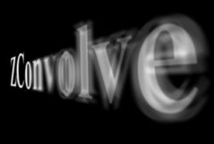

## S_ZConvolve

Convolves areas of the source clip using a kernel which
is made larger or smaller using depth values from a ZBuffer
input. Separates the input into a number of layers and applies
different sized convolution blurs depending on the distance from the
focal depth, and depth of field. This is similar to ZDefocus but with
an iris shape (or Kernel) that comes from a clip.

In the Sapphire Blur+Sharpen effects submenu.

### Inputs:

- **Source**: The current layer. The clip to be processed.

- **Kernel**: Defaults to None. The filter kernel or shape for the convolution. This should normally be all black around the edges (outside the specified Kernel Crop region), with a non-black central part. A larger shape normally produces blurrier results. Only the part of the kernel within the two Kernel Crop params is considered; the part outside that boundary is ignored.

- **ZBuffer**: Defaults to None. The input clip containing depth values for each Source pixel. These values should be in the range of black to white, and it is best if not anti-aliased. Normally black corresponds to the farthest objects and white to the nearest, though this can be adjusted using Z Buffer parameter.

### Parameters:

- **Load Preset** (Push-button)
  Brings up the Preset Browser to browse all available presets for this effect.

- **Save Preset** (Push-button)
  Brings up the Preset Save dialog to save a preset for this effect.

- **Focal Depth** (Default: 0, Range: any)
  The depth of the focus plane; 0 is near and 1 is far. Areas with this Z value will be in focus. Objects near this depth may be in focus depending on the Depth of Field parameter. You can use Show: In Focus Zone to show the Focal Depth when adjusting. If the effect of this parameter seems backwards, you can invert the depth values using the Z Buffer parameter.

- **Depth Of Field** (Default: 0.1, Range: 0 to 1)
  Specifies how wide a range of depths near the Focal Depth will be in focus. If the Focal Depth is 0.5 and Depth of Field is 0.2, all objects with Z values from 0.4 to 0.6 will be in focus. Set to zero to have only objects exactly at the Focal Depth in focus. You can use Show: In Focus Zone to show this when adjusting.

- **Size** (Default: 1, Range: 0 or greater)
  The maximum amount to resize the kernel larger or smaller. 1.0 is the original size. This parameter can be adjusted using the Size Widget.

- **Size Rel X** (Default: 1, Range: 0 or greater)
  Increase to make the kernel fatter or wider without changing its height. Decrease to shrink it horizontally, making it thinner.

- **Size Rel Y** (Default: 1, Range: 0 or greater)
  Increase to make the kernel taller without changing its wieght. Decrease to shrink it vertically, making it flatter.

- **Z Buffer Type** (Popup menu, Default: White is Near)
  How to interpret the values in the Z buffer.
  - **Black is Near**: Black pixels in the Z buffer indicate that
the object at that point is near (close to you), and white means far
away.
  - **White is Near**: White pixels in the Z buffer indicate that
the object at that point is near (close to you), and black means far
away.

- **Show** (Popup menu, Default: Result)
  Selects the type of output.
  - **Result**: Show the final output.
  - **Kernel**: Show the convolve kernel over the final output. Use
this to adjust the kernel cropping and threshold parameters.
  - **In Focus Zone**: Show the in-focus zone highlighted over the
original image. Use this to adjust the focal depth and depth of
field.

- **Layers** (Integer, Default: 5, Range: 2 to 50)
  The number of depth layers to separate the source into. More layers require more processing but give smoother results in Z. More layers are sometimes needed to avoid visible seams between the layers.

- **Layer Mode** (Popup menu, Default: Interp)
  Determines how the differently blurred layers are combined.
  - **Comp**: the closer layers are composited over the farther
layers. This method often gives better results if you have objects
at different depths overlapping each other with discontinuous values
in your depth image. However, this option can be slower, and sometimes
artifacts between layers are visible.
  - **Interp**: the layers are interpolated using depth
image values. This method gives smoother transitions between
layers, and is usually better if there are no sharp changes in your
depth image.

- **Kernel Center** (X & Y, Default: [0 0], Range: any)
  The center point of the kernel; if you think of convolution as repeated stamping of the kernel at each point of the source, the center is where the stamp aligns with the source pixels it's stamped over. If you move the center to the right in the kernel, the whole result image will move to the left, and similarly up and down. This parameter is ignored if AutoCenter is on. It may be helpful to turn on Show Kernel while adjusting this parameter. Note that if Autocenter is off, the center point is always included in the kernel no matter what this param is set to.

- **Autocenter** (Check-box, Default: on)
  Automatically finds the center of the kernel image. Turning this on makes the effect ignore the Kernel Center parameter.

- **Use Gamma** (Default: 1, Range: 0.1 or greater)
  Values above 1 cause highlights in the source clip to keep their brightness after the convolution filter is applied.

- **Boost Highlights** (Default: 0, Range: 0 or greater)
  The amount to increase the luma of the highlights in the source clip. Increase this parameter to blow out the highlights without affecting the darks or mid-tones.

- **Highlight Threshold** (Default: 0.9, Range: 0 or greater)
  The minimum luma value for highlights. Pixels brighter than this will be brightened according to the Boost Highlights parameter.

- **Brightness** (Default: 1, Range: 0 or greater)
  Scales the brightness of the result.

- **Threshold** (Default: 0, Range: 0 or greater)
  Any source value below this will be treated as black. When combining the convolved result with the original, you can increase this value to only convolve bright areas of the source. Typically when using this parameter, you will also set Combine to Screen or Add to get a glare-like effect.

- **Threshold Add Color** (Default rgb: [0 0 0])
  This can be used to raise the threshold on a specific color and thereby reduce the convolved result generated on areas of the source clip containing that color.

- **Combine** (Popup menu, Default: Convolve Only)
  Determines how the convolved image is combined with the original source.
  - **Convolve Only**: Only show the convolved image. Use this option for a blur
or defocus-like effect
  - **Screen**: Screen the convolved image with the original source. Use this option for a
glow or glare-like effect.
  - **Add**: Add the convolved image to the original source.
  - **Difference**: Show the difference between the convolved image and the source.

- **Mix With Source** (Default: 0, Range: 0 to 1)
  Interpolates between the convolved result (0) and the original source (1). 0.1 can give a nice misty effect since it mixes only a little of the source in.

- **Edge Mode** (X & Y, Popup menu, Default: [ Transparent Transparent ])
  Determines the behavior when accessing areas outside the source image.
  - **Transparent**: Areas outside the source image are treated as transparent, which can produce
transparency around the edges of the image.
Select this for fastest rendering.
  - **Repeat**: Repeats the last pixel outside the border of the image.
  - **Reflect**: Reflects the image outside the border.

- **Size Rel Near** (Default: 1, Range: 0 or greater)
  Scales the kernel size for parts of the image that are nearer than the focal plane.

- **Size Rel Far** (Default: 1, Range: 0 or greater)
  Scales the kernel size for parts of the image that are farther away than the focal plane.

- **Kernel Threshold** (Default: 0.001, Range: 0 or greater)
  Any kernel value below this will be treated as black. It's important for the edges of the kernel image to be completely black, or the result will have a grayish cast to it. If your kernel image may have a little noise in the black areas, turn up threshold a little to remove that background noise.

- **Clamp Below Threshold** (Check-box, Default: on)
  When turned on, values below the threshold are clamped to zero. This usually gives the best result. For certain special cases with partially-negative kernels, turning this off gives you additional flexibility in designing your kernel.

- **Kernel Crop1** (X & Y, Default: [-0.997 -0.747], Range: any)
  The upper left corner of the kernel area. Parts of the kernel image outside the rectangle defined by Kernel Crop1 and Kernel Crop2 are assumed to be black. Making this area smaller to avoid processing the kernel's black edges can speed up the convolution somewhat. It may be helpful to turn on Show Kernel while adjusting this parameter. Note that if Autocenter is off, the center point is always included in the kernel no matter what this param is set to.

- **Kernel Crop2** (X & Y, Default: [0.997 0.747], Range: any)
  The lower right corner of the kernel area.

- **Autoscale Mode** (Popup menu, Default: Max Channel)
  In convolution, either a larger or brighter kernel will make the result image brighter. The kernel must be auto-scaled or normalized so the result is, on average, as bright as the input. The autoscaling can be done in several ways, each of which is best in certain circumstances. With a monochrome kernel or with Color Kernel turned off, Max Channel, Luma, and Indep Channels all give the same result.
  - **Max Channel**: Autoscales the kernel by summing the
elements of each channel, and using whichever is brightest as the
overall kernel scale factor. This normalizes a dim kernel to full
brightness, and generally preserves the color of the kernel, but
allows brightness variations in the dimmer channels to show in the
result.
  - **Luma**: Autoscales the kernel by summing the
luminances of each kernel pixel. This method preserves changes in
the kernel's hue, but normalizes the luma, so a brighter or darker
kernel will have no effect. Use the Scale parameter to adjust the
result brightness.
  - **Indep Channels**: Independently normalizes each
color channel of the kernel. A colored kernel will give a
white/gray result with this method. Use this method if your kernel
channels are independent of each other (i.e. different things going
on in each of R, G, and B) but you want normalized results in each
channel.
  - **Count Nonzero**: Count how many kernel pixels are
nonzero (brighter than black), but otherwise ignore how bright they
are. This method is best if you want variations in kernel hue and
luma to show up in the result. But blurring the kernel will give a
dimmer result, since there will be more nonzero pixels.
  - **Kernel Size**: Ignore the pixel
entirely;
only use the size of the kernel rectangle to auto-scale. Use this
if you want all kernel variations to show up in the result, but
don't use it if you intend to animate Kernel Crop1 and Crop2, as
that would affect the result's brightness.

- **Zbuffer Use** (Popup menu, Default: Luma)
  Determines how the ZBuffer input channels make a monochrome z image.
  - **Luma**: the luminance of the RGB channels is used.
  - **Alpha**: only the Alpha channel is used.

- **Opacity** (Popup menu, Default: Normal)
  Determines the method used for dealing with opacity/transparency.
  - **All Opaque**: Use this option to render slightly faster when
the input image is fully opaque with no transparency (alpha=1).
  - **Normal**: Process opacity normally.
  - **As Premult**: Process as if the image is already in
premultiplied form (colors have been scaled by opacity). This option
also renders slightly faster than Normal mode, but the results will
also be in premultiplied form, which is sometimes less correct.

- **Show Size** (Check-box, Default: on)
  Turns on or off the screen user interface for adjusting the Size parameter.This parameter only appears on AE and Premiere, where on-screen widgets are supported.

- **Show Kernel Crop** (Check-box, Default: off)
  Turns on or off the screen user interface for adjusting the Kernel Crop1 parameter.This parameter only appears on AE and Premiere, where on-screen widgets are supported.

