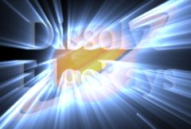

## S_DissolveEdgeRays

Transitions between two input clips using animated edge rays.
The clips dissolve into each other, and edge rays are added to the result.
The edge rays ramps up and down over the duration of the effect.
The edge rays animate by moving
the origin of the edge rays across the screen along a line.
The Dissolve Percent parameter should be animated
to control the transition speed.

In the Sapphire Transitions effects submenu.

### Inputs:

- **Foreground**: The current layer. Starts the transition with this clip.

- **Background**: Defaults to None. Ends the transition with this clip.

### Parameters:

- **Load Preset** (Push-button)
  Brings up the Preset Browser to browse all available presets for this effect.

- **Save Preset** (Push-button)
  Brings up the Preset Save dialog to save a preset for this effect.

- **Transition Dir** (Popup menu, Default: Dissolve Off to Bg)
  Selects the direction of the transition.
  - **Dissolve Off to Bg**: transitions from the current layer to the Background.
  - **Dissolve On from Bg**: transitions from the Background to the current layer.

- **Auto Trans** (Popup YES-NO, Default: No)
  If enabled, a transition is performed automatically between the first and last frames of the layer. If this is off, the transition is performed manually by animating the Dissolve Percent parameter.

- **Dissolve Percent** (Default: 0, Range: 0 to 1)
  Auto Trans must be disabled for this parameter to be used. It determines the transition ratio between the Foreground and Background inputs, and would normally be animated from 0 to 100 to perform a complete transition. The curve controlling this parameter can be adjusted for more detailed control over the timing of the dissolve.

- **Dissolve Speed** (Default: 3, Range: 1 or greater)
  The speed of the dissolve between the From and To clips. When set to 1, the dissolve takes place over the entire duration of the effect. When set higher, the dissolve is shorter, although the edge rays ramp-up and ramp-down still takes the entire duration. Setting this to 10 can make the transition snappier and more like a flash-frame cut.

- **Rays Center** (X & Y, Default: [0 0], Range: any)
  The location from which the rays beam outwards at the midpoint of the transition.

- **Rays Center Speed** (Default: 0.2, Range: 0 to 2)
  The speed at which the rays center moves across the screen.

- **Rays Center Angle** (Default: 0, Range: any)
  The angle at which the rays center moves across the screen.

- **Rays Length** (Default: 0.75, Range: 2 or less)
  The maximum length of the rays at the midpoint of the transition.

- **Length Red** (Default: 1, Range: 0 or greater)
  The relative length of the red channel of the rays. Adjust this, along with Length Green and Length Blue, to create color fringing effects.

- **Length Green** (Default: 1, Range: 0 or greater)
  The relative length of the green channel of the rays.

- **Length Blue** (Default: 1, Range: 0 or greater)
  The relative length of the blue channel of the rays.

- **Reverse Rays** (Default: 0, Range: 0 or greater)
  Extend rays inward as well as outward. The length of the reversed rays is controlled by Rays Length as well as this parameter.

- **Rays Shrink** (Default: 0, Range: 0 to 1)
  The fraction by which the length of the rays is reduced at the beginning and end of the transition.

- **Rays Brightness** (Default: 8, Range: 0 or greater)
  The maximum brightness of the rays at the midpoint of the transition.

- **Rays Fade** (Default: 1, Range: 0 to 1)
  The fraction by which the rays brightness is reduced at the beginning and end of the transition.

- **Blur Rays** (Default: 0, Range: 0 or greater)
  Blur the rays only, before applied to the Source image.

- **Blur Rays Rel** (X & Y, Default: [1 1], Range: 0 or greater)
  The relative horizontal and vertical blur widths applied to the rays. Set Blur Rays Rel X to 0 for a vertical-only blur, or set Blur Rays Rel Y to 0 for a horizontal-only blur.

- **Rays Color** (Default rgb: [1 1 1])
  Scales the color of the ray beams.

- **Enable Dark Rays** (Check-box, Default: off)
  Allow rays to darken the source as well as brighten it. If enabled, a dark Rays Color will cause rays to darken the source. A bright Rays Color will brighten the source as usual.

- **Bias Outer Bright** (Default: 0, Range: 0 to 1)
  Determines the variable amount of brightness along the rays. This is normally near 0 so the rays fade away at their outer ends, 0.5 causes equal brightness along the rays, and 1.0 causes maximum brightness at the ends.

- **Rays Res** (Popup menu, Default: Full)
  Selects the resolution factor for the rays. Higher resolutions give sharper rays, lower resolutions give smoother rays and faster processing. This 'Res' factor only affects the rays: the background is still combined with the rays at full resolution.
  - **Full**: Full resolution is used.
  - **Half**: The rays are calculated at half resolution.
  - **Quarter**: The rays are calculated at quarter resolution.

- **Show** (Popup menu, Default: Result)
  Selects between output options.
  - **Result**: outputs the rays over the Background.
  - **Edges**: outputs only the edge image. This can useful during the
adjustment of the edge or shimmer parameters.

- **Edge Thickness** (Default: 0.022, Range: 0 or greater)
  The thickness of the edges which generate the rays.

- **Edge Brightness** (Default: 1, Range: 0 or greater)
  Scales the brightness of the edges which generate the rays.

- **Edge Subpixel** (Check-box, Default: on)
  Enables subpixel Edge Thickness amounts. Turn this on you are animating Edge Thickness or if you want finer control of small values.

- **Shimmer Amp** (Default: 0.5, Range: 0 or greater)
  Modulates the ray source image with this amount of noise texture to give the rays a shimmering look.

- **Shimmer Freq** (Default: 40, Range: 0.01 or greater)
  The frequency of the shimmer texture. Increase for a finer grained shimmer effect, decrease for larger, softer shimmer. This has no effect unless Shimmer Amp is positive.

- **Shimmer Seed** (Default: 0.123, Range: 0 or greater)
  Used to initialize the random number generator for the shimmer texture. The actual seed value is not significant, but different seeds give different results and the same value should give a repeatable result.

- **Shimmer Shift** (X & Y, Default: [0 0], Range: any)
  Translation of the shimmer texture. This has no effect unless Shimmer Amp is positive.

- **Shimmer Speed** (X & Y, Default: [0 0], Range: any)
  Translation speed of the shimmer texture. If non-zero, the shimmering is automatically animated to shift at this rate.

- **Atmosphere Amp** (Default: 0, Range: 0 or greater)
  Atmosphere gives the effect of rays shining through a dusty atmosphere and picking up light or getting shadowed. This parameter adjusts the amount, or amplitude, of the atmospheric effect. Zero gives smooth rays, higher values give more dusty look.

- **Atmosphere Freq** (Default: 1, Range: 0.1 to 20)
  Controls the spatial frequency of the atmospheric noise. Turn this up higher to get finer details, turn down for broader overall variation.

- **Atmosphere Detail** (Default: 0.6, Range: 0 to 1)
  Controls the amount of fine detail in the atmosphere simulation. Decrease to get smoother atmosphere, increase for a more crunchy or grainy look.

- **Atmosphere Speed** (Default: 1, Range: any)
  The cloudy noise in the atmosphere evolves over time like real dust clouds; this parameter controls how fast the cloud pattern changes over time. Set to zero for a static pattern.

- **Affect Alpha** (Default: 1, Range: 0 or greater)
  If this value is positive the output Alpha channel will include some opacity from the rays. The maximum of the red, green, and blue ray brightness is scaled by this value and combined with the background Alpha at each pixel.

- **Rays From Alpha** (Default: 0, Range: 0 to 1)
  Set to 1 to generate rays from the edges of the source's alpha channel instead of its RGB channels. This will typically reduce the rays generated from internal edges. Values between 0 and 1 interpolate between using the RGB and the Alpha.

- **Source Opacity** (Default: 1, Range: 0 to 1)
  Scales the opacity of the Source input when combined with the rays. This does not affect the generation of the rays themselves.

- **Opacity** (Popup menu, Default: Normal)
  Determines the method used for dealing with opacity/transparency.
  - **All Opaque**: Use this option to render slightly faster when
the input image is fully opaque with no transparency (alpha=1).
  - **Normal**: Process opacity normally.
  - **As Premult**: Process as if the image is already in
premultiplied form (colors have been scaled by opacity). This option
also renders slightly faster than Normal mode, but the results will
also be in premultiplied form, which is sometimes less correct.

- **Show Rays Center** (Check-box, Default: on)
  Turns on or off the screen user interface for adjusting the Rays Center parameter.This parameter only appears on AE and Premiere, where on-screen widgets are supported.

- **Show Rays Center Angle** (Check-box, Default: on)
  Turns on or off the screen user interface for adjusting the Rays Center parameter.This parameter only appears on AE and Premiere, where on-screen widgets are supported.

