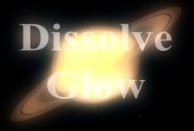

## S_DissolveGlow

Transitions between two input clips using a bright glowing flash.
The clips dissolve into each other, while each one gets a glow which
ramps up and down over the duration of the effect.
The Dissolve Percent parameter should be animated
to control the transition speed.

In the Sapphire Transitions effects submenu.

### Inputs:

- **Foreground**: The current layer. Starts the transition with this clip.

- **Background**: Defaults to None. Ends the transition with this clip.

### Parameters:

- **Load Preset** (Push-button)
  Brings up the Preset Browser to browse all available presets for this effect.

- **Save Preset** (Push-button)
  Brings up the Preset Save dialog to save a preset for this effect.

- **Transition Dir** (Popup menu, Default: Dissolve Off to Bg)
  Selects the direction of the transition.
  - **Dissolve Off to Bg**: transitions from the current layer to the Background.
  - **Dissolve On from Bg**: transitions from the Background to the current layer.

- **Auto Trans** (Popup YES-NO, Default: No)
  If enabled, a transition is performed automatically between the first and last frames of the layer. If this is off, the transition is performed manually by animating the Dissolve Percent parameter.

- **Dissolve Percent** (Default: 0, Range: 0 to 1)
  Auto Trans must be disabled for this parameter to be used. It determines the transition ratio between the Foreground and Background inputs, and would normally be animated from 0 to 100 to perform a complete transition. The curve controlling this parameter can be adjusted for more detailed control over the timing of the dissolve.

- **Dissolve Speed** (Default: 3, Range: 1 or greater)
  The speed of the dissolve between the From and To clips. When set to 1, the dissolve takes place over the entire duration of the effect. When set higher, the dissolve is shorter, although the glow ramp-up and ramp-down still takes the entire duration. Setting this to 10 can make the transition snappier and more like a flash-frame cut.

- **Glow Brightness** (Default: 6, Range: 0 or greater)
  Overall maximum brightness of the glow.

- **Glow Threshold** (Default: 0.2, Range: 0 or greater)
  Parts of the source clip that are brighter than this value get glowed. A value of 0.9 makes only the brightest spots glow. A value of 0 makes every non-black area glow.

- **Glow Color** (Default rgb: [1 1 1])
  Overall color of the glow.

- **Glow Width** (Default: 0.4, Range: 0 or greater)
  The width of the glow. This and all the width parameters can be adjusted with the Width widget. Note that a zero glow width still enhances the bright areas; set the glow brightness parameter to zero if you want to pass the sources through unchanged.

- **Width X** (Default: 1, Range: 0 or greater)
  Scales the horizontal glow width. Set to 0 for vertical only.

- **Width Y** (Default: 1, Range: 0 or greater)
  Scales the vertical glow width. Set to 0 for horizontal only.

- **Width Red** (Default: 1, Range: 0 or greater)
  Scales the red glow width. If the red, green, and blue widths are equal, the glows will match the color of the source clip. If they are not equal, the glows will vary in color with distance.

- **Width Green** (Default: 1.2, Range: 0 or greater)
  Scales the green glow width.

- **Width Blue** (Default: 1.4, Range: 0 or greater)
  Scales the blue glow width.

- **Rel From Brightness** (Default: 1, Range: 0 or greater)
  Relative brightness of the glow on the outgoing (From) clip.

- **Rel From Width** (Default: 1, Range: 0 or greater)
  Relative width of the glow on the outgoing (From) clip.

- **From Offset Threshold** (Default: 0, Range: any)
  Extra threshold to apply to the glow on the outgoing (From) clip.

- **Rel From Color** (Default rgb: [1 1 1])
  Relative color of the glow on the outgoing (From) clip.

- **Rel To Brightness** (Default: 1, Range: 0 or greater)
  Relative brightness of the glow on the incoming (To) clip.

- **Rel To Width** (Default: 1, Range: 0 or greater)
  Relative brightness of the glow on the incoming (To) clip.

- **To Offset Threshold** (Default: 0, Range: any)
  Extra threshold to apply to the glow on the incoming (To) clip.

- **Rel To Color** (Default rgb: [1 1 1])
  Relative color of the glow on the incoming (To) clip.

- **Opacity** (Popup menu, Default: Normal)
  Determines the method used for dealing with opacity/transparency.
  - **All Opaque**: Use this option to render slightly faster when
the input image is fully opaque with no transparency (alpha=1).
  - **Normal**: Process opacity normally.
  - **As Premult**: Process as if the image is already in
premultiplied form (colors have been scaled by opacity). This option
also renders slightly faster than Normal mode, but the results will
also be in premultiplied form, which is sometimes less correct.

- **Show Glow Width** (Check-box, Default: on)
  Turns on or off the screen user interface for adjusting the Glow Width parameter.This parameter only appears on AE and Premiere, where on-screen widgets are supported.

