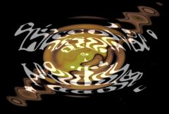

## S_DissolvePuddle

Transitions between two input clips while warping
by a circular pattern of waves. The first clip is warped away and
faded out while the second clip is unwarped into place and faded in. The Dissolve
Percent parameter should be animated to control the transition speed.

In the Sapphire Transitions effects submenu.

### Inputs:

- **Foreground**: The current layer. Starts the transition with this clip.

- **Background**: Defaults to None. Ends the transition with this clip. If this input is not provided, a fully transparent background is used, showing whatever is behind it. Note that the background can not be warped during the transition unless this input is provided.

### Parameters:

- **Load Preset** (Push-button)
  Brings up the Preset Browser to browse all available presets for this effect.

- **Save Preset** (Push-button)
  Brings up the Preset Save dialog to save a preset for this effect.

- **Transition Dir** (Popup menu, Default: Dissolve Off to Bg)
  Selects the direction of the transition.
  - **Dissolve Off to Bg**: transitions from the current layer to the Background.
  - **Dissolve On from Bg**: transitions from the Background to the current layer.

- **Auto Trans** (Popup YES-NO, Default: No)
  If enabled, a transition is performed automatically between the first and last frames of the layer. If this is off, the transition is performed manually by animating the Dissolve Percent parameter.

- **Dissolve Percent** (Default: 0, Range: 0 to 1)
  Auto Trans must be disabled for this parameter to be used. It determines the transition ratio between the Foreground and Background inputs, and would normally be animated from 0 to 100 to perform a complete transition. The curve controlling this parameter can be adjusted for more detailed control over the timing of the dissolve. The Slow In and Slow Out parameters, if positive, also adjust the transition ratio internally for a smoother start and/or end to the transition.

- **Center** (X & Y, Default: [0 0], Range: any)
  The location of the puddle center in screen coordinates relative to the center of the frame. This parameter can be set by enabling and moving the Center Widget. Note that moving the puddle center can also cause the puddle size to change so that the current value of Wipe Amt remains correct.

- **Frequency** (Default: 5, Range: 0.01 or greater)
  The frequency of the puddle pattern. Increase for more and smaller elements, or decrease for fewer and larger.

- **Rel Height** (Default: 0.75, Range: 0.01 or greater)
  The relative height of the concentric wave pattern.

- **Amplitude** (Default: 0.2, Range: any)
  Scales the amount of warping distortion.

- **Rel Amp2** (Default: -1, Range: any)
  The relative amplitude of the second input clip warping distortion. If this is positive instead of negative, the clip will be unwarped from the opposite direction.

- **Rotate Puddle** (Default: 0, Range: any)
  Rotates the puddle pattern by this many degrees after the Rel Height stretching has been applied. This has no effect when Rel Height is 1.

- **Phase Start** (Default: 0, Range: any)
  The phase shift of the waves.

- **Phase Speed** (Default: 1, Range: any)
  The speed of the waves. If this is positive the waves automatically travel outwards from the center at this rate.

- **Inner Radius** (Default: 0, Range: any)
  The distance from the puddle center where the wave distortion is phased in. No waves are generated inside this radius.

- **Inner Softness** (Default: 0.1, Range: 0.0056 or greater)
  The width of the region at the Inner Radius over which the wave distortion is phased in.

- **Outer Radius** (Default: 1.4, Range: 0 or greater)
  The distance from the puddle center where the wave distortion is phased out. No waves are generated outside this radius.

- **Outer Softness** (Default: 0.42, Range: 0.0056 or greater)
  The width of the region at the Outer Radius over which the wave distortion is phased out.

- **Slow In** (Default: 0.2, Range: 0 to 1)
  If positive, causes the transition to start more gradually.

- **Slow Out** (Default: 0.2, Range: 0 to 1)
  If positive, causes the transition to end more gradually.

- **Wrap** (X & Y, Popup menu, Default: [ Reflect Reflect ])
  Determines the method for accessing outside the borders of the source images.
  - **No**: gives black beyond the borders.
  - **Tile**: repeats a copy of the image.
  - **Reflect**: repeats a mirrored copy. Edges are often less
visible with this method.

- **Filter** (Check-box, Default: on)
  If enabled, the image is adaptively filtered when it is resampled. This gives a better quality result when parts of the image are warped smaller.

- **Opacity** (Popup menu, Default: Normal)
  Determines the method used for dealing with opacity/transparency.
  - **All Opaque**: Use this option to render slightly faster when
the input image is fully opaque with no transparency (alpha=1).
  - **Normal**: Process opacity normally.
  - **As Premult**: Process as if the image is already in
premultiplied form (colors have been scaled by opacity). This option
also renders slightly faster than Normal mode, but the results will
also be in premultiplied form, which is sometimes less correct.
If your image has sharp color changes where the matte
channel also has sharp edges, you may get better results with Normal
mode.

- **Crop Input Parameters** (Default: 0, Range: 0 or greater)
  These 4 parameters, Crop Top , Crop Bottom , Crop Left, and Crop Right , allow selecting a rectangular subsection of the input image to be processed. If the Wrap parameters are set to "No" the exposed borders will be transparent. If the Wrap is "Tile" or "Reflect" the source image is wrapped on the new cropped borders to fill the frame. This can make it easier to avoid artifacts due to distorting an image with bad edges.

- **Show Outer Radius** (Check-box, Default: on)
  Turns on or off the screen user interface for adjusting the Center parameter.This parameter only appears on AE and Premiere, where on-screen widgets are supported.

- **Show Inner Radius** (Check-box, Default: on)
  Turns on or off the screen interface parameter for adjusting the Inner Radius. The value of the Inner Radius parameter must first be positive for this widget to be visible.This parameter only appears on AE and Premiere, where on-screen widgets are supported.

- **Show Center** (Check-box, Default: on)
  Turns on or off the screen user interface for adjusting the Center parameter.This parameter only appears on AE and Premiere, where on-screen widgets are supported.

- **Show Rotate Puddle** (Check-box, Default: on)
  Turns on or off the screen user interface for adjusting the Center parameter.This parameter only appears on AE and Premiere, where on-screen widgets are supported.

- **Show Frequency** (Check-box, Default: on)
  Turns on or off the screen user interface for adjusting the Center parameter.This parameter only appears on AE and Premiere, where on-screen widgets are supported.

