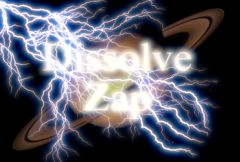

## S_DissolveZap

Transition between two clips using animated lightning bolts. The clips dissolve
into each other, while the lightning grows. The Dissolve Percent parameter should be
animated to control the transition speed.

In the Sapphire Transitions effects submenu.

### Inputs:

- **Foreground**: The current layer. Starts the transition with this clip.

- **Background**: Defaults to None. The clip to combine the dissolves with. If no background is given, the Source is also used as the Background.

### Parameters:

- **Load Preset** (Push-button)
  Brings up the Preset Browser to browse all available presets for this effect.

- **Save Preset** (Push-button)
  Brings up the Preset Save dialog to save a preset for this effect.

- **Transition Dir** (Popup menu, Default: Dissolve Off to Bg)
  Selects the direction of the transition.
  - **Dissolve Off to Bg**: transitions from the current layer to the Background.
  - **Dissolve On from Bg**: transitions from the Background to the current layer.

- **Auto Trans** (Popup YES-NO, Default: No)
  If enabled, a transition is performed automatically between the first and last frames of the layer. If this is off, the transition is performed manually by animating the Dissolve Percent parameter.

- **Dissolve Percent** (Default: 0, Range: 0 to 1)
  Auto Trans must be disabled for this parameter to be used. It determines the transition ratio between the Foreground and Background inputs, and would normally be animated from 0 to 100 to perform a complete transition. The curve controlling this parameter can be adjusted for more detailed control over the timing of the dissolve.

- **Dissolve Speed** (Default: 5, Range: 1 or greater)
  The speed of the dissolve between the From and To clips. When set to 1, the dissolve takes place over the entire duration of the effect. When set higher, the dissolve is shorter, although the lightning bolts still change size and brightness over the entire duration. Setting this to 10 can make the transition snappier and more like a flash-frame cut.

- **Max Bolts** (Integer, Default: 35, Range: 1 to 500)
  The maximum number of lightning bolts at the midpoint of the transition.

- **Start** (X & Y, Default: [0 0], Range: any)
  The starting point of the bolts.

- **End** (X & Y, Default: [0 0], Range: any)
  The end point of the bolts. This parameter can be adjusted using the End Widget.

- **Vary Endpoint** (Default: 1.4, Range: 0 or greater)
  Offsets the End location by a random amount within a circle of this radius. If Max Bolts is greater than 1, this can be useful to spread out the different End points.

- **Bolt Width** (Default: 0.112, Range: 0 or greater)
  The width of the lightning bolts.

- **Branchiness** (Default: 5, Range: 0 to 20)
  Scales the number of additional bolts that branch from the main bolt. Set this to 0 for basic bolts with no extra branches.

- **Zap Bright** (Default: 1, Range: 0 or greater)
  Scales the brightness of the lightning bolts.

- **Zap Color** (Default rgb: [1 1 1])
  The color of the lightning. If you want to keep the lightning bolt itself bright white, you can still affect the perceived color by adjusting the Glow Color instead.

- **Zap Glow Bright** (Default: 2, Range: 0 or greater)
  Scales the brightness of the glow applied to the lightning.

- **Zap Glow Color** (Default rgb: [0.5 0.5 1])
  The color of the glow applied to the lightning.

- **Zap Glow Width** (Default: 0.224, Range: 0 or greater)
  The width of the glow applied to the lightning.

- **Bg Glow Bright** (Default: 8, Range: 0 or greater)
  Scales the brightness of the background glow at the midpoint of the transition.

- **Bg Glow Color** (Default rgb: [1 1 1])
  Scales of the color of the background glow at the midpoint of the transition. The colors and brighness of the glow is also affected by the inputs.

- **Bg Glow Width** (Default: 0.4, Range: 0 or greater)
  Scales the background glow distance at the midpoint of the transition. Note that a zero glow width still enhances bright areas; set the brightness parameter to zero if you want no background glow.

- **Start Offset** (Default: 0, Range: 0 or greater)
  The offset from the start point to begin drawing the bolts. This can be useful for animating a lightning strike.

- **Length** (Default: 1, Range: 0 or greater)
  The length of the bolts, beginning at Start Offset. If less than 1, the bolts will not be drawn all the way from start to end. This can be useful for animating a lightning strike.

- **Rand Seed** (Default: 0, Range: 0 or greater)
  Used to initialize the random number generator. The actual seed value is not significant, but different seeds give different random lightning bolts, and the same value should give a repeatable result.

- **Affect Alpha** (Default: 1, Range: 0 or greater)
  If this value is positive the output Alpha channel will include some opacity from the lightning and its glow. The maximum of the red, green, and blue brightness is scaled by this value and combined with the background Alpha at each pixel.

- **Show Start** (Check-box, Default: on)
  Turns on or off the screen user interface for adjusting the Start parameter.This parameter only appears on AE and Premiere, where on-screen widgets are supported.

- **Show Vary Endpoint** (Check-box, Default: on)
  Turns on or off the screen user interface for adjusting the End parameter.This parameter only appears on AE and Premiere, where on-screen widgets are supported.

