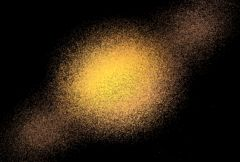

## S_Diffuse

Scrambles the pixels of the source input within an area determined by the
Diffuse Amount. Use the Blur Rel X and Y parameters for a more horizontal
or vertical diffuse direction. The pixelated look of this effect depends
on the image resolution, so it is recommended to test your final resolution
before processing.

In the Sapphire Stylize effects submenu.

### Inputs:

- **Source**: The current layer. The clip to be processed.

- **Matte**: Defaults to None. If provided, this determines which areas of the image receive diffusing pixels. Gray values internally scale the Diffuse Amount parameter rather than simply cross-fading between the effect and the original source. This can allow more continuous results at the matte edges and more detailed control over the diffusion amounts. This input can be affected using the Blur Matte, Invert Matte, or Matte Use parameters.

### Parameters:

- **Load Preset** (Push-button)
  Brings up the Preset Browser to browse all available presets for this effect.

- **Save Preset** (Push-button)
  Brings up the Preset Save dialog to save a preset for this effect.

- **Mocha Project** (Default: 0, Range: 0 or greater)
  Brings up the Mocha window for tracking footage and generating masks.

- **Blur Mocha** (Default: 0, Range: 0 or greater)
  Blurs the Mocha Mask by this amount before using. This can be used to soften the edges or quantization artifacts of the mask, and smooth out the time displacements.

- **Mocha Opacity** (Default: 1, Range: 0 to 1)
  Controls the strength of the Mocha mask. Lower values reduce the intensity of the effect.

- **Invert Mocha** (Check-box, Default: off)
  If enabled, the black and white of the Mocha Mask are inverted before applying the effect.

- **Resize Mocha** (Default: 1, Range: 0 to 2)
  Scales the Mocha Mask. 1.0 is the original size.

- **Resize Rel X** (Default: 1, Range: 0 to 2)
  The relative horizontal size of the Mocha Mask.

- **Resize Rel Y** (Default: 1, Range: 0 to 2)
  The relative vertical size of the Mocha Mask.

- **Shift Mocha** (X & Y, Default: [0 0], Range: any)
  Offsets the position of the Mocha Mask.

- **Dilate Mocha** (Default: 0, Range: -100 to 100)
  Dilates or erodes the Mocha Mask by this pixel amount before using.

- **Dilation Quality** (Popup menu, Default: Fast)
  Selects whether Dilate Mocha adusts quickly in default Fast mode or looks better in High quality mode.
  - **Fast**: Dilate Mocha in Fast mode for quick adjustments.
  - **High**: Dilate Mocha in High quality mode for a better looking mask shape.

- **Bypass Mocha** (Check-box, Default: off)
  Ignore the Mocha Mask and apply the effect to the entire source clip.

- **Show Mocha Only** (Check-box, Default: off)
  Bypass the effect and show the Mocha Mask itself.

- **Combine Masks** (Popup menu, Default: Union)
  Determines how to combine the Mocha Mask and Input Mask when both are supplied to the effect.
  - **Union**: Uses the area covered by both masks together.
  - **Intersect**: Uses the area that overlaps between the two masks.
  - **Mocha Only**: Ignore the Input Mask and only use the
Mocha Mask.

- **Diffuse Amount** (Default: 0.2, Range: 0 or greater)
  The amplitude of the pixel diffusion process. This parameter can be adjusted using the Diffuse Amount Widget.

- **Rel Amount** (X & Y, Default: [1 1], Range: 0 or greater)
  Scales the relative horizontal and vertical amounts of diffusion. This parameter can be adjusted using the Diffuse Amount Widget.

- **Wrap** (X & Y, Popup menu, Default: [ Reflect Reflect ])
  Determines the method for accessing outside the borders of the source image.
  - **No**: gives black beyond the borders.
  - **Tile**: repeats a copy of the image.
  - **Reflect**: repeats a mirrored copy. Edges are often less
visible with this method.

- **Blur Matte** (Default: 0, Range: 0 or greater)
  Blurs the Matte input by this amount before using. This can provide a smoother transition between the matted and unmatted areas. It has no effect unless the Matte input is provided.

- **Invert Matte** (Check-box, Default: off)
  If on, inverts the Matte input so the effect is applied to areas where the Matte is black instead of white. This has no effect unless the Matte input is provided.

- **Matte Use** (Popup menu, Default: Luma)
  Determines how the Matte input channels are used to make a monochrome matte.
  - **Luma**: the luminance of the RGB channels is used.
  - **Alpha**: only the Alpha channel is used.

- **Crop Input Parameters** (Default: 0, Range: 0 or greater)
  These 4 parameters, Crop Top , Crop Bottom , Crop Left, and Crop Right , allow selecting a rectangular subsection of the input image to be processed. If the Wrap parameters are set to "No" the exposed borders will be transparent. If the Wrap is "Tile" or "Reflect" the source image is wrapped on the new cropped borders to fill the frame. This can make it easier to avoid artifacts due to distorting an image with bad edges.

- **Show Diffuse Amount** (Check-box, Default: on)
  Turns on or off the screen user interface for adjusting the Diffuse Amount parameter.This parameter only appears on AE and Premiere, where on-screen widgets are supported.

