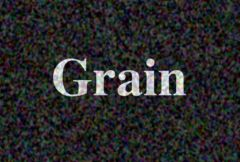

## S_Grain

Adds color and/or monochrome grain to the source clip. Amplitude and
frequency parameters allow adjusting the grain texture independently for
all colors together, each color channel, or black and white grain.

In the Sapphire Stylize effects submenu.

### Inputs:

- **Source**: The current layer. The clip to be processed.

- **Mask**: Defaults to None. Interpolate between the result and the Source input. White areas use the result of the effect. Black areas use the Source clip.

### Parameters:

- **Load Preset** (Push-button)
  Brings up the Preset Browser to browse all available presets for this effect.

- **Save Preset** (Push-button)
  Brings up the Preset Save dialog to save a preset for this effect.

- **Mocha Project** (Default: 0, Range: 0 or greater)
  Brings up the Mocha window for tracking footage and generating masks.

- **Blur Mocha** (Default: 0, Range: 0 or greater)
  Blurs the Mocha Mask by this amount before using. This can be used to soften the edges or quantization artifacts of the mask, and smooth out the time displacements.

- **Mocha Opacity** (Default: 1, Range: 0 to 1)
  Controls the strength of the Mocha mask. Lower values reduce the intensity of the effect.

- **Invert Mocha** (Check-box, Default: off)
  If enabled, the black and white of the Mocha Mask are inverted before applying the effect.

- **Resize Mocha** (Default: 1, Range: 0 to 2)
  Scales the Mocha Mask. 1.0 is the original size.

- **Resize Rel X** (Default: 1, Range: 0 to 2)
  The relative horizontal size of the Mocha Mask.

- **Resize Rel Y** (Default: 1, Range: 0 to 2)
  The relative vertical size of the Mocha Mask.

- **Shift Mocha** (X & Y, Default: [0 0], Range: any)
  Offsets the position of the Mocha Mask.

- **Dilate Mocha** (Default: 0, Range: -100 to 100)
  Dilates or erodes the Mocha Mask by this pixel amount before using.

- **Dilation Quality** (Popup menu, Default: Fast)
  Selects whether Dilate Mocha adusts quickly in default Fast mode or looks better in High quality mode.
  - **Fast**: Dilate Mocha in Fast mode for quick adjustments.
  - **High**: Dilate Mocha in High quality mode for a better looking mask shape.

- **Bypass Mocha** (Check-box, Default: off)
  Ignore the Mocha Mask and apply the effect to the entire source clip.

- **Show Mocha Only** (Check-box, Default: off)
  Bypass the effect and show the Mocha Mask itself.

- **Combine Masks** (Popup menu, Default: Union)
  Determines how to combine the Mocha Mask and Input Mask when both are supplied to the effect.
  - **Union**: Uses the area covered by both masks together.
  - **Intersect**: Uses the area that overlaps between the two masks.
  - **Mocha Only**: Ignore the Input Mask and only use the
Mocha Mask.

- **Color Scale** (Default rgb: [1 1 1])
  Scales the color of the grain by this value. The grain will include both positive and negative values of this color.

- **Color Amplitude** (Default: 0.1, Range: 0 or greater)
  The amplitude of color grain to include.

- **Color Frequency** (Default: 100, Range: 0.1 or greater)
  The frequency of the color grain. Increase for finer color grain, decrease for coarser color grain.

- **Red Freq** (Default: 1, Range: 0.01 or greater)
  The relative frequency of the red channel grain.

- **Green Freq** (Default: 1, Range: 0.01 or greater)
  The relative frequency of the green channel grain.

- **Blue Freq** (Default: 1, Range: 0.01 or greater)
  The relative frequency of the blue channel grain.

- **Color Octaves** (Integer, Default: 1, Range: 1 to 10)
  The number of octaves of color grain to include. Each octave is twice the frequency and half the amplitude of the previous.

- **Bw Amplitude** (Default: 0, Range: 0 or greater)
  The amplitude of black and white grain to include.

- **Bw Frequency** (Default: 100, Range: 0.1 or greater)
  The frequency of the black and white grain. Increase for finer grain, decrease for coarser grain.

- **Bw Octaves** (Integer, Default: 1, Range: 1 to 10)
  The number of octaves of black and white grain to include. Each octave is twice the frequency and half the amplitude of the previous.

- **Seed** (Default: 0.123, Range: 0 or greater)
  Used to initialize the random number generator. The actual seed value is not significant, but different seeds give different results and the same value should give a repeatable result.

- **Jitter Frames** (Integer, Default: 1, Range: 0 or greater)
  If this is 0, the noise texture will remain the same for every frame processed. If it is 1, a new noise texture is used for each frame. If it is 2, a new noise texture is used for every other frame, and so on.

- **Mask Use** (Popup menu, Default: Luma)
  Determines how the Mask input channels are used to make a monochrome mask.
  - **Luma**: the luminance of the RGB channels is used.
  - **Alpha**: only the Alpha channel is used.

- **Blur Mask** (Default: 0.05, Range: 0 or greater)
  Blurs the Matte input by this amount before using. This can provide a smoother transition between the matted and unmatted areas. It has no effect unless the Matte input is provided.

- **Invert Mask** (Check-box, Default: off)
  If on, inverts the Matte input so the effect is applied to areas where the Matte is black instead of white. This has no effect unless the Matte input is provided.

