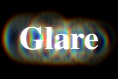

## S_Glare

Composites rainbow halos and/or glint-like rays at locations where the Source
clip is brighter than the threshold.
Lower the threshold parameter to produce glares in more areas.
Use the Style menu to select different glare types.
Set the Glare Res parameter to 1/2 for faster rendering with slightly softer glares.
Use the Convolve option for smoother results.
Glares are best observed on dark images with a few bright spots.

In the Sapphire Lighting effects submenu.

### Inputs:

- **Source**: The current layer. The input clip that determines the glare locations and colors.

- **Background**: Defaults to None. The clip to combine the glares with. If no background is given, the Source is also used as the Background.

- **Matte**: Defaults to None. If provided, the source glare colors are scaled by this input. A monochrome matte can be used to choose a subset of Source areas that will generate glares. A color matte can be used to selectively adjust the glare colors in different regions. The matte is applied to the source before the glares are generated so it will not clip the resulting glares.

### Parameters:

- **Load Preset** (Push-button)
  Brings up the Preset Browser to browse all available presets for this effect.

- **Save Preset** (Push-button)
  Brings up the Preset Save dialog to save a preset for this effect.

- **Mocha Project** (Default: 0, Range: 0 or greater)
  Brings up the Mocha window for tracking footage and generating masks.

- **Blur Mocha** (Default: 0, Range: 0 or greater)
  Blurs the Mocha Mask by this amount before using. This can be used to soften the edges or quantization artifacts of the mask, and smooth out the time displacements.

- **Mocha Opacity** (Default: 1, Range: 0 to 1)
  Controls the strength of the Mocha mask. Lower values reduce the intensity of the effect.

- **Invert Mocha** (Check-box, Default: off)
  If enabled, the black and white of the Mocha Mask are inverted before applying the effect.

- **Resize Mocha** (Default: 1, Range: 0 to 2)
  Scales the Mocha Mask. 1.0 is the original size.

- **Resize Rel X** (Default: 1, Range: 0 to 2)
  The relative horizontal size of the Mocha Mask.

- **Resize Rel Y** (Default: 1, Range: 0 to 2)
  The relative vertical size of the Mocha Mask.

- **Shift Mocha** (X & Y, Default: [0 0], Range: any)
  Offsets the position of the Mocha Mask.

- **Dilate Mocha** (Default: 0, Range: -100 to 100)
  Dilates or erodes the Mocha Mask by this pixel amount before using.

- **Dilation Quality** (Popup menu, Default: Fast)
  Selects whether Dilate Mocha adusts quickly in default Fast mode or looks better in High quality mode.
  - **Fast**: Dilate Mocha in Fast mode for quick adjustments.
  - **High**: Dilate Mocha in High quality mode for a better looking mask shape.

- **Bypass Mocha** (Check-box, Default: off)
  Ignore the Mocha Mask and apply the effect to the entire source clip.

- **Show Mocha Only** (Check-box, Default: off)
  Bypass the effect and show the Mocha Mask itself.

- **Combine Masks** (Popup menu, Default: Union)
  Determines how to combine the Mocha Mask and Input Mask when both are supplied to the effect.
  - **Union**: Uses the area covered by both masks together.
  - **Intersect**: Uses the area that overlaps between the two masks.
  - **Mocha Only**: Ignore the Input Mask and only use the
Mocha Mask.

- **Style** (Default: 0, Range: 0 or greater)
  The style of glare to apply. Custom glare types can also be made, or existing types modified, by editing the "s_glares.text" file.

- **Convolve** (Check-box, Default: off)
  Determines the method for applying the glares to the Background.

- **Brightness** (Default: 1, Range: 0 or greater)
  Scales the brightness of all the glares.

- **Scale Colors** (Default rgb: [1 1 1])
  Scales the color of the glares. The colors and brightnesses of the glares are also affected by the Source and Matte inputs.

- **Saturation** (Default: 1, Range: -2 to 8)
  Scales the color saturation of the glare elements. Increase for more intense colors. Set to 0 for monochrome glares.

- **Hue Shift** (Default: 0, Range: -1 to 1)
  Shifts the hue of the glare, in revolutions from red to green to blue to red.

- **Threshold** (Default: 0.8, Range: 0 or greater)
  Glares are generated from locations in the source clip that are brighter than this value. A value of 0.9 causes glares at only the brightest spots. A value of 0 causes glares for every non-black area.

- **Threshold Add Color** (Default rgb: [0 0 0])
  This can be used to raise the threshold on a specific color and thereby reduce the glares generated on areas of the source clip containing that color.

- **Threshold Blur** (Default: 0.0896, Range: 0 or greater)
  Increase to smooth out the areas creating glares. This can be used to eliminate glares generated from small speckles or to simply soften the glares. Increasing this may put more highlights below the threshold and darken the resulting glares, but you can decrease the Threshold parameter to compensate.

- **Size** (Default: 0.8, Range: 0 or greater)
  Scales the size of the glares. This parameter can be adjusted using the Size Widget.

- **Rel Height** (Default: 1, Range: 0 or greater)
  Scales the vertical dimension of the glares, making them elliptical instead of circular.

- **Rotate** (Default: 0, Range: any)
  Rotates the ray elements of the glares, if any, in degrees.

- **Rays Num Scale** (Default: 1, Range: 0 or greater)
  Increases or decreases the number of rays.

- **Rays Length** (Default: 1, Range: 0 or greater)
  Adjusts the length of the rays without changing their thickness.

- **Rays Thickness** (Default: 1, Range: 0 or greater)
  Adjusts the thickness of the individual rays.

- **Blur Glare** (Default: 0, Range: 0 or greater)
  The glare is blurred by this amount before being combined with the background.

- **Glare Res** (Popup menu, Default: Full)
  Selects the resolution factor for the glares. Higher resolutions give sharper glares, lower resolutions give smoother glares and faster processing. This 'Res' factor only affects the glares: the background is still combined with the glares at full resolution.
  - **Full**: Full resolution is used.
  - **Half**: The glares are calculated at half resolution.
  - **Quarter**: The glares are calculated at quarter resolution.

- **Affect Alpha** (Default: 1, Range: 0 or greater)
  If this value is positive the output Alpha channel will include some opacity from the glares. The maximum of the red, green, and blue glare brightness is scaled by this value and combined with the background Alpha at each pixel.

- **Glare From Alpha** (Default: 0, Range: 0 to 1)
  Set to 1 to generate glares from the alpha channel of the source input instead of the RGB channels. In this case the glares will not pick up color from the source and will typically be brighter. Values between 0 and 1 interpolate between using the RGB and the Alpha.

- **Glare Under Source** (Default: 0, Range: 0 to 1)
  Set to 1 to composite the Source input over the glares.

- **Source Opacity** (Default: 1, Range: 0 to 1)
  Scales the opacity of the Source input when combined with the glares. This does not affect the generation of the glares themselves.

- **Bg Brightness** (Default: 1, Range: 0 or greater)
  Scales the brightness of the background. This parameter only has an effect if the background input is provided, and is visible due to a partially transparent Source image or a reduced Source Opacity parameter value.

- **Invert Matte** (Check-box, Default: off)
  If on, inverts the Matte input so the effect is applied to areas where the Matte is black instead of white. This has no effect unless the Matte input is provided.

- **Matte Type** (Popup menu, Default: Luma)
  This setting is ignored unless the Matte input is provided.
  - **Luma**: uses the luminance of the Matte input to scale the brightness of the glares.
  - **Color**: uses the RGB channels of the Matte input to scale the colors of the glares.
  - **Alpha**: uses the alpha channel of the Matte input to scale the brightness of the glares.

- **Expand Borders** (Check-box, Default: off)
  If enabled, transparent borders are added to the input image before processing. This allows the result to include soft edges beyond the original image size. When off, the effect only occurs within the frame and the result will retain an edge at the borders.

- **Opacity** (Popup menu, Default: Normal)
  Determines the method used for dealing with opacity/transparency.
  - **All Opaque**: Use this option to render slightly faster when
the input image is fully opaque with no transparency (alpha=1).
  - **Normal**: Process opacity normally.
  - **As Premult**: Process as if the image is already in
premultiplied form (colors have been scaled by opacity). This option
also renders slightly faster than Normal mode, but the results will
also be in premultiplied form, which is sometimes less correct.

- **Show Size** (Check-box, Default: on)
  Turns on or off the screen user interface widget for adjusting the Size and Rel Height parameters.This parameter only appears on AE and Premiere, where on-screen widgets are supported.

