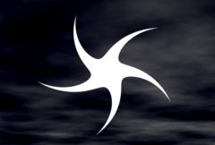

## S_Shape

Draws a shape into the image. It can give a wide
variety of shapes, from polygons and circles to stars, flower
shapes, and swirled starfish shapes.
The main parameters to look at are Points, Pointiness, Roundness, and Swirl.

In the Sapphire Render effects submenu.

### Inputs:

- **Background**: The current layer. The clip to use as background.

- **Mask**: Defaults to None. Interpolate between the result and the Source input. White areas use the result of the effect. Black areas use the Source clip.

### Parameters:

- **Load Preset** (Push-button)
  Brings up the Preset Browser to browse all available presets for this effect.

- **Save Preset** (Push-button)
  Brings up the Preset Save dialog to save a preset for this effect.

- **Mocha Project** (Default: 0, Range: 0 or greater)
  Brings up the Mocha window for tracking footage and generating masks.

- **Blur Mocha** (Default: 0, Range: 0 or greater)
  Blurs the Mocha Mask by this amount before using. This can be used to soften the edges or quantization artifacts of the mask, and smooth out the time displacements.

- **Mocha Opacity** (Default: 1, Range: 0 to 1)
  Controls the strength of the Mocha mask. Lower values reduce the intensity of the effect.

- **Invert Mocha** (Check-box, Default: off)
  If enabled, the black and white of the Mocha Mask are inverted before applying the effect.

- **Resize Mocha** (Default: 1, Range: 0 to 2)
  Scales the Mocha Mask. 1.0 is the original size.

- **Resize Rel X** (Default: 1, Range: 0 to 2)
  The relative horizontal size of the Mocha Mask.

- **Resize Rel Y** (Default: 1, Range: 0 to 2)
  The relative vertical size of the Mocha Mask.

- **Shift Mocha** (X & Y, Default: [0 0], Range: any)
  Offsets the position of the Mocha Mask.

- **Dilate Mocha** (Default: 0, Range: -100 to 100)
  Dilates or erodes the Mocha Mask by this pixel amount before using.

- **Dilation Quality** (Popup menu, Default: Fast)
  Selects whether Dilate Mocha adusts quickly in default Fast mode or looks better in High quality mode.
  - **Fast**: Dilate Mocha in Fast mode for quick adjustments.
  - **High**: Dilate Mocha in High quality mode for a better looking mask shape.

- **Bypass Mocha** (Check-box, Default: off)
  Ignore the Mocha Mask and apply the effect to the entire source clip.

- **Show Mocha Only** (Check-box, Default: off)
  Bypass the effect and show the Mocha Mask itself.

- **Combine Masks** (Popup menu, Default: Union)
  Determines how to combine the Mocha Mask and Input Mask when both are supplied to the effect.
  - **Union**: Uses the area covered by both masks together.
  - **Intersect**: Uses the area that overlaps between the two masks.
  - **Mocha Only**: Ignore the Input Mask and only use the
Mocha Mask.

- **Center** (X & Y, Default: [0 0], Range: any)
  The center point of the shape. This parameter can be adjusted using the Center Widget.

- **Size** (Default: 0.5, Range: 0 or greater)
  The overall size of the shape. This parameter can be adjusted using the Size Widget.

- **Rel Width** (Default: 1.4, Range: 0 or greater)
  Increase to make the shape wider.

- **Rel Height** (Default: 1, Range: 0 or greater)
  Increase to make the shape taller.

- **Points** (Integer, Default: 5, Range: 3 to 500)
  The number of points in the shape. Unless Pointiness is zero, the shape will have this many points around the edge.

- **Pointiness** (Default: 0, Range: any)
  How pointy the shape is. 0 gives a circle (as long as Roundness is 1); 1 gives a regular polygon. Greater than 1 gives starlike shapes, and less than zero gives flower-like shapes with outward-facing lobes.

- **Roundness** (Default: 1, Range: 0 to 1)
  How rounded the edges of the shape are between the points. 0 means straight lines, and 1 means smoothly curved. When Pointiness is 1, this has no effect.

- **Swirl** (Default: 0, Range: -5 to 5)
  Setting this to nonzero swirls the whole shape around; the outward edge is rotated more than the center to give a vortex-like appearance. Try it with large pointiness.

- **Rotate** (Default: 0, Range: any)
  Rotates the whole shape around its center. This parameter can be adjusted using the Rotate Widget.

- **Rotate Pre Scale** (Default: 0, Range: any)
  Rotates the figure around its center before the Rel Width and Rel Height are applied. You can use both rotations to get interesting effects.

- **Blur** (Default: 0, Range: 0 or greater)
  Blurs the whole shape.

- **Brightness1** (Default: 1, Range: 0 or greater)
  Scales the brightness of the shape.

- **Color1** (Default rgb: [1 1 1])
  The color of the shape.

- **Color0** (Default rgb: [0 0 0])
  The color of the background of the shape image.

- **Offset0** (Default: 0, Range: any)
  Adds this value to color0.

- **Bg Brightness** (Default: 1, Range: 0 or greater)
  Scales the brightness of the background before combining with the shapes. If 0, the result will contain only the shape image over black.

- **Combine** (Popup menu, Default: Over)
  Determines how the shape image is combined with the Background.
  - **Shape Only**: gives only the shape image with no Background.
  - **Mult**: the shape image is multiplied by the Background.
  - **Add**: the shape image is added to the Background.
  - **Screen**: the shape image is blended with the Background using a screen operation.
  - **Difference**: the result is the difference between the shape image and Background.
  - **Overlay**: the shape image is combined with the Background using an overlay function.
  - **Over**: composites the shape image over the background.

- **Opacity** (Popup menu, Default: Normal)
  Determines the method used for dealing with opacity/transparency.
  - **All Opaque**: Use this option to render slightly faster when
the input image is fully opaque with no transparency (alpha=1).
  - **Normal**: Process opacity normally.
  - **As Premult**: Process as if the image is already in
premultiplied form (colors have been scaled by opacity). This option
also renders slightly faster than Normal mode, but the results will
also be in premultiplied form, which is sometimes less correct.

- **Mask Use** (Popup menu, Default: Luma)
  Determines how the Mask input channels are used to make a monochrome mask.
  - **Luma**: the luminance of the RGB channels is used.
  - **Alpha**: only the Alpha channel is used.

- **Blur Mask** (Default: 0.05, Range: 0 or greater)
  Blurs the Matte input by this amount before using. This can provide a smoother transition between the matted and unmatted areas. It has no effect unless the Matte input is provided.

- **Invert Mask** (Check-box, Default: off)
  If on, inverts the Matte input so the effect is applied to areas where the Matte is black instead of white. This has no effect unless the Matte input is provided.

- **Show Size** (Check-box, Default: on)
  Turns on or off the screen user interface for adjusting the Center parameter.This parameter only appears on AE and Premiere, where on-screen widgets are supported.

- **Show Rotate** (Check-box, Default: on)
  Turns on or off the screen user interface for adjusting the Center parameter.This parameter only appears on AE and Premiere, where on-screen widgets are supported.

- **Show Center** (Check-box, Default: on)
  Turns on or off the screen user interface for adjusting the Center parameter.This parameter only appears on AE and Premiere, where on-screen widgets are supported.

