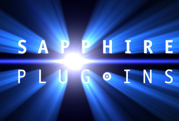

## Introduction to Sapphire Plug-ins for Adobe After Effects

Sapphire Plug-ins is a package of image processing and synthesis effects for use with Adobe After Effects and compatible products. It includes over 250 plug-ins, each with many options and parameters which can be adjusted and animated for an unlimited range of results.

Sapphire LensFlare Plug-ins for Adobe After Effects is a package of two LensFlare Plug-ins for use with Adobe After Effects and compatible products such as Premiere Pro.

This document corresponds to version 2026 of 17-nov-2025. For updated information please check [www.borisfx.com](http://www.borisfx.com). Also see our [support page](https://borisfx.com/support/) for help with technical issues.

- [List all effects with pictures](/en/sapphire/intro/picture-index)
- [List all effects by name](/en/sapphire/intro/name-index)
- [List all effects with a brief summary](/en/sapphire/intro/summary-index)
