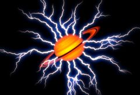

## S_ZapFrom

Generates multiple lightning bolts outwards from the
edges of objects in the FromObj input clip, and renders them over a
background input. Use the Show:Edges option to view the source edges
while adjusting the Threshold and Blur From Obj parameters.

In the Sapphire Render effects submenu.

### Inputs:

- **Background**: The current layer. The clip to use as background. If none is selected the main input (the current layer) is also used for the background.

- **FromObject**: Defaults to None. The edges of objects in this clip are extracted, and the lightning starts at points along these edges.

- **Matte**: Defaults to None. If provided, the lengths of the bolts in each area are scaled by this input. White areas generate normal bolts, gray areas generate shorter bolts, and black areas cause no bolts to be made.

### Parameters:

- **Load Preset** (Push-button)
  Brings up the Preset Browser to browse all available presets for this effect.

- **Save Preset** (Push-button)
  Brings up the Preset Save dialog to save a preset for this effect.

- **Mocha Project** (Default: 0, Range: 0 or greater)
  Brings up the Mocha window for tracking footage and generating masks.

- **Blur Mocha** (Default: 0, Range: 0 or greater)
  Blurs the Mocha Mask by this amount before using. This can be used to soften the edges or quantization artifacts of the mask, and smooth out the time displacements.

- **Mocha Opacity** (Default: 1, Range: 0 to 1)
  Controls the strength of the Mocha mask. Lower values reduce the intensity of the effect.

- **Invert Mocha** (Check-box, Default: off)
  If enabled, the black and white of the Mocha Mask are inverted before applying the effect.

- **Resize Mocha** (Default: 1, Range: 0 to 2)
  Scales the Mocha Mask. 1.0 is the original size.

- **Resize Rel X** (Default: 1, Range: 0 to 2)
  The relative horizontal size of the Mocha Mask.

- **Resize Rel Y** (Default: 1, Range: 0 to 2)
  The relative vertical size of the Mocha Mask.

- **Shift Mocha** (X & Y, Default: [0 0], Range: any)
  Offsets the position of the Mocha Mask.

- **Dilate Mocha** (Default: 0, Range: -100 to 100)
  Dilates or erodes the Mocha Mask by this pixel amount before using.

- **Dilation Quality** (Popup menu, Default: Fast)
  Selects whether Dilate Mocha adusts quickly in default Fast mode or looks better in High quality mode.
  - **Fast**: Dilate Mocha in Fast mode for quick adjustments.
  - **High**: Dilate Mocha in High quality mode for a better looking mask shape.

- **Bypass Mocha** (Check-box, Default: off)
  Ignore the Mocha Mask and apply the effect to the entire source clip.

- **Show Mocha Only** (Check-box, Default: off)
  Bypass the effect and show the Mocha Mask itself.

- **Combine Masks** (Popup menu, Default: Union)
  Determines how to combine the Mocha Mask and Input Mask when both are supplied to the effect.
  - **Union**: Uses the area covered by both masks together.
  - **Intersect**: Uses the area that overlaps between the two masks.
  - **Mocha Only**: Ignore the Input Mask and only use the
Mocha Mask.

- **Surface Bolts** (Integer, Default: 25, Range: 1 to 2000)
  The number of points along the edges to generate lightning bolts from. These surface bolts are divided up amongst the isolated shapes in the FromObject input, proportionally to the sizes of the shapes.

- **Threshold** (Default: 0.5, Range: 0 or greater)
  The value used to determine the edge locations. Objects darker than this value are ignored. On smooth objects, larger threshold values move the edges inwards to make smaller shapes, and smaller values move the edges outwards. You can use the Show Edges option to view the edge image directly while adjusting this parameter.

- **Blur FromObj** (Default: 0.088, Range: 0 or greater)
  Blurs the FromObject input clip before finding the edges. This can help remove noise, and reduce the number of separate shapes. You can use the Show Edges option to view the edge image directly while adjusting this parameter.

- **FromObj Use** (Popup menu, Default: Luma)
  Determines which channel of the FromObject input channels are used.
  - **Luma**: the luminance of the RGB channels is used.
  - **Alpha**: only the Alpha channel is used.

- **Show** (Popup menu, Default: Result)
  Selects the output option.
  - **Result**: shows the normal lightning result over the background.
  - **Edges**: shows the edge image. This can be useful to view
while adjusting the Threshold and Blur From Obj parameters.

- **Max Length** (Default: 0.2, Range: 0 or greater)
  Scales the length of the bolts.

- **Vary Length** (Default: 0.5, Range: 0 to 1)
  The amount to randomly vary the length of each bolt. A value of 0 makes all bolt lengths equal to Max Length, and a value of 1 makes bolt lengths between zero and Max Length.

- **Vary Spacing** (Default: 0.5, Range: 0 or greater)
  The amount to randomly vary the starting point of each bolt along the edges. A value of 0 makes the bolts regularly spaced, and value of 1 make the bolts randomly spaced.

- **Bolt Width** (Default: 0.07, Range: 0 or greater)
  The width of the lightning bolts.

- **Vary Width** (Default: 0, Range: 0 to 1)
  The amount of random variation in the width of the bolts along their lengths.

- **End Pointiness** (Default: 1, Range: 0 to 1)
  Determines how pointed the end of the bolts are. If 0, the entire bolt will have equal width. If 1, the bolts will thin out along their entire length for a pointed end. If it is .5, the bolts will start thinning out half way between the start and end points.

- **Wiggle Start** (Default: 0, Range: 0 or greater)
  By default the bolts automatically wiggle over time. This parameter provides a starting offset for these bolt perturbations.

- **Wiggle Speed** (Default: 1, Range: 0 or greater)
  The speed at which the bolts are perturbed automatically over time. To animate changes in speed, set this to zero and animate the Wiggle Start parameter instead.

- **Jitter Frames** (Integer, Default: 0, Range: 0 or greater)
  If this is 0, the same random lightning will be used for every frame processed. If it is 1, different random lightning is used for each frame. If it is 2, new random lightning is used for every other frame, and so on.

- **Rand Seed** (Default: 0.123, Range: 0 or greater)
  Used to initialize the random number generator. The actual seed value is not significant, but different seeds give different random lightning bolts, and the same value should give a repeatable result.

- **Wrinkle Amp** (Default: 1, Range: 0 or greater)
  Scales the amount of wrinkles in the bolts. Decrease for straighter smoother bolts or increase for more kinky bolts.

- **Curve Amp** (Default: 0.5, Range: 0 or greater)
  Similar to Wrinkle Amp but affects the general path of the bolt. If decreased, the bolt will stay closer to the line between the Start and End points. If increased it can wander further away from this line. This differs from the Wrinkle Amp parameter in that it can be used to make straighter bolts while still keeping the wrinkles at the detailed level.

- **Branchiness** (Default: 1, Range: 0 to 10)
  Scales the number of additional bolts that branch from the main bolt. Set this to 0 for basic bolts with no extra branches.

- **Branch Angle** (Default: 65, Range: 0 to 180)
  The maximum angle of the random branches relative to the bolt they are branching off of. If this is 0 the branches will be more lined up with the main bolt. With larger values the branches will be more perpendicular to the main bolt.

- **Branch Length** (Default: 0.5, Range: 0 to 3)
  The scaled length of the branches relative to the distance between the Start and End points.

### Glow Parameters:

Glow Bright:
*Default:
*2,
*Range:
*0 or greater.Scales the brightness of the glow applied to the lightning.

Glow Color:
*Default rgb:
*[0.5 0.5 1].The color of the glow applied to the lightning.

Glow Width:
*Default:
*0.224,
*Range:
*0 or greater.The width of the glow applied to the lightning.

Glow Width Red:
*Default:
*0.5,
*Range:
*0 or greater.The relative red width of the glow.

Glow Width Grn:
*Default:
*1,
*Range:
*0 or greater.The relative green width of the glow.

Glow Width Blue:
*Default:
*1.5,
*Range:
*0 or greater.The relative blue width of the glow.

Affect Alpha:
*Default:
*1,
*Range:
*0 or greater.
If this value is positive the output Alpha channel will
include some opacity from the lightning and its glow. The maximum
of the red, green, and blue brightness is scaled by this value and
combined with the background Alpha at each pixel.

### Other Parameters:

Zap Bright:
*Default:
*1,
*Range:
*0 or greater.Scales the brightness of the lightning bolts.

Zap Color:
*Default rgb:
*[1 1 1].The color of the lightning. If you want to keep the
lightning bolt itself bright white, you can still affect the
perceived color by adjusting the Glow Color instead.

Start Offset:
*Default:
*0,
*Range:
*0 to 1.The offset from the start point to begin drawing the
bolts. This can be useful for animating a lightning strike.

Length:
*Default:
*1,
*Range:
*0 to 1.The length of the bolts, beginning at Start Offset. If
less than 1, the bolts will not be drawn all the way from start to end.
This can be useful for animating a lightning strike.

Bg Brightness:
*Default:
*1,
*Range:
*0 or greater.Scales the brightness of the background before
combining with the lightning. If 0, the result will contain only the
lightning image over black.

Combine:
*Popup menu, Default: Screen
*.Determines how the lightning and glow are combined with the Background.
*Screen:
*performs a blend function which can help prevent
overly bright results.*Add:
*causes the lightning to be added to the background. This gives
brighter glows over light backgrounds.*Zap Only:
*displays the lightning over black, ignoring the source image.

Blur Matte:
*Default:
*0,
*Range:
*0 or greater.Blurs the Matte input by this amount before using. This
can provide a smoother transition between the matted and unmatted
areas. It has no effect unless the Matte input is provided.

Invert Matte:
*Check-box, Default:
*off.If on, inverts the Matte input so the effect is applied
to areas where the Matte is black instead of white. This has no effect
unless the Matte input is provided.

Matte Use:
*Popup menu, Default: Luma
*.Determines how the Matte input channels are used to make
a monochrome matte.
*Luma:
*the luminance of the RGB channels is used.*Alpha:
*only the Alpha channel is used.

Atmosphere Amp:
*Default:
*0,
*Range:
*0 or greater.Atmosphere gives the effect of the zap shining through
a dusty atmosphere and picking up light or getting shadowed.
This parameter adjusts the amount, or amplitude, of the atmospheric
effect. Zero gives a smooth zap, higher values give more dusty look.

Atmosphere Freq:
*Default:
*2,
*Range:
*0.1 to 20.Controls the spatial frequency of the atmospheric
noise. Turn this up higher to get finer details, turn down for
broader overall variation.

Atmosphere Detail:
*Default:
*0.7,
*Range:
*0 to 1.Controls the amount of fine detail in the
atmosphere simulation. Decrease to get smoother atmosphere,
increase for a more crunchy or grainy look.

Atmosphere Seed:
*Default:
*0.123,
*Range:
*0 or greater.Used to initialize the random number generator for
the atmospheric noise. The actual seed value is not significant, but
different seeds give different results and the same value should
give a repeatable result.

Atmosphere Speed:
*Default:
*1,
*Range:
*any.The cloudy noise in the atmosphere evolves over
time like real dust clouds; this parameter controls how fast the
cloud pattern changes over time. Set to zero for a static pattern.

Opacity:
*Popup menu, Default: Normal
*.Determines the method used for dealing with
opacity/transparency.
*All Opaque:
*Use this option to render slightly faster when
the input image is fully opaque with no transparency (alpha=1).*Normal:
*Process opacity normally.*As Premult:
*Process as if the image is already in
premultiplied form (colors have been scaled by opacity). This option
also renders slightly faster than Normal mode, but the results will
also be in premultiplied form, which is sometimes less correct.
See general info for
[Motion Blur](/en/sapphire/#motion-blur)
