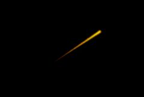

## S_LaserBeam

Simulates the beam from a science fiction style laser blaster. The beam moves over a number of
frames from a source point to a target point. A perspective effect may also be added.

In the Sapphire Render effects submenu.

### Inputs:

- **Background**: The current layer. The clip to use as background.

- **Mask**: Defaults to None. Interpolate between the result and the Source input. White areas use the result of the effect. Black areas use the Source clip.

### Parameters:

- **Load Preset** (Push-button)
  Brings up the Preset Browser to browse all available presets for this effect.

- **Save Preset** (Push-button)
  Brings up the Preset Save dialog to save a preset for this effect.

- **Mocha Project** (Default: 0, Range: 0 or greater)
  Brings up the Mocha window for tracking footage and generating masks.

- **Blur Mocha** (Default: 0, Range: 0 or greater)
  Blurs the Mocha Mask by this amount before using. This can be used to soften the edges or quantization artifacts of the mask, and smooth out the time displacements.

- **Mocha Opacity** (Default: 1, Range: 0 to 1)
  Controls the strength of the Mocha mask. Lower values reduce the intensity of the effect.

- **Invert Mocha** (Check-box, Default: off)
  If enabled, the black and white of the Mocha Mask are inverted before applying the effect.

- **Resize Mocha** (Default: 1, Range: 0 to 2)
  Scales the Mocha Mask. 1.0 is the original size.

- **Resize Rel X** (Default: 1, Range: 0 to 2)
  The relative horizontal size of the Mocha Mask.

- **Resize Rel Y** (Default: 1, Range: 0 to 2)
  The relative vertical size of the Mocha Mask.

- **Shift Mocha** (X & Y, Default: [0 0], Range: any)
  Offsets the position of the Mocha Mask.

- **Dilate Mocha** (Default: 0, Range: -100 to 100)
  Dilates or erodes the Mocha Mask by this pixel amount before using.

- **Dilation Quality** (Popup menu, Default: Fast)
  Selects whether Dilate Mocha adusts quickly in default Fast mode or looks better in High quality mode.
  - **Fast**: Dilate Mocha in Fast mode for quick adjustments.
  - **High**: Dilate Mocha in High quality mode for a better looking mask shape.

- **Bypass Mocha** (Check-box, Default: off)
  Ignore the Mocha Mask and apply the effect to the entire source clip.

- **Show Mocha Only** (Check-box, Default: off)
  Bypass the effect and show the Mocha Mask itself.

- **Combine Masks** (Popup menu, Default: Union)
  Determines how to combine the Mocha Mask and Input Mask when both are supplied to the effect.
  - **Union**: Uses the area covered by both masks together.
  - **Intersect**: Uses the area that overlaps between the two masks.
  - **Mocha Only**: Ignore the Input Mask and only use the
Mocha Mask.

- **Start** (X & Y, Default: [-0.444 -0.287], Range: any)
  Staring point for the beam. This parameter can be adjusted using the Start Widget.

- **Stop** (X & Y, Default: [0.111 0.33], Range: any)
  Target point for the beam. This parameter can be adjusted using the Stop Widget.

- **Shift** (X & Y, Default: [0 0], Range: any)
  Moves the Start and Stop points, shifting the whole beam to a different location. This parameter can be adjusted using the Shift Widget.

- **Position** (Default: 0.5, Range: 0 or greater)
  Where the drawn beam segment should appear along the beam trajectory. At 0, the drawn beam segment will not yet have emerged from the source point. NOTE: nothing will be drawn at this point! At 1, the drawn beam segment will have gone inside the target point. NOTE: again, nothing will be drawn. At values in between, the beam segment will appear along the beam trajectory. The beam position may be controlled manually by key framing this control, or its position can be controlled by the frame number using the time controls.

- **Length** (Default: 0.5, Range: 0.001 or greater)
  Length of the drawn beam segment.

- **Width** (Default: 0.01, Range: 0.001 or greater)
  Width of the drawn beam segment.

- **Core Color** (Default rgb: [1 1 0])
  Color at the center of the beam.

- **Edge Color** (Default rgb: [1 0 0])
  Color at the edge of the beam.

- **Color Balance** (Default: 0.5, Range: 0 to 1)
  Adjusts the balance between the core and edge colors.

- **Brightness** (Default: 1, Range: 0 or greater)
  Brightness of the beam.

- **Softness** (Default: 1, Range: 0 or greater)
  Softness of the texturing in the beam.

- **Fade Back** (Default: 0, Range: 0 or greater)
  Fades out the brightness of the back half of the beam. Setting this to 1 will fade to black at the very back of the beam. Higher values will fade out more quickly.

- **Fade Front** (Default: 0, Range: 0 or greater)
  Fades out the brightness of the front half of the beam. Setting this to 1 will fade to black at the very front of the beam. Higher values will fade out more quickly.

- **Start Time** (Default: 0, Range: 0 or greater)
  If using the time mode of operation, this is the time at which the beam will start out from the source.

- **Duration** (Default: 10, Range: 0 to 500)
  If using the time mode of operation, this is the duration of flight of the laser beam. After start time + duration the beam will disappear into the target.

- **Laser Shape** (Popup menu, Default: Forward)
  The shape of the drawn segment of the beam.
  - **Smooth**: The segment is drawn with a circular profile.
  - **Spear**: The segment is drawn as a symmetrical shape with sharpened ends.
  - **Forward**: The segment is drawn as an asymmetrical shape with the leading end wider than the trailing end.
  - **Backward**: The segment is drawn as an asymmetrical shape with the trailing end wider than the leading end.

- **Perspective** (Default: 0, Range: -1 to 1)
  The strength of the persepctive effect. At zero, there is no effect. Positive values move the bolt nearer to the target than it otherwise would be at a given beam position (or time), while negative values move it nearer to the source.

- **Use Time** (Check-box, Default: off)
  Control the motion of the beam segment automatically with frame number rather than manually with the position control.

- **Breakup** (Default: 0.05, Range: 0 to 1)
  As this increases, the drawn beam segment become more and more ragged.

- **Smooth** (Default: 0, Range: 0 or greater)
  Overall smoothing applied to the beam segment.

- **Atmosphere Amp** (Default: 0, Range: 0 or greater)
  Atmosphere gives the effect of the laser shining through a dusty atmosphere and picking up light or getting shadowed. This parameter adjusts the amount, or amplitude, of the atmospheric effect. Zero gives a smooth beam, higher values give more dusty look.

- **Atmosphere Freq** (Default: 4, Range: 0.1 to 20)
  Controls the spatial frequency of the atmospheric noise. Turn this up higher to get finer details, turn down for broader overall variation.

- **Atmosphere Detail** (Default: 0.8, Range: 0 to 1)
  Controls the amount of fine detail in the atmosphere simulation. Decrease to get smoother atmosphere, increase for a more crunchy or grainy look.

- **Atmosphere Seed** (Default: 0.123, Range: 0 or greater)
  Used to initialize the random number generator for the atmospheric noise. The actual seed value is not significant, but different seeds give different results and the same value should give a repeatable result.

- **Atmosphere Speed** (Default: 1, Range: any)
  The cloudy noise in the atmosphere evolves over time like real dust clouds; this parameter controls how fast the cloud pattern changes over time. Set to zero for a static pattern.

- **Affect Alpha** (Default: 1, Range: 0 or greater)
  If this value is positive the output Alpha channel will include some opacity from the laser beam. The maximum of the red, green, and blue laser beam brightness is scaled by this value and combined with the Background Alpha at each pixel.

- **Combine** (Popup menu, Default: Screen)
  Determines how the beam image is combined with the background.
  - **Screen**: blends the beam with the background, which can help prevent
overly bright results.
  - **Add**: causes the beam image to be added to the background.
  - **Beam Only**: shows the beam over a transparent black background.

- **Opacity** (Popup menu, Default: Normal)
  Determines the method used for dealing with opacity/transparency.
  - **All Opaque**: Use this option to render slightly faster when
the input image is fully opaque with no transparency (alpha=1).
  - **Normal**: Process opacity normally.
  - **As Premult**: Process as if the image is already in
premultiplied form (colors have been scaled by opacity). This option
also renders slightly faster than Normal mode, but the results will
also be in premultiplied form, which is sometimes less correct.

- **Mask Use** (Popup menu, Default: Luma)
  Determines how the Mask input channels are used to make a monochrome mask.
  - **Luma**: the luminance of the RGB channels is used.
  - **Alpha**: only the Alpha channel is used.

- **Blur Mask** (Default: 0.05, Range: 0 or greater)
  Blurs the Matte input by this amount before using. This can provide a smoother transition between the matted and unmatted areas. It has no effect unless the Matte input is provided.

- **Invert Mask** (Check-box, Default: off)
  If on, inverts the Matte input so the effect is applied to areas where the Matte is black instead of white. This has no effect unless the Matte input is provided.

- **Show Start** (Check-box, Default: on)
  Turns on or off the screen user interface for adjusting the Start parameter.This parameter only appears on AE and Premiere, where on-screen widgets are supported.

- **Show Stop** (Check-box, Default: on)
  Turns on or off the screen user interface for adjusting the Stop parameter.This parameter only appears on AE and Premiere, where on-screen widgets are supported.

- **Show Shift** (Check-box, Default: off)
  Turns on or off the screen user interface for adjusting the Shift parameter.This parameter only appears on AE and Premiere, where on-screen widgets are supported.

