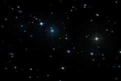

## S_NightSky

Generates a realistic starry night sky as viewed from a major city
or a specified longitude and latitude. The stars are generated using a
star database so that major constellations are visible where expected.
Adjust magnitude limit to see more stars. Animate the Minute param to
make the stars move realistically over time.

In the Sapphire Render effects submenu.

### Inputs:

- **Background**: The current layer. The clip to combine the nights with. If no background is given, the Source is also used as the Background.

- **Matte**: Defaults to None. Defines the area where stars should be rendered.

### Parameters:

- **Load Preset** (Push-button)
  Brings up the Preset Browser to browse all available presets for this effect.

- **Save Preset** (Push-button)
  Brings up the Preset Save dialog to save a preset for this effect.

- **Mode** (Popup menu, Default: Night Sky)
  Controls how the location is determined.
  - **Night Sky**: location is set by adjusting Latitude, Longitude, and GMT Offset parameters.
  - **Night Sky Locations**: location is set by choosing a city from the Location list.

- **Mocha Project** (Default: 0, Range: 0 or greater)
  Brings up the Mocha window for tracking footage and generating masks.

- **Blur Mocha** (Default: 0, Range: 0 or greater)
  Blurs the Mocha Mask by this amount before using. This can be used to soften the edges or quantization artifacts of the mask, and smooth out the time displacements.

- **Mocha Opacity** (Default: 1, Range: 0 to 1)
  Controls the strength of the Mocha mask. Lower values reduce the intensity of the effect.

- **Invert Mocha** (Check-box, Default: off)
  If enabled, the black and white of the Mocha Mask are inverted before applying the effect.

- **Resize Mocha** (Default: 1, Range: 0 to 2)
  Scales the Mocha Mask. 1.0 is the original size.

- **Resize Rel X** (Default: 1, Range: 0 to 2)
  The relative horizontal size of the Mocha Mask.

- **Resize Rel Y** (Default: 1, Range: 0 to 2)
  The relative vertical size of the Mocha Mask.

- **Shift Mocha** (X & Y, Default: [0 0], Range: any)
  Offsets the position of the Mocha Mask.

- **Dilate Mocha** (Default: 0, Range: -100 to 100)
  Dilates or erodes the Mocha Mask by this pixel amount before using.

- **Dilation Quality** (Popup menu, Default: Fast)
  Selects whether Dilate Mocha adusts quickly in default Fast mode or looks better in High quality mode.
  - **Fast**: Dilate Mocha in Fast mode for quick adjustments.
  - **High**: Dilate Mocha in High quality mode for a better looking mask shape.

- **Bypass Mocha** (Check-box, Default: off)
  Ignore the Mocha Mask and apply the effect to the entire source clip.

- **Show Mocha Only** (Check-box, Default: off)
  Bypass the effect and show the Mocha Mask itself.

- **Combine Masks** (Popup menu, Default: Union)
  Determines how to combine the Mocha Mask and Input Mask when both are supplied to the effect.
  - **Union**: Uses the area covered by both masks together.
  - **Intersect**: Uses the area that overlaps between the two masks.
  - **Mocha Only**: Ignore the Input Mask and only use the
Mocha Mask.

- **Latitude** (Default: 42.3, Range: -90 to 90)
  Latitude for specifying the location of the camera.

- **Longitude** (Default: -71.1, Range: -180 to 180)
  Longitude for specifying location of the camera.

- **GMT Offset** (Default: -5, Range: -12 to 12)
  Number of hours the specified time is offset from Coordinated Universal Time (UTC) or Greenwich Mean Time (GMT).

- **Location** (Popup menu, Default: Boston)
  Specifies which city to use to determine position on the Earth's surface. Available cities are scattered around each of the continents.
  - **Anchorage**: Anchorage, Alaska, United States, North America.
  - **Astana**: Astana, Kazakhstan, Asia.
  - **Beijing**: Beijing, China, Asia.
  - **Boston**: Boston, Massachusetts, United States, North America.
  - **Cairo**: Cairo, Egypt, Africa.
  - **Caracas**: Caracas, Venezuela, South America.
  - **Chicago**: Chicago, Illinois, United States, North America.
  - **Hong Kong**: Hong Kong, China, Asia.
  - **Istanbul**: Istanbul, Turkey, Asia/Europe.
  - **Johannesburg**: Johannesburg, South Africa, Africa.
  - **Lagos**: Lagos, Nigeria, Africa.
  - **Lima**: Lima, Peru, South America.
  - **London**: Longon, England, Europe.
  - **Los Angeles**: Los Angeles, California, United States, North America.
  - **Madrid**: Madrid, Spain, Europe.
  - **Mexico City**: Mexico City, Mexico, North America.
  - **Moscow**: Moscow, Russia, Europe.
  - **Mumbai**: Mumbai, India, Asia.
  - **Nairobi**: Nairobi, Kenya, Africa.
  - **New York City**: New York City, New York, United States, North America.
  - **Nuuk**: Nuuk, Greenland, North America.
  - **Perth**: Perth, Australia, Australia.
  - **Punta Arenas**: Punta Arenas, Chile, South America.
  - **Rio de Janeiro**: Rio de Janeiro, Brazil, South America.
  - **Central Siberia**: Siberia, Russia, Europe.
  - **Stockholm**: Stockholm, Sweeden, Europe.
  - **Sydney**: Sydney, Australia, Australia.
  - **Tokyo**: Tokyo, Japan, Asia.
  - **Vancouver**: Vancouver, Canada, North America.
  - **Yellowknife**: Yellowknife, Canada, North America.
  - **Warsaw**: Warsaw, Poland, Europe.

- **Star Size** (Default: 0.05, Range: 0 or greater)
  The size of magnitude zero stars in pixels.

- **Star Brightness** (Default: 1, Range: 0 or greater)
  The overall brightness of the stars.

- **Altitude** (Default: 30, Range: any)
  Camera rotation up and down. An altitude of 0 points out towards the horizon. 90 degrees points straight up. 180 looks backwards (and upside down).

- **Azimuth** (Default: -12, Range: any)
  Camera rotation left and right. An azimuth of zero points North and positive values rotate East (right).

- **Field Of View** (Default: 90, Range: 0.5 to 179)
  Camera field of view.

- **Year** (Integer, Default: 2.02e+03, Range: 1900 to 2295)
  Which year to use to look up star locations.

- **Month** (Integer, Default: 12, Range: 1 to 12)
  Which month to use to look up star locations.

- **Day** (Integer, Default: 1, Range: 1 to 31)
  Which day of the month to use to look up star locations.

- **Hour** (Integer, Default: 16, Range: 0 to 23)
  The hour portion of the time to use to look up star locations. This should be specified in military (24 hour) format.

- **Minute** (Default: 0, Range: any)
  The minute portion of the time to use to look up star locations. Animate this parameter if you want to animate the stars over a period of real world time.

- **Magnitude Limit** (Default: 6.5, Range: -2 to 10)
  This controls which stars are currently visible based on their apparent magnitude.Brighter stars have smaller magnitudes and dimmer stars have smaller magnitudes, opposite from what you might think. The brightest stars in the sky have magnitude 0 or even -1. With the naked eye you can see stars up to magnitude 5 or 6, but a backyard telescope can see much fainter stars, up to 12 or more.The larger Magnitude Limit, the more stars visible on screen. Increasing this parameter will add stars dimmer than the currently visible ones. Stars near the magnitude limit parameter value will fade so that this parameter can be animated.

- **Vary Size By Mag** (Default: 0.2, Range: 0 to 1)
  Make brighter stars larger and dimmer stars smaller so that brighter stars appear brighter and smaller stars appear dimmer. A value of zero will make all stars the same size while a value of 1 will approximate the apparent size differences naturally occuring in the sky. Magnitude 0 stars will remain the same size regardless of the value of this parameter. Negative magnitude stars (very bright stars) will grow with an increased parameter value. Positive magnitude stars (dim stars) will shrink with an increased parameter value.

- **Star Saturation** (Default: 1, Range: 0 or greater)
  Scales the color saturation of the star. Set to 0 for all white stars. Increase for more intense colors.

- **Glare** (Default: 0, Range: 0 or greater)
  The style of glare to apply. Custom glare types can also be made, or existing types modified, by editing the "s_glares.text" file.

- **Glare Brightness** (Default: 0.5, Range: 0 or greater)
  The overall brightness of the glares.

- **Glare Size** (Default: 0.12, Range: 0 or greater)
  Scales the size of the glares.

- **Rel Height** (Default: 1, Range: 0 or greater)
  Scales the vertical dimension of the glares, making them elliptical instead of circular.

- **Glare Color** (Default rgb: [1 1 1])
  Scales the color of the glares.

- **Glare Rotate** (Default: 0, Range: any)
  Rotates the ray elements of the glares, if any, in degrees.

- **Rays Length** (Default: 1, Range: 0 or greater)
  Adjusts the length of the rays without changing their thickness.

- **Glare Star Mag** (Default: 1.8, Range: -2 to 10)
  Specify which stars should be glared based on magnitude. Stars brighter than this (i.e. lower magnitude) will get glares.

- **Streak Length** (Default: 0.02, Range: 0 or greater)
  Length of streaks or rays radiating out from the brightest stars.

- **Streak Brightness** (Default: 0.1, Range: 0 or greater)
  Brightness of streaks radiating out from the brightest stars.

- **Streak Number** (Default: 8, Range: 0 to 8)
  Number of streaks radiating out from the brightest stars.

- **Streak Rotation** (Default: 0, Range: any)
  Rotation of the streaks emenating from the stars. A 0 value means that the first streak will be vertical from the star if Streak Symmetry is set to 1.

- **Streak Symmetry** (Default: 0.8, Range: 0 to 1)
  How symmetrically the rays are drawn. This affects both spacing and length.

- **Streak Star Mag** (Default: 3, Range: -2 to 10)
  Specify which stars should have streaks based on magnitude. Stars brighter than this (i.e. lower magnitude) will get streaks.

- **Twinkle Amount** (Default: 1, Range: 0 to 1)
  How dim stars should get when they twinkle. Twinkle is meant to simulate infrequent, intense changes in the brightness of a star (such as from a cloud passing in front of it).

- **Twinkle Frequency** (Default: 5, Range: 0.01 or greater)
  Frequency at which stars twinkle.

- **Twinkle Always** (Default: 0.3, Range: 0 to 1)
  What percentage of the time a star will twinkle on average. Set to 1 to twinkle constantly. Set to a smaller value to make the twinkle more intermittent.

- **Flicker Amount** (Default: 0.3, Range: 0 to 1)
  How dim stars should get when they flicker. Flicker is meant to simulate frequent, subtle changes in brightness, such as that caused by atmospheric distortion.

- **Flicker Frequency** (Default: 30, Range: 0.01 or greater)
  Frequency at which stars flicker.

- **Bg Brightness** (Default: 1, Range: 0 or greater)
  Scales the brightness of the background. This parameter only has an effect if the background input is provided, and is visible due to a partially transparent Source image or a reduced Source Opacity parameter value.

- **Combine** (Popup menu, Default: Screen)
  Determines how the stars are combined with the source image.
  - **Stars Only**: gives only the stars with no source.
  - **Mult**: the stars are multiplied by the source.
  - **Add**: the stars are added to the source.
  - **Screen**: the stars are blended with the source using a screen operation.
  - **Difference**: the result is the difference between the stars and source.
  - **Overlay**: the stars are combined with the source using an overlay function.

- **Blur Mask** (Default: 0, Range: 0 or greater)
  Blurs the Matte input by this amount before using. This can provide a smoother transition between the matted and unmatted areas. It has no effect unless the Matte input is provided.

- **Invert Mask** (Check-box, Default: off)
  If on, inverts the Matte input so the effect is applied to areas where the Matte is black instead of white. This has no effect unless the Matte input is provided.

- **Mask Type** (Popup menu, Default: Luma)
  This setting is ignored unless the Mask input is provided.
  - **Luma**: uses the luminance of the Mask input to scale the brightness of the lights.
  - **Color**: uses the RGB channels of the Mask input to scale the colors of the lgiths.
  - **Alpha**: uses the alpha channel of the Mask input to scale the
brightness of the lights.

- **Seed** (Default: 0.123, Range: 0 or greater)
  Used to initialize the random number generator. The actual seed value is not significant, but different seeds give different results and the same value should give a repeatable result.

- **Opacity** (Popup menu, Default: Normal)
  Determines the method used for dealing with opacity/transparency.
  - **All Opaque**: Use this option to render slightly faster when
the input image is fully opaque with no transparency (alpha=1).
  - **Normal**: Process opacity normally.
  - **As Premult**: Process as if the image is already in
premultiplied form (colors have been scaled by opacity). This option
also renders slightly faster than Normal mode, but the results will
also be in premultiplied form, which is sometimes less correct.

