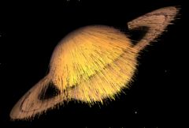

## S_PixelSort

Sorts pixels over a threshold along lines arranged in various patterns.
Patterns include parallel lines, lines radiating from a centeral point, and
circular lines.

In the Sapphire Stylize effects submenu.

### Inputs:

- **Source**: The current layer. The clip to be processed.

- **Matte**: Defaults to None. Defines the area that will be sorted.

### Parameters:

- **Load Preset** (Push-button)
  Brings up the Preset Browser to browse all available presets for this effect.

- **Save Preset** (Push-button)
  Brings up the Preset Save dialog to save a preset for this effect.

- **Mode** (Popup menu, Default: Linear)
  Selects between several sort patterns.
  - **Linear**: Sort pixels along parallel lines.
  - **Radial**: Sort pixels along lines emanating from a point.
  - **Circular**: Sort pixels along concentric circles.

- **Mocha Project** (Default: 0, Range: 0 or greater)
  Brings up the Mocha window for tracking footage and generating masks.

- **Blur Mocha** (Default: 0, Range: 0 or greater)
  Blurs the Mocha Mask by this amount before using. This can be used to soften the edges or quantization artifacts of the mask, and smooth out the time displacements.

- **Mocha Opacity** (Default: 1, Range: 0 to 1)
  Controls the strength of the Mocha mask. Lower values reduce the intensity of the effect.

- **Invert Mocha** (Check-box, Default: off)
  If enabled, the black and white of the Mocha Mask are inverted before applying the effect.

- **Resize Mocha** (Default: 1, Range: 0 to 2)
  Scales the Mocha Mask. 1.0 is the original size.

- **Resize Rel X** (Default: 1, Range: 0 to 2)
  The relative horizontal size of the Mocha Mask.

- **Resize Rel Y** (Default: 1, Range: 0 to 2)
  The relative vertical size of the Mocha Mask.

- **Shift Mocha** (X & Y, Default: [0 0], Range: any)
  Offsets the position of the Mocha Mask.

- **Dilate Mocha** (Default: 0, Range: -100 to 100)
  Dilates or erodes the Mocha Mask by this pixel amount before using.

- **Dilation Quality** (Popup menu, Default: Fast)
  Selects whether Dilate Mocha adusts quickly in default Fast mode or looks better in High quality mode.
  - **Fast**: Dilate Mocha in Fast mode for quick adjustments.
  - **High**: Dilate Mocha in High quality mode for a better looking mask shape.

- **Bypass Mocha** (Check-box, Default: off)
  Ignore the Mocha Mask and apply the effect to the entire source clip.

- **Show Mocha Only** (Check-box, Default: off)
  Bypass the effect and show the Mocha Mask itself.

- **Combine Masks** (Popup menu, Default: Union)
  Determines how to combine the Mocha Mask and Input Mask when both are supplied to the effect.
  - **Union**: Uses the area covered by both masks together.
  - **Intersect**: Uses the area that overlaps between the two masks.
  - **Mocha Only**: Ignore the Input Mask and only use the
Mocha Mask.

- **Apply Mask** (Popup menu, Default: Post-threshold)
  Control where in the effect the mask is applied - this affects both the input mask and the mocha mask.
  - **Post-threshold**: Applies the masks to the threshold map before sorting any pixels.
  - **Pre-effect**: Applies the mask to the source before running the pixel sort.

- **Sort Angle** (Default: 0, Range: any)
  The angle to sort parallel lines at in Linear mode.

- **Center** (X & Y, Default: [0 0], Range: any)
  The center in Radial mode.

- **Start Angle** (Default: 0, Range: any)
  The angle to start sorting in Radial mode.

- **Degrees Sorted** (Default: 360, Range: 0 to 360)
  How many degrees around the center should be sorted in Radial mode.

- **Inner Radius** (Default: 0.1, Range: 0 or greater)
  The radius of unsorted pixels around the center in Radial mode.

- **Ray Length** (Default: 0.8, Range: 0 or greater)
  The length of the sorted pixel chunks in Radial mode.

- **Vary Radius** (Default: 0.1, Range: 0 to 1)
  How much to vary the starting pixel of the radiating lines in Radial mode.

- **Start Angle** (Default: 0, Range: any)
  The angle to start sorting in Circular mode.

- **Degrees Sorted** (Default: 270, Range: 0 to 360)
  How many degrees around the center should be sorted in Circular mode.

- **Circle Center** (X & Y, Default: [0 0], Range: any)
  The center of the concentric circles in Circular mode.

- **Vary Start** (Default: 0.15, Range: 0 to 1)
  How much to vary the start in Circular mode.

- **Inner Radius** (Default: 0, Range: 0 or greater)
  The minimum circle to sort in Circular mode.

- **Thickness** (Default: 1.1, Range: 0 or greater)
  The number of concentric circles to sort in Circular mode.

- **Threshold** (Default: 0.3, Range: any)
  Threshold for sorting the pixels. Only pixels on one side of the threshold will be sorted

- **Sort Direction** (Popup menu, Default: sort above threshold)
  Controls whether pixels over the threshold or under the threshold will be sorted.
  - **sort below threshold**: Sort pixels with a value lower than the threshold.
  - **sort above threshold**: Sort pixels with a value higher than the threshold.

- **Reverse Sort Direction** (Check-box, Default: off)
  Determines whether to sort the pixels in an ascending or descending order.

- **Sort Type** (Popup menu, Default: monochrome)
  Determines how to analyze the colors of the pixels for sorting.
  - **monochrome**: Sort on the monochrome value of the pixels.
  - **average**: Sort on the average value of the color channels in the pixels.
  - **minimum**: Sort on the smallest channel in the pixels.
  - **maximum**: Sort on the largest channel in the pixels.
  - **red**: Sort on the red channel in the pixels.
  - **green**: Sort on the green channel in the pixels.
  - **blue**: Sort on the blue channel in the pixels.
  - **hue**: Sort on the hue of the pixels.
  - **saturation**: Sort on the saturation of the pixels.
  - **brightness**: Sort on the brightness of the pixels.

- **Randomly Restart Sort** (Default: 100, Range: 0 to 1000)
  How often to break up the sorted pixel chunks.

- **Soften Threshold Mask** (Default: 0.1, Range: 0 or greater)
  Blur the mask generated by thresholding the image.

- **Downsample** (Check-box, Default: off)
  If checked, reduces output resolution according to Sort Resolution.

- **Sort Resolution** (Integer, Default: 720, Range: 1 or greater)
  Target output resolution in pixels when Downsample is checked.

- **Seed** (Default: 0.273, Range: 0 or greater)
  Initializes the random number generator for the sort restarts.

- **Mix With Source** (Default: 0, Range: 0 to 1)
  Interpolates between the sorted image and the original Source.

- **Show** (Popup menu, Default: Result)
  Selects the output option.
  - **Result**: Shows the result of the pixel sort.
  - **Raw Sort Values**: Shows the values the pixel sort will use for sorting.
  - **Threshold Mask**: Shows the mask of pixels to sort based on the threshold parameter.
  - **Random Restart Noise**: Shows the pixels that will cause the sort lines to restart.
  - **Combined Threshold Mask**: Shows the threshold mask combined with the input mask if apply_mask is set to Mask Threshold.

- **Matte Use** (Popup menu, Default: Luma)
  Determines how the Matte input channels are used to make a monochrome matte.
  - **Luma**: the luminance of the RGB channels is used.
  - **Alpha**: only the Alpha channel is used.

- **Blur Matte** (Default: 0.05, Range: 0 or greater)
  Blurs the Matte input by this amount before using. This can provide a smoother transition between the matted and unmatted areas. It has no effect unless the Matte input is provided.

- **Invert Matte** (Check-box, Default: off)
  If on, inverts the Matte input so the effect is applied to areas where the Matte is black instead of white. This has no effect unless the Matte input is provided.

- **Soft Borders** (Check-box, Default: off)
  If enabled, transparent borders are added to the input image before processing. This allows the result to include soft edges beyond the original image size. When off, the effect only occurs within the frame and the result will retain an edge at the borders.

- **Opacity** (Popup menu, Default: Normal)
  Determines the method used for dealing with opacity/transparency.
  - **All Opaque**: Use this option to render slightly faster when
the input image is fully opaque with no transparency (alpha=1).
  - **Normal**: Process opacity normally.
  - **As Premult**: Process as if the image is already in
premultiplied form (colors have been scaled by opacity). This option
also renders slightly faster than Normal mode, but the results will
also be in premultiplied form, which is sometimes less correct.

