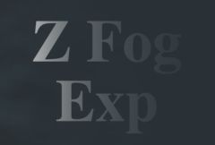

## S_ZFogExponential

Mixes a fog color into the source clip using depth values
from a ZBuffer input. The fog starts at Z Near and increases
exponentially to Z Far at a rate depending on the Fog Density. The
ZBuffer input will be solid black if not provided, so you should
specify this input for this effect to do anything useful.

In the Sapphire Stylize effects submenu.

### Inputs:

- **Source**: The current layer. The clip to be processed.

- **ZBuffer**: Defaults to None. The input clip containing depth values for each Source pixel. These values should be in the range of black to white, and it is best if not anti-aliased. Normally black corresponds to the farthest objects and white to the nearest, though this can be adjusted using Z Buffer parameter.

### Parameters:

- **Load Preset** (Push-button)
  Brings up the Preset Browser to browse all available presets for this effect.

- **Save Preset** (Push-button)
  Brings up the Preset Save dialog to save a preset for this effect.

- **Fog Density** (Default: 0.7, Range: 0 to 1)
  The density of the fog.

- **Fog Color** (Default rgb: [0.5 0.5 0.5])
  The fog color should normally match the sky or background color of the source clip. Use gray for mist, brown for smog, blue for underwater, etc.

- **Z Buffer Type** (Popup menu, Default: White is Near)
  How to interpret the values in the Z buffer.
  - **Black is Near**: Black pixels in the Z buffer indicate that
the object at that point is near (close to you), and white means far
away.
  - **White is Near**: White pixels in the Z buffer indicate that
the object at that point is near (close to you), and black means far
away.

- **Z Buffer Use** (Popup menu, Default: Luma)
  Determines how the ZBuffer input channels make a monochrome z image.
  - **Luma**: the luminance of the RGB channels is used.
  - **Alpha**: only the Alpha channel is used.

