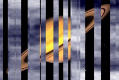

## S_ParallaxStripsTransition

Applies a collection of 3d refracting glass
strips to break up the image. The image is shifted within each strip, and
the strips move over time. The strips gradually fade in or out, so the
transition to the source is seamless.
Note: because you can control the size of the strips, it's possible to set
up a transition that won't completely cover the secondary (incoming or
outgoing) clip, and so will have a 'pop' at the start or end.
To ensure a smooth transition, go to the end of the transition where the
strips are largest, select Show: Strips mode, and adjust the strip size to
make sure they fully cover the image. That way none of the back clip will
leak through on that frame. Alternatively, hit the 'Ensure Full Coverage'
button, and the number of strips will automatically adjust to the minimum
needed to fully cover the image.

In the Sapphire Transitions effects submenu.

### Inputs:

- **Foreground**: The current layer. Starts the transition with this clip.

- **Background**: Defaults to None. Ends the transition with this clip.

### Parameters:

- **Load Preset** (Push-button)
  Brings up the Preset Browser to browse all available presets for this effect.

- **Save Preset** (Push-button)
  Brings up the Preset Save dialog to save a preset for this effect.

- **Mode** (Popup menu, Default: Rectangular Strips)
  Selects between several variations of ParallaxStripsTransition.
  - **Rectangular Strips**: Strips shift across the transition and dissolve into the secondary clip.
  - **Linear Strips**: Full-height strips grow to reveal the secondary clip.

- **Dissolve Speed** (Default: 3, Range: 1 or greater)
  The speed of the dissolve between the From and To clips in Panning Strips.

- **Transition Dir** (Popup menu, Default: Transition Off to Bg)
  Selects the direction of the transition.
  - **Transition Off to Bg**: transitions from the current layer to the Background.
  - **Transition On from Bg**: transitions from the Background to the current layer.

- **Auto Trans** (Popup YES-NO, Default: No)
  If enabled, a transition is performed automatically between the first and last frames of the layer. If this is off, the transition is performed manually by animating the Parallax Percent parameter.

- **Trans Amount** (Default: 0.5, Range: 0 to 1)
  The transition ratio between the From and To inputs. A value of 0 gives only the From input and a value of 1 gives only the To input. By default this parameter will automatically animate from 0 to 1 to perform a complete transition.

- **Ensure Full Coverage** (Push-button)
  Pressing this button adjusts the number of strips to the minimum needed to fully cover the last frame.

- **N Strips** (Integer, Default: 50, Range: 1 to 1000)
  Number of refracting strips to apply. The strips are positioned randomly all over the image.

- **Size** (Default: 0.35, Range: 0 or greater)
  Size of the strips, in image-widths.

- **Rel Height** (Default: 0.3, Range: 0.001 or greater)
  Height of the strips, relative to their width. Increase to make the strips taller.

- **Size Vary** (X & Y, Default: [0.1 0.1], Range: 0 to 1)
  Increase to make each strip randomly larger or smaller.

- **Angle** (Default: 0, Range: any)
  Angle of the strips; 0 is horizontal. The strips move along their angle, and also shift the image along the same angle.

- **Depth** (Default: 2, Range: 0 or greater)
  Make the frontmost strips larger and move faster, so it appears they're in front, giving a 3d look.

- **Strip Speed** (Default: 0.4, Range: any)
  Sets how fast the strips move along their major axis. Note that this doesn't affect how the image refracts, or shifts, within the strip, just how fast the strip itself moves.

- **Strip Speed Vary** (Default: 0, Range: 0 or greater)
  Increase to give each strip a bit of randomness in its speed.

- **Shift Amount** (Default: 0.6, Range: any)
  Sets how much the image shifts, or refracts, within each strip. Shifting is always along the major axis of the strip. As the effect progresses, the shift amount progressively goes to zero, seamlessly transitioning to the original clip. See the Fade and Slow Fade params for details.

- **Shift Vary** (Default: 0, Range: 0 or greater)
  Increase to make the amount of shift in each strip more random.

- **All Strips Shift** (X & Y, Default: [0 0], Range: any)
  Move all strips around on the screen.

- **Z Dist** (Default: 1, Range: 0.001 or greater)
  Zoom in or out on the source image, before applying the parallax strips.

- **Show** (Popup menu, Default: Result)
  Show the effect result, or the strips themselves, which is useful during effect setup.
  - **Result**: Show the result of the effect.
  - **Strips Over Source**: Show each strip as a gray rectangle, with brightness set by depth.
Uncovered areas show the source image.
  - **Strips Over Black**: Show each strip as a gray rectangle, with brightness set by depth.
Uncovered areas show as black.

- **Slow Fade** (Default: 0.9, Range: 0 to 2)
  Increase to make the fade in our out slower. Set to 0 for a linear fade.

- **Slow Grow** (Default: 0.9, Range: 0 to 2)
  Increase to make the strips start growing more slowly, for a nicer look. Set to 0 for a linear growth rate through the effect.

- **Wrap** (Popup menu, Default: Reflect)
  Determines the method for accessing outside the borders of the source images.
  - **No**: gives black beyond the borders.
  - **Tile**: repeats a copy of the image.
  - **Reflect**: repeats a mirrored copy. Edges are often less
visible with this method.

- **Seed** (Default: 0.123, Range: 0 or greater)
  Used to initialize the random number generator. The actual seed value is not significant, but different seeds give different results and the same value should give a repeatable result.

- **Flip Tiles** (Check-box, Default: off)
  Flips tiles vertically if needed to achieve a consistent look.

