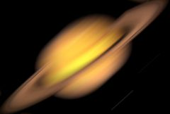

## S_WhipLash

2D-only version of Swish3D, with optional Whip Out motion and RGB Split.
Cuts between two input clips while performing 2D moves on each.
During the transition the clips are transformed by the Rotate,
Shift, and Scale parameters.

In the Sapphire Transitions effects submenu.

### Inputs:

- **Foreground**: The current layer. Starts the transition with this clip.

- **Background**: Defaults to None. Ends the transition with this clip.

### Parameters:

- **Load Preset** (Push-button)
  Brings up the Preset Browser to browse all available presets for this effect.

- **Save Preset** (Push-button)
  Brings up the Preset Save dialog to save a preset for this effect.

- **Transition Dir** (Popup menu, Default: Wipe Off to Bg)
  Selects the direction of the transition.
  - **Wipe Off to Bg**: transitions from the current layer to the Background.
  - **Wipe On from Bg**: transitions from the Background to the current layer.

- **Auto Trans** (Popup YES-NO, Default: No)
  If enabled, a transition is performed automatically between the first and last frames of the layer. If this is off, the transition is performed manually by animating the Whip Percent parameter.

- **Wipe Percent** (Default: 0, Range: 0 to 1)
  Auto Trans must be disabled for this parameter to be used. It determines the transition ratio between the From and To inputs, and would normally be animated from 0 to 100 to perform a complete transition. The curve controlling this parameter can be adjusted for more detailed control over the timing of the wipe.

- **Center** (X & Y, Default: [0 0], Range: any)
  The center position about which to scale or rotate.

- **Motion Blur** (Default: 1, Range: 0 or greater)
  Scales the amount of motion blur to use.

- **Rotate** (Default: 0, Range: any)
  Rotates by the specified angle in degrees.

- **Shift** (X & Y, Default: [-4 0], Range: any)
  Translates horizontally or vertically.

- **Scale** (Default: 1, Range: 0 to 2)
  Scales the size of the clips.

- **Whip Out** (Popup menu, Default: Smooth)
  End of transition motion
  - **Smooth**: Smooth decelerate
  - **Bounce**: Overshoot with bounce to stop
  - **Snap**: Overshoot then snap to stop

- **Mix RGB** (Default: 0, Range: 0 to 1)
  Blend in optional RGB split / blur

- **Blur Amount** (Default: 1.25, Range: 0 or greater)
  Scales the width of the blur.

- **Angle** (Default: 0, Range: any)
  The rotation of the overall lash pattern used for the wipe, in degrees.

- **Shift RGB** (Default: 2, Range: any)
  Shifts the image in the direction of the blur. A negative shift amount shifts the image in the opposite direction.

- **Bias** (Default: 0.5, Range: 0 to 1)
  Varies the weight of the pixels along the path of the blur, which gives the appearance of trails or streaks in a single direction. A value of 0.5 weights all pixels evenly. A value of 1 causes the weight to increase toward the direction of the blur, while a value of 0 has the opposite effect.

- **Blur Red** (Default: 1, Range: 0 or greater)
  The blur width of the red channel, relative to Blur Amount.

- **Blur Green** (Default: 0.5, Range: 0 or greater)
  The blur width of the green channel, relative to Blur Amount.

- **Blur Blue** (Default: 0, Range: 0 or greater)
  The blur width of the blue channel, relative to Blur Amount.

- **Shift Red** (Default: 0.5, Range: any)
  Additional amount to shift the red color channel.

- **Shift Green** (Default: 0.25, Range: any)
  Additional amount to shift the green color channel.

- **Shift Blue** (Default: 0, Range: any)
  Additional amount to shift the blue color channel.

- **Brightness** (Default: 1, Range: 0 or greater)
  Scales the brightness of the result.

- **Offset Darks** (Default: 0, Range: -8 to 2)
  Adds this gray value to the darker regions of the result. This can be negative to increase contrast.

- **Edge Mode** (Popup menu, Default: Reflect)
  Determines the behavior when accessing areas outside the source image.
  - **Transparent**: Areas outside the source image are treated as transparent, which can produce
transparency around the edges of the image.
Select this for fastest rendering.
  - **Repeat**: Repeats the last pixel outside the border of the image.
  - **Reflect**: Reflects the image outside the border.

- **Soft Borders** (Check-box, Default: off)
  If enabled, transparent borders are added to the input image before processing. This allows the result to include soft edges beyond the original image size. When off, the effect only occurs within the frame and the result will retain an edge at the borders.

- **Opacity** (Popup menu, Default: Normal)
  Determines the method used for dealing with opacity/transparency.
  - **All Opaque**: Use this option to render slightly faster when
the input image is fully opaque with no transparency (alpha=1).
  - **Normal**: Process opacity normally.
  - **As Premult**: Process as if the image is already in
premultiplied form (colors have been scaled by opacity). This option
also renders slightly faster than Normal mode, but the results will
also be in premultiplied form, which is sometimes less correct.

