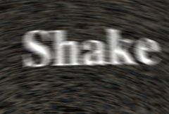

## S_Shake

Applies a shaking motion to the source clip over time with translation,
zooming, and/or rotation. The shaking is random but repeatable, so with
the same parameters the same shaking motion is generated each time. Turn
on Motion Blur and adjust the Mo Blur Length for different amounts of blur.
Adjust the Amplitude and Frequency for different shaking speeds and amounts.
The Rand parameters give detailed control of the random non-periodic
shaking, and the Wave parameters adjust the regular periodic shaking. The
X, Y, Z, and Tilt parameters control the horizontal, vertical, zoom, and
rotation amounts of shaking respectively.

In the Sapphire Distort effects submenu.

### Inputs:

- **Source**: The current layer. The clip to shake.

- **Mask**: Defaults to None. Interpolate between the result and the Source input. White areas use the result of the effect. Black areas use the Source clip.

### Parameters:

- **Load Preset** (Push-button)
  Brings up the Preset Browser to browse all available presets for this effect.

- **Save Preset** (Push-button)
  Brings up the Preset Save dialog to save a preset for this effect.

- **Style** (Popup menu, Default: Normal)
  Controls the type of shaking.
  - **Normal**: A steady camera shake.
  - **Twitchy**: Periods of stillness interrupted by bursts of rapid shaking.
  - **Jumpy**: Sudden jumps from one place to another, with slower drifting in between.

- **Mocha Project** (Default: 0, Range: 0 or greater)
  Brings up the Mocha window for tracking footage and generating masks.

- **Blur Mocha** (Default: 0, Range: 0 or greater)
  Blurs the Mocha Mask by this amount before using. This can be used to soften the edges or quantization artifacts of the mask, and smooth out the time displacements.

- **Mocha Opacity** (Default: 1, Range: 0 to 1)
  Controls the strength of the Mocha mask. Lower values reduce the intensity of the effect.

- **Invert Mocha** (Check-box, Default: off)
  If enabled, the black and white of the Mocha Mask are inverted before applying the effect.

- **Resize Mocha** (Default: 1, Range: 0 to 2)
  Scales the Mocha Mask. 1.0 is the original size.

- **Resize Rel X** (Default: 1, Range: 0 to 2)
  The relative horizontal size of the Mocha Mask.

- **Resize Rel Y** (Default: 1, Range: 0 to 2)
  The relative vertical size of the Mocha Mask.

- **Shift Mocha** (X & Y, Default: [0 0], Range: any)
  Offsets the position of the Mocha Mask.

- **Dilate Mocha** (Default: 0, Range: -100 to 100)
  Dilates or erodes the Mocha Mask by this pixel amount before using.

- **Dilation Quality** (Popup menu, Default: Fast)
  Selects whether Dilate Mocha adusts quickly in default Fast mode or looks better in High quality mode.
  - **Fast**: Dilate Mocha in Fast mode for quick adjustments.
  - **High**: Dilate Mocha in High quality mode for a better looking mask shape.

- **Bypass Mocha** (Check-box, Default: off)
  Ignore the Mocha Mask and apply the effect to the entire source clip.

- **Show Mocha Only** (Check-box, Default: off)
  Bypass the effect and show the Mocha Mask itself.

- **Combine Masks** (Popup menu, Default: Union)
  Determines how to combine the Mocha Mask and Input Mask when both are supplied to the effect.
  - **Union**: Uses the area covered by both masks together.
  - **Intersect**: Uses the area that overlaps between the two masks.
  - **Mocha Only**: Ignore the Input Mask and only use the
Mocha Mask.

- **Apply Mask** (Popup menu, Default: Post-effect)
  Control where in the effect the mask is applied - this affects both the input mask and the mocha mask.
  - **Post-effect**: Applies the masks after all the effect has been rendered.
  - **Pre-effect**: Applies the mask to the source before processing the effect.

- **Amplitude** (Default: 1, Range: 0 or greater)
  Scales the amplitude of the shaking motion.

- **Frequency** (Default: 8, Range: 0 or greater)
  Increase for faster shaking, decrease for slower shaking. (Be careful if you animate frequency values because the resulting shake frequency is also affected by the rate of change of the value.)

- **Phase** (Default: 0, Range: any)
  Time shift of the shaking motions. (If you animate this value, its rate of change will also affect the apparent frequency.)

- **Stillness** (Default: 0.7, Range: 0 to 1)
  In Twitchy mode, adjusts the fraction of the time that the image is still. Increase for more frequent shaking.

- **Twitch Frequency** (Default: 2, Range: 0 or greater)
  In Twitchy mode, controls the length of the periods of movement and stillness. Increase for shorter, more frequent bursts of movement.

- **Drift** (Default: 0.3, Range: 0 to 1)
  In Jumpy mode, controls the speed of movement in between jumps.

- **Center Bias** (Default: 0, Range: 0 or greater)
  In Jumpy mode, adjusts the likelihood that each jump will reset the image to its original position. If set to zero, every jump is random. If set to one, every jump will go back to the center.

- **Z Dist** (Default: 1, Range: 0.001 or greater)
  Scales the 'distance' of the image. Values greater than 1.0 move it farther away and make it smaller. Values less than 1.0 move the image closer and enlarge it. Zooming in slightly can sometimes be used to hide edge artifacts.

- **Motion Blur** (Check-box, Default: off)
  Options for motion blur of the shaking motion.

- **Mo Blur Length** (Default: 1, Range: 0 or greater)
  Scales the amount of motion blur. Use around .5 when processing on fields or 1.0 for frames to give realistic motion blur. This parameter has no effect if Motion Blur is No .

- **Seed** (Default: 0, Range: 0 or greater)
  Used to initialize the random number generator. The actual seed value is not significant, but different seeds give different results and the same value should give a repeatable result.

- **Wrap** (X & Y, Popup menu, Default: [ Reflect Reflect ])
  Determines the method for accessing outside the borders of the source image.
  - **No**: gives black beyond the borders.
  - **Tile**: repeats a copy of the image.
  - **Reflect**: repeats a mirrored copy. Edges are often less
visible with this method.

### X Shake Parameters:

X Rand Amp:
*Default:
*0.2,
*Range:
*0 or greater.Amplitude of horizontal random shaking.

X Rand Freq:
*Default:
*1,
*Range:
*0 or greater.Frequency of horizontal random shaking.

X Wave Amp:
*Default:
*0,
*Range:
*0 or greater.Amplitude of horizontal regular wave shaking.

X Wave Freq:
*Default:
*0.5,
*Range:
*0 or greater.Frequency of horizontal regular wave shaking, in
cycles per second.

X Phase:
*Default:
*0,
*Range:
*any.
Time shift of the horizontal shaking.

### Y Shake Parameters:

Y Rand Amp:
*Default:
*0.1,
*Range:
*0 or greater.Amplitude of the vertical random shaking.

Y Rand Freq:
*Default:
*1,
*Range:
*0 or greater.Frequency of the vertical random shaking.

Y Wave Amp:
*Default:
*0,
*Range:
*0 or greater.Amplitude of the vertical regular wave shaking.

Y Wave Freq:
*Default:
*0.5,
*Range:
*0 or greater.Frequency of the vertical regular wave shaking, in
cycles per second.

Y Phase:
*Default:
*0,
*Range:
*any.
Time shift of the vertical shaking.

### Z Shake Parameters:

Z Rand Amp:
*Default:
*0,
*Range:
*0 or greater.Amplitude of the zoom random shaking.

Z Rand Freq:
*Default:
*1,
*Range:
*0 or greater.Frequency of the zoom random shaking.

Z Wave Amp:
*Default:
*0,
*Range:
*0 or greater.Amplitude of the zoom regular wave shaking.

Z Wave Freq:
*Default:
*0.5,
*Range:
*0 or greater.Frequency of the zoom regular wave shaking, in
cycles per second.

Z Phase:
*Default:
*0,
*Range:
*any.
Time shift of the zoom shaking.

### Tilt Shake Parameters:

Tilt Rand Amp:
*Default:
*0,
*Range:
*0 or greater.Amplitude of the rotational random shaking, in degrees.

Tilt Rand Freq:
*Default:
*1,
*Range:
*0 or greater.Frequency of the rotational random shaking.

Tilt Wave Amp:
*Default:
*0,
*Range:
*0 or greater.Amplitude of the rotational regular wave shaking, in degrees.

Tilt Wave Freq:
*Default:
*0.5,
*Range:
*0 or greater.Frequency of the rotational regular wave shaking, in
cycles per second.

Tilt Phase:
*Default:
*0,
*Range:
*any.
Time shift of the rotational shaking.

### Channels Parameters:

Red Amplitude:
*Default:
*1,
*Range:
*0 or greater.The relative amount of shaking in the red channel. Changing this value from
the default will cause the red channel to move more or less than the other color channels,
resulting in a color fringing or channel separation look.

Green Amplitude:
*Default:
*1,
*Range:
*0 or greater.The relative amount of shaking in the green channel.

Blue Amplitude:
*Default:
*1,
*Range:
*0 or greater.The relative amount of shaking in the blue channel.

Red Phase:
*Default:
*0,
*Range:
*any.The relative phase of the red channel. Positive values will move the red
channel ahead of the others in time, causing it to move first and the other channels to
follow. Negative values have the opposite effect, causing the red channel to lag behind
the others. Small values usually produce the best looks.

Green Phase:
*Default:
*0,
*Range:
*any.The relative phase of the green channel.

Blue Phase:
*Default:
*0,
*Range:
*any.The relative phase of the blue channel.

RGB Randomness:
*Default:
*0,
*Range:
*0 or greater.The amount of random motion in each color channel. Turn up this
parameter to cause all three color channels to move randomly on different paths, independent
of the overall shaking. This motion is scaled by X Rand Amp, Y Rand Amp, Z Rand Amp, and
Tilt Rand Amp.

RGB Frequency:
*Default:
*2,
*Range:
*0 or greater.
The frequency of the random color channel shaking.

### Other Parameters:

Opacity:
*Popup menu, Default: Normal
*.Determines the method used for dealing with
opacity/transparency.
*All Opaque:
*Use this option to render slightly faster when
the input image is fully opaque with no transparency (alpha=1).*Normal:
*Process opacity normally.*As Premult:
*Process as if the image is already in
premultiplied form (colors have been scaled by opacity). This option
also renders slightly faster than Normal mode, but the results will
also be in premultiplied form, which is sometimes less correct.

Mask Use:
*Popup menu, Default: Luma
*.Determines how the Mask input channels are used to make a
monochrome mask.
*Luma:
*the luminance of the RGB channels is used.*Alpha:
*only the Alpha channel is used.

Blur Mask:
*Default:
*0.05,
*Range:
*0 or greater.Blurs the Matte input by this amount before using. This
can provide a smoother transition between the matted and unmatted
areas. It has no effect unless the Matte input is provided.

Invert Mask:
*Check-box, Default:
*off.If on, inverts the Matte input so the effect is applied
to areas where the Matte is black instead of white. This has no effect
unless the Matte input is provided.

Crop Input Parameters:
*Default:
*0,
*Range:
*0 or greater.These 4 parameters,
Crop Top
,
Crop Bottom
,
Crop Left,
and
Crop Right
,
allow selecting a rectangular subsection of the input image to be processed.
If the Wrap parameters are set to "No" the exposed borders will be transparent.
If the Wrap is "Tile" or "Reflect" the source image is wrapped on the new cropped borders to fill the frame.
This can make it easier to avoid artifacts due to distorting an image with bad edges.
