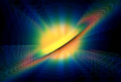

## S_WarpChroma

Separates the source clip into spectral bands and warps them by different
amounts. The red is warped by the From transformation, the blue by the To
transformation, with the other colors of the spectrum in between. The From
and To parameters do not refer to time. They describe the two
transformations in space that determine the sequence of warps applied to
each color.

In the Sapphire Distort effects submenu.

### Inputs:

- **Source**: The current layer. The input clip to be warped.

- **Matte**: Defaults to None. If provided, the amplitude of warping is scaled by the values of this input clip. Gray values internally scale the warping amplitude rather than simply cross-fading between the effect and the original source to allow more continuous results at the matte edges and more detailed control over the warping amounts. This input can be affected using the Blur Matte, Invert Matte, or Matte Use parameters.

### Parameters:

- **Load Preset** (Push-button)
  Brings up the Preset Browser to browse all available presets for this effect.

- **Save Preset** (Push-button)
  Brings up the Preset Save dialog to save a preset for this effect.

- **Mocha Project** (Default: 0, Range: 0 or greater)
  Brings up the Mocha window for tracking footage and generating masks.

- **Blur Mocha** (Default: 0, Range: 0 or greater)
  Blurs the Mocha Mask by this amount before using. This can be used to soften the edges or quantization artifacts of the mask, and smooth out the time displacements.

- **Mocha Opacity** (Default: 1, Range: 0 to 1)
  Controls the strength of the Mocha mask. Lower values reduce the intensity of the effect.

- **Invert Mocha** (Check-box, Default: off)
  If enabled, the black and white of the Mocha Mask are inverted before applying the effect.

- **Resize Mocha** (Default: 1, Range: 0 to 2)
  Scales the Mocha Mask. 1.0 is the original size.

- **Resize Rel X** (Default: 1, Range: 0 to 2)
  The relative horizontal size of the Mocha Mask.

- **Resize Rel Y** (Default: 1, Range: 0 to 2)
  The relative vertical size of the Mocha Mask.

- **Shift Mocha** (X & Y, Default: [0 0], Range: any)
  Offsets the position of the Mocha Mask.

- **Dilate Mocha** (Default: 0, Range: -100 to 100)
  Dilates or erodes the Mocha Mask by this pixel amount before using.

- **Dilation Quality** (Popup menu, Default: Fast)
  Selects whether Dilate Mocha adusts quickly in default Fast mode or looks better in High quality mode.
  - **Fast**: Dilate Mocha in Fast mode for quick adjustments.
  - **High**: Dilate Mocha in High quality mode for a better looking mask shape.

- **Bypass Mocha** (Check-box, Default: off)
  Ignore the Mocha Mask and apply the effect to the entire source clip.

- **Show Mocha Only** (Check-box, Default: off)
  Bypass the effect and show the Mocha Mask itself.

- **Combine Masks** (Popup menu, Default: Union)
  Determines how to combine the Mocha Mask and Input Mask when both are supplied to the effect.
  - **Union**: Uses the area covered by both masks together.
  - **Intersect**: Uses the area that overlaps between the two masks.
  - **Mocha Only**: Ignore the Input Mask and only use the
Mocha Mask.

- **Apply Mask** (Popup menu, Default: Post-effect)
  Control where in the effect the mask is applied - this affects both the input mask and the mocha mask.
  - **Post-effect**: Applies the masks after all the effect has been rendered.
  - **Pre-effect**: Applies the mask to the source before processing the effect.

- **Steps** (Integer, Default: 15, Range: 3 to 100)
  The number of spectrum samples to include along the path between the From (red) and To (blue) transformations. More steps give a smoother result, but require more time to process.

- **Center** (X & Y, Default: [0 0], Range: any)
  The center of rotation and zooming, in screen coordinates relative to the center of the frame. The shift values should be zero for this location to make sense. This parameter can be adjusted using the Center Widget.

- **From Z Dist** (Default: 0.85, Range: 0.001 or greater)
  The 'distance' of the From transformation. This zooms about the Center location when Shift is 0. Increase to zoom out, decrease to zoom in. This parameter can be adjusted using the From Transfm Widget.

- **From Rotate** (Default: 0, Range: any)
  The rotation angle of the From transformation, in degrees, about the center. This parameter can be adjusted using the From Transfm Widget.

- **From Shift** (X & Y, Default: [0 0], Range: any)
  The horizontal and vertical translations of the From transformation. This can be used for directional motion. If it is non-zero the center location becomes less meaningful. This parameter can be adjusted using the From Transfm Widget.

- **To Z Dist** (Default: 1, Range: 0.001 or greater)
  The 'distance' of the To transformation. Increase to zoom out, or decrease to zoom in. This parameter can be adjusted using the To Transform Widget.

- **To Rotate** (Default: 0, Range: any)
  The rotation angle of the To transformation, in degrees, about the center. Note that if the From and To Rotate angles are very different, the interpolation between them will become less accurate. This parameter can be adjusted using the To Transform Widget.

- **To Shift** (X & Y, Default: [0 0], Range: any)
  The horizontal and vertical translations of the To transformation. This can be used for directional motion. If it is non-zero the center location becomes less meaningful. This parameter can be adjusted using the To Transform Widget.

- **Warp Amount** (Default: 0.5, Range: 0 or greater)
  Adjusts the overall amount of warping by scaling the From and To transformations. Setting this to zero disables both transforms and leaves the image unchanged.

- **Brightness** (Default: 1, Range: 0 or greater)
  Scales the brightness of the result.

- **Color1** (Default rgb: [1 0 0])
  The color at the From transformation.

- **Color2** (Default rgb: [0 1 0])
  The color midway between the From and To transformations.

- **Color3** (Default rgb: [0 0 1])
  The color at the To transformation.

- **White Balance** (Check-box, Default: off)
  When enabled, the three colors are adjusted internally so they sum to white. In this case, the colors of unwarped regions are not affected and the average color of the result remains the same.

- **Wrap** (X & Y, Popup menu, Default: [ No No ])
  Determines the method for accessing outside the borders of the source image.
  - **No**: gives black beyond the borders.
  - **Tile**: repeats a copy of the image.
  - **Reflect**: repeats a mirrored copy. Edges are often less
visible with this method.

- **Filter** (Check-box, Default: off)
  If enabled, the image is adaptively filtered when it is resampled. This gives a better quality result when parts of the image are warped smaller.

- **Blur Matte** (Default: 0, Range: 0 or greater)
  Blurs the Matte input by this amount before using. This can provide a smoother transition between the matted and unmatted areas. It has no effect unless the Matte input is provided.

- **Invert Matte** (Check-box, Default: off)
  If on, inverts the Matte input so the effect is applied to areas where the Matte is black instead of white. This has no effect unless the Matte input is provided.

- **Matte Use** (Popup menu, Default: Luma)
  Determines how the Matte input channels are used to make a monochrome matte.
  - **Luma**: the luminance of the RGB channels is used.
  - **Alpha**: only the Alpha channel is used.

- **Opacity** (Popup menu, Default: Normal)
  Determines the method used for dealing with opacity/transparency.
  - **All Opaque**: Use this option to render slightly faster when
the input image is fully opaque with no transparency (alpha=1).
  - **Normal**: Process opacity normally.
  - **As Premult**: Process as if the image is already in
premultiplied form (colors have been scaled by opacity). This option
also renders slightly faster than Normal mode, but the results will
also be in premultiplied form, which is sometimes less correct.
If your image has sharp color changes where the matte
channel also has sharp edges, you may get better results with Normal
mode.

- **Crop Input Parameters** (Default: 0, Range: 0 or greater)
  These 4 parameters, Crop Top , Crop Bottom , Crop Left, and Crop Right , allow selecting a rectangular subsection of the input image to be processed. If the Wrap parameters are set to "No" the exposed borders will be transparent. If the Wrap is "Tile" or "Reflect" the source image is wrapped on the new cropped borders to fill the frame. This can make it easier to avoid artifacts due to distorting an image with bad edges.

- **Show Center** (Check-box, Default: on)
  Turns on or off the screen user interface for adjusting the Center parameter.This parameter only appears on AE and Premiere, where on-screen widgets are supported.

- **Show From Transfm** (Check-box, Default: on)
  Turns on or off the screen user interface for adjusting the From Z Dist and From Rotate parameters.This parameter only appears on AE and Premiere, where on-screen widgets are supported.

- **Show To Transform** (Check-box, Default: on)
  Turns on or off the screen user interface for adjusting the To Z Dist and To Rotate parameters.This parameter only appears on AE and Premiere, where on-screen widgets are supported.

- **Show From Shift** (Check-box, Default: off)
  Turns on or off the screen user interface for adjusting the Center parameter.This parameter only appears on AE and Premiere, where on-screen widgets are supported.

- **Show To Shift** (Check-box, Default: off)
  Turns on or off the screen user interface for adjusting the Center parameter.This parameter only appears on AE and Premiere, where on-screen widgets are supported.

