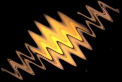

## S_WarpWaves

Warps the source clip by a wave pattern. You can make the waves move over
time by increasing the Phase Speed parameter, or by animating the value of
Phase Start.

In the Sapphire Distort effects submenu.

### Inputs:

- **Source**: The current layer. The input clip to be warped.

- **Matte**: Defaults to None. If provided, the amplitude of warping is scaled by the values of this input clip. Gray values internally scale the warping amplitude rather than simply cross-fading between the effect and the original source to allow more continuous results at the matte edges and more detailed control over the warping amounts. This input can be affected using the Blur Matte, Invert Matte, or Matte Use parameters.

### Parameters:

- **Load Preset** (Push-button)
  Brings up the Preset Browser to browse all available presets for this effect.

- **Save Preset** (Push-button)
  Brings up the Preset Save dialog to save a preset for this effect.

- **Mocha Project** (Default: 0, Range: 0 or greater)
  Brings up the Mocha window for tracking footage and generating masks.

- **Blur Mocha** (Default: 0, Range: 0 or greater)
  Blurs the Mocha Mask by this amount before using. This can be used to soften the edges or quantization artifacts of the mask, and smooth out the time displacements.

- **Mocha Opacity** (Default: 1, Range: 0 to 1)
  Controls the strength of the Mocha mask. Lower values reduce the intensity of the effect.

- **Invert Mocha** (Check-box, Default: off)
  If enabled, the black and white of the Mocha Mask are inverted before applying the effect.

- **Resize Mocha** (Default: 1, Range: 0 to 2)
  Scales the Mocha Mask. 1.0 is the original size.

- **Resize Rel X** (Default: 1, Range: 0 to 2)
  The relative horizontal size of the Mocha Mask.

- **Resize Rel Y** (Default: 1, Range: 0 to 2)
  The relative vertical size of the Mocha Mask.

- **Shift Mocha** (X & Y, Default: [0 0], Range: any)
  Offsets the position of the Mocha Mask.

- **Dilate Mocha** (Default: 0, Range: -100 to 100)
  Dilates or erodes the Mocha Mask by this pixel amount before using.

- **Dilation Quality** (Popup menu, Default: Fast)
  Selects whether Dilate Mocha adusts quickly in default Fast mode or looks better in High quality mode.
  - **Fast**: Dilate Mocha in Fast mode for quick adjustments.
  - **High**: Dilate Mocha in High quality mode for a better looking mask shape.

- **Bypass Mocha** (Check-box, Default: off)
  Ignore the Mocha Mask and apply the effect to the entire source clip.

- **Show Mocha Only** (Check-box, Default: off)
  Bypass the effect and show the Mocha Mask itself.

- **Combine Masks** (Popup menu, Default: Union)
  Determines how to combine the Mocha Mask and Input Mask when both are supplied to the effect.
  - **Union**: Uses the area covered by both masks together.
  - **Intersect**: Uses the area that overlaps between the two masks.
  - **Mocha Only**: Ignore the Input Mask and only use the
Mocha Mask.

- **Amplitude** (Default: 0.1, Range: any)
  Scales the amount of warping distortion. Increase for more severe distortion.

- **Frequency** (Default: 8, Range: 0.1 or greater)
  The frequency of the waves. Increase for more waves, decrease for fewer.

- **Angle** (Default: 45, Range: any)
  The rotation angle of the wave pattern in degrees. If angle is 0, the waves move to the right and are aligned vertically.

- **Displace Angle** (Default: 90, Range: any)
  The warping direction in degrees relative to the angle of the waves. 0 gives compression-expansion waves, and 90 gives side to side waves.

- **Phase Start** (Default: 0, Range: any)
  The phase shift of the waves. The wave pattern is translated in the direction of Angle by this amount.

- **Phase Speed** (Default: 0, Range: any)
  The phase speed of the waves. If this is non-zero the wave pattern automatically travels at this rate.

- **Z Dist** (Default: 1, Range: 0.001 or greater)
  Scales the 'distance' of the image. Values greater than 1.0 move it farther away and make it smaller. Values less than 1.0 move the image closer and enlarge it. Zooming in slightly can sometimes be used to hide edge artifacts.

- **Wrap** (X & Y, Popup menu, Default: [ Reflect Reflect ])
  Determines the method for accessing outside the borders of the source image.
  - **No**: gives black beyond the borders.
  - **Tile**: repeats a copy of the image.
  - **Reflect**: repeats a mirrored copy. Edges are often less
visible with this method.

- **Filter** (Check-box, Default: on)
  If enabled, the image is adaptively filtered when it is resampled. This gives a better quality result when parts of the image are warped smaller.

- **Blur Matte** (Default: 0, Range: 0 or greater)
  Blurs the Matte input by this amount before using. This can provide a smoother transition between the matted and unmatted areas. It has no effect unless the Matte input is provided.

- **Invert Matte** (Check-box, Default: off)
  If on, inverts the Matte input so the effect is applied to areas where the Matte is black instead of white. This has no effect unless the Matte input is provided.

- **Matte Use** (Popup menu, Default: Luma)
  Determines how the Matte input channels are used to make a monochrome matte.
  - **Luma**: the luminance of the RGB channels is used.
  - **Alpha**: only the Alpha channel is used.

- **Opacity** (Popup menu, Default: Normal)
  Determines the method used for dealing with opacity/transparency.
  - **All Opaque**: Use this option to render slightly faster when
the input image is fully opaque with no transparency (alpha=1).
  - **Normal**: Process opacity normally.
  - **As Premult**: Process as if the image is already in
premultiplied form (colors have been scaled by opacity). This option
also renders slightly faster than Normal mode, but the results will
also be in premultiplied form, which is sometimes less correct.
If your image has sharp color changes where the matte
channel also has sharp edges, you may get better results with Normal
mode.

- **Crop Input Parameters** (Default: 0, Range: 0 or greater)
  These 4 parameters, Crop Top , Crop Bottom , Crop Left, and Crop Right , allow selecting a rectangular subsection of the input image to be processed. If the Wrap parameters are set to "No" the exposed borders will be transparent. If the Wrap is "Tile" or "Reflect" the source image is wrapped on the new cropped borders to fill the frame. This can make it easier to avoid artifacts due to distorting an image with bad edges.

