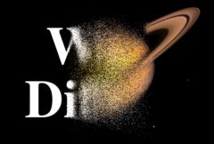

## S_WipeDiffuse

Wipes between two input clips with a pixel-diffusion process performed within
the transition area. The Wipe Percent parameter should be animated to
control the transition speed. The pixelated look of this effect depends on
the image resolution, so it is recommended to test your final resolution
before processing.

In the Sapphire Transitions effects submenu.

### Inputs:

- **Foreground**: The current layer. Starts the transition with this clip.

- **Background**: Defaults to None. Ends the transition with this clip. If this input is not provided, a fully transparent background is used, showing whatever is behind it. Note that the background can not be diffused during the transition unless this input is provided.

### Parameters:

- **Load Preset** (Push-button)
  Brings up the Preset Browser to browse all available presets for this effect.

- **Save Preset** (Push-button)
  Brings up the Preset Save dialog to save a preset for this effect.

- **Transition Dir** (Popup menu, Default: Wipe Off to Bg)
  Selects the direction of the transition.
  - **Wipe Off to Bg**: transitions from the current layer to the Background.
  - **Wipe On from Bg**: transitions from the Background to the current layer.

- **Auto Trans** (Popup YES-NO, Default: No)
  If enabled, a transition is performed automatically between the first and last frames of the layer. If this is off, the transition is performed manually by animating the Wipe Percent parameter.

- **Wipe Percent** (Default: 0, Range: 0 to 1)
  Auto Trans must be disabled for this parameter to be used. It determines the transition ratio between the From and To inputs, and would normally be animated from 0 to 100 to perform a complete transition. The curve controlling this parameter can be adjusted for more detailed control over the timing of the wipe.

- **Edge Width** (Default: 1.4, Range: 0.0138 or greater)
  The width of the transition area. This can be adjusted using the Wipe Widget.

- **Angle** (Default: 0, Range: any)
  The angle of the wipe direction in degrees from the right. This can be adjusted using the Wipe Widget.

- **Diffuse Amount** (Default: 0.4, Range: 0 or greater)
  The magnitude of the pixel diffusion.

- **Wrap** (X & Y, Popup menu, Default: [ Reflect Reflect ])
  Determines the method for accessing outside the borders of the source images.
  - **No**: gives black beyond the borders.
  - **Tile**: repeats a copy of the image.
  - **Reflect**: repeats a mirrored copy. Edges are often less
visible with this method.

- **Crop Input Parameters** (Default: 0, Range: 0 or greater)
  These 4 parameters, Crop Top , Crop Bottom , Crop Left, and Crop Right , allow selecting a rectangular subsection of the input image to be processed. If the Wrap parameters are set to "No" the exposed borders will be transparent. If the Wrap is "Tile" or "Reflect" the source image is wrapped on the new cropped borders to fill the frame. This can make it easier to avoid artifacts due to distorting an image with bad edges.

- **Show Wipe** (Check-box, Default: on)
  Turns on or off the screen user interface widget for adjusting the Wipe Amt, Angle, and Edge Width parameters.This parameter only appears on AE and Premiere, where on-screen widgets are supported.

