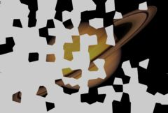

## S_WipePointalize

Transitions between two input clips by adding brush-like polygon shapes
from one clip onto another in a semi-random order. The Wipe Percent
parameter should be animated to control the transition speed. Adjust the Frequency to
change the size of the shapes, and adjust the Edge Width and Chunky parameters for different patterns.

In the Sapphire Transitions effects submenu.

### Inputs:

- **Foreground**: The current layer. Starts the transition with this clip.

- **Background**: Defaults to None. Ends the transition with this clip.

### Parameters:

- **Load Preset** (Push-button)
  Brings up the Preset Browser to browse all available presets for this effect.

- **Save Preset** (Push-button)
  Brings up the Preset Save dialog to save a preset for this effect.

- **Transition Dir** (Popup menu, Default: Wipe Off to Bg)
  Selects the direction of the transition.
  - **Wipe Off to Bg**: transitions from the current layer to the Background.
  - **Wipe On from Bg**: transitions from the Background to the current layer.

- **Auto Trans** (Popup YES-NO, Default: No)
  If enabled, a transition is performed automatically between the first and last frames of the layer. If this is off, the transition is performed manually by animating the Wipe Percent parameter.

- **Wipe Percent** (Default: 0, Range: 0 to 1)
  Auto Trans must be disabled for this parameter to be used. It determines the transition ratio between the From and To inputs, and would normally be animated from 0 to 100 to perform a complete transition. The curve controlling this parameter can be adjusted for more detailed control over the timing of the wipe.

- **Edge Width** (Default: 2, Range: 0.05 or greater)
  The width of the transition area.

- **Angle** (Default: 0, Range: any)
  The angle of the wipe direction in degrees. Use 0 for a wipe from left to right, 90 or -90 for a vertical wipe, 180 for a wipe from right to left.

- **Frequency** (Default: 20, Range: 5 or greater)
  Increase for smaller and more polygon shapes, decrease for fewer and larger.

- **Chunky** (Default: 0, Range: 0 or greater)
  Increase to cause the shapes to be added with a more clustered ordering.

- **Stroke Length** (Default: 0, Range: any)
  Determines the length of the brush stroke shapes. A zero value gives regular polygon shapes. Increase for longer more random shapes. Negative values cause the strokes to orient in the other direction. Note that when this parameter is non-zero, the stroke shapes will also vary over time as if being re-painted.

- **Stroke Align** (Default: 0.5, Range: 0 or greater)
  Increase to smooth out the directions of the strokes so nearby strokes are more parallel.

- **Seed** (Default: 0.23, Range: 0 or greater)
  Used to initialize the random number generator. The actual seed value is not significant, but different seeds give different results and the same value should give a repeatable result.

- **Opacity** (Popup menu, Default: Normal)
  Determines the method used for dealing with opacity/transparency.
  - **All Opaque**: Use this option to render slightly faster when
the input image is fully opaque with no transparency (alpha=1).
  - **Normal**: Process opacity normally.
  - **As Premult**: Process as if the image is already in
premultiplied form (colors have been scaled by opacity). This option
also renders slightly faster than Normal mode, but the results will
also be in premultiplied form, which is sometimes less correct.

- **Show Wipe** (Check-box, Default: on)
  Turns on or off the screen user interface widget for adjusting the Grad Add, Grad Angle, and Wipe Percent parameters. The value of the Grad Add parameter must first be positive for this widget to be visible.This parameter only appears on AE and Premiere, where on-screen widgets are supported.

