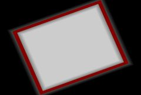

## S_WipeRectangle

Performs a wipe transition between two input clips
using a growing or shrinking rectangle. The Wipe Percent parameter should be
animated to control the transition speed. Increase the Border Width parameter
to draw a border at the wipe transition edges.

In the Sapphire Transitions effects submenu.

### Inputs:

- **Foreground**: The current layer. Starts the transition with this clip.

- **Background**: Defaults to None. Ends the transition with this clip.

### Parameters:

- **Load Preset** (Push-button)
  Brings up the Preset Browser to browse all available presets for this effect.

- **Save Preset** (Push-button)
  Brings up the Preset Save dialog to save a preset for this effect.

- **Transition Dir** (Popup menu, Default: Wipe Off to Bg)
  Selects the direction of the transition.
  - **Wipe Off to Bg**: transitions from the current layer to the Background.
  - **Wipe On from Bg**: transitions from the Background to the current layer.

- **Auto Trans** (Popup YES-NO, Default: No)
  If enabled, a transition is performed automatically between the first and last frames of the layer. If this is off, the transition is performed manually by animating the Wipe Percent parameter.

- **Wipe Percent** (Default: 0, Range: 0 to 1)
  Auto Trans must be disabled for this parameter to be used. It determines the transition ratio between the From and To inputs, and would normally be animated from 0 to 100 to perform a complete transition. The curve controlling this parameter can be adjusted for more detailed control over the timing of the wipe.

- **Wipe Direction** (Popup menu, Default: Rect In)
  The direction of the rectangle wipe.
  - **Rect In**: the rectangle contains the first image and shrinks inwards.
  - **Rect Out**: the rectangle contains the second image and grows outwards.

- **Edge Softness** (Default: 0, Range: 0 or greater)
  The width of the transition edges. Larger values will cause softer, less visible edges in the wipe pattern.

- **Angle** (Default: 0, Range: any)
  The rotation angle of the rectangle in degrees.

- **Rel Width** (Default: 1.25, Range: 0.02 or greater)
  The relative width of the rectangle. Increase to make wider, decrease to make thinner.

- **Center** (X & Y, Default: [0 0], Range: any)
  The location of the rectangle center in screen coordinates relative to the center of the frame. This parameter can be set by enabling and moving the Center Widget. Note that moving the rectangle center can also cause the rectangle size to change so that the current value of Wipe Amt remains correct.

- **Border Width** (Default: 0, Range: 0 or greater)
  If positive, a colored border is drawn at the wipe transition edges, using the border color, opacity, softness, and shift parameters below.

- **Border Color** (Default rgb: [0.75 0 0])
  The color of the border. This has no effect unless Border Width is positive.

- **Border Opacity** (Default: 1, Range: 0 to 1)
  The opacity of the border. Decrease to make the border transparent and allow the image under it to show through. This has no effect unless Border Width is positive.

- **Border Softness** (Default: 0, Range: 0 or greater)
  The softness of the border edges. This has no effect unless Border Width is positive.

- **Border Shift** (Default: 0, Range: any)
  Shifts the border ahead of or behind the transition edge. This has no effect unless Border Width is positive.

- **Border Glow** (Default: 0, Range: 0 or greater)
  Adds a glow along the border of the wipe. The value determines the brightness of the glow.

- **Glow Width** (Default: 0.1, Range: 0 or greater)
  The width of the glowing border.

- **Width Red** (Default: 1, Range: 0 or greater)
  Scales the red glow width. If the red, green, and blue widths are all equal, the glow will match Glow Color. Otherwise it will have a fringe of varying color.

- **Width Green** (Default: 1.2, Range: 0 or greater)
  Scales the green glow width.

- **Width Blue** (Default: 1.4, Range: 0 or greater)
  Scales the blue glow width.

- **Glow Color** (Default rgb: [1 1 1])
  The color of the glowing border.

- **Noise Amp** (Default: 1, Range: 0 or greater)
  The amount of noise to add to the glowing border.

- **Noise Freq** (Default: 16, Range: 0.1 to 20)
  The spatial frequency of the noise.

- **Noise Speed** (Default: 2, Range: any)
  The speed with which the noise changes or boils over time.

- **Opacity** (Popup menu, Default: Normal)
  Determines the method used for dealing with opacity/transparency.
  - **All Opaque**: Use this option to render slightly faster when
the input image is fully opaque with no transparency (alpha=1).
  - **Normal**: Process opacity normally.
  - **As Premult**: Process as if the image is already in
premultiplied form (colors have been scaled by opacity). This option
also renders slightly faster than Normal mode, but the results will
also be in premultiplied form, which is sometimes less correct.

- **Show Angle** (Check-box, Default: off)
  Turns on or off the screen user interface for adjusting the Angle parameter.This parameter only appears on AE and Premiere, where on-screen widgets are supported.

- **Show Center** (Check-box, Default: on)
  Turns on or off the screen user interface for adjusting the Center parameter.This parameter only appears on AE and Premiere, where on-screen widgets are supported.

- **Show Glow Width** (Check-box, Default: off)
  Turns on or off the screen user interface for adjusting the Glow Width parameter.This parameter only appears on AE and Premiere, where on-screen widgets are supported.

