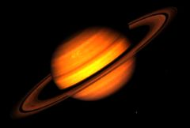

## S_Gamma

对输入素材应用伽马校正。红色、绿色和蓝色通道可以独立调整。From Gamma 只是产生与调整 Gamma 相反的效果。

在 Sapphire Adjust 效果子菜单中。

### Inputs:

- **Source**: 当前图层。要处理的素材。

- **Mask**: 默认为无。在结果和源输入之间进行插值。白色区域使用效果结果，黑色区域使用源素材。

### Parameters:

- **Load Preset** (Push-button)
  打开预设浏览器，浏览此效果的所有可用预设。

- **Save Preset** (Push-button)
  打开预设保存对话框，保存此效果的预设。

- **Mocha Project** (Default: 0, Range: 0 or greater)
  打开 Mocha 窗口，用于跟踪素材和生成遮罩。

- **Blur Mocha** (Default: 0, Range: 0 or greater)
  在使用前按此数值模糊 Mocha 遮罩。可用于柔化遮罩的边缘或量化伪影，并平滑时间位移。

- **Mocha Opacity** (Default: 1, Range: 0 to 1)
  控制 Mocha 遮罩的强度。较低的值会降低效果的强度。

- **Invert Mocha** (Check-box, Default: off)
  如果启用，Mocha 遮罩的黑白将在应用效果之前反转。

- **Resize Mocha** (Default: 1, Range: 0 to 2)
  缩放 Mocha 遮罩。1.0 为原始大小。

- **Resize Rel X** (Default: 1, Range: 0 to 2)
  Mocha 遮罩的相对水平大小。

- **Resize Rel Y** (Default: 1, Range: 0 to 2)
  Mocha 遮罩的相对垂直大小。

- **Shift Mocha** (X & Y, Default: [0 0], Range: any)
  偏移 Mocha 遮罩的位置。

- **Dilate Mocha** (Default: 0, Range: -100 to 100)
  在使用前按此像素量膨胀或收缩 Mocha 遮罩。

- **Dilation Quality** (Popup menu, Default: Fast)
  选择 Dilate Mocha 是在默认的 Fast 模式下快速调整，还是在 High 质量模式下获得更好的效果。
  - **Fast**: 在 Fast 模式下进行快速调整。
  - **High**: 在 High 质量模式下获得更好的遮罩形状。

- **Bypass Mocha** (Check-box, Default: off)
  忽略 Mocha 遮罩，将效果应用于整个源素材。

- **Show Mocha Only** (Check-box, Default: off)
  绕过效果，仅显示 Mocha 遮罩本身。

- **Combine Masks** (Popup menu, Default: Union)
  当两个遮罩同时提供给效果时，确定如何组合 Mocha 遮罩和输入遮罩。
  - **Union**: 使用两个遮罩共同覆盖的区域。
  - **Intersect**: 使用两个遮罩重叠的区域。
  - **Mocha Only**: 忽略输入遮罩，仅使用 Mocha 遮罩。

- **Gamma** (Default: 1, Range: 0.1 to 10)
  大于 1.0 的值使中间调更亮，小于 1.0 的值使中间调更暗，1.0 保持输入不变。

- **Gamma Red** (Default: 1, Range: 0.1 to 10)
  增亮或变暗红色中间调。

- **Gamma Green** (Default: 1, Range: 0.1 to 10)
  增亮或变暗绿色中间调。

- **Gamma Blue** (Default: 1, Range: 0.1 to 10)
  增亮或变暗蓝色中间调。

- **From Gamma** (Default: 1, Range: 0.1 to 10)
  在处理前将 Gamma 除以此值。如果您的图像在此伽马值下是正确的，但需要从此值调整到新的伽马值，这会很有用。

- **From Gamma Red** (Default: 1, Range: 0.1 to 10)
  变暗或增亮红色中间调。

- **From Gamma Green** (Default: 1, Range: 0.1 to 10)
  变暗或增亮绿色中间调。

- **From Gamma Blue** (Default: 1, Range: 0.1 to 10)
  变暗或增亮蓝色中间调。

- **Scale Lights** (Default: 1, Range: 0 or greater)
  在伽马校正后按此数值缩放亮度。增大可获得更亮的结果。

- **Scale Lights Red** (Default: 1, Range: 0 or greater)
  在伽马校正后按此数值缩放红色。

- **Scale Lights Green** (Default: 1, Range: 0 or greater)
  在伽马校正后按此数值缩放红色。

- **Scale Lights Blue** (Default: 1, Range: 0 or greater)
  在伽马校正后按此数值缩放红色。

- **Offset Darks** (Default: 0, Range: -8 to 2)
  在伽马校正后将此灰度值添加到较暗区域。可以为负值以增加对比度。

- **Offset Darks Red** (Default: 0, Range: -8 to 2)
  在伽马校正后将此红色值添加到较暗的红色区域。可以为负值以增加对比度。

- **Offset Darks Green** (Default: 0, Range: -8 to 2)
  在伽马校正后将此绿色值添加到较暗的绿色区域。可以为负值以增加对比度。

- **Offset Darks Blue** (Default: 0, Range: -8 to 2)
  在伽马校正后将此蓝色值添加到较暗的蓝色区域。可以为负值以增加对比度。

- **Mask Use** (Popup menu, Default: Luma)
  确定如何使用遮罩输入通道来生成单色遮罩。
  - **Luma**: 使用 RGB 通道的亮度。
  - **Alpha**: 仅使用 Alpha 通道。

- **Blur Mask** (Default: 0.05, Range: 0 or greater)
  在使用前按此数值模糊遮罩输入。这可以在遮罩区域和非遮罩区域之间提供更平滑的过渡。除非提供了遮罩输入，否则无效。

- **Invert Mask** (Check-box, Default: off)
  如果启用，反转遮罩输入，使效果应用于遮罩为黑色而非白色的区域。除非提供了遮罩输入，否则无效。
