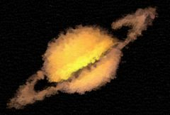

## S_Brush:Oil

通过叠加不同大小和方向的笔触来模拟油画效果。此效果可与以下画笔之一配合使用：毡尖笔、飞溅、水彩、点画、铅笔、粉彩、海绵、泼墨、圆形或方块。此外，还提供了调整形状、大小、方向、密度、光照和阴影的控制选项。

位于 Sapphire Stylize 效果子菜单中。
位于 S_Brush 插件中。

### Inputs:

- **Source**: 当前图层。要处理的素材。

- **Matte**: 默认为无。如果提供，源笔刷颜色将按此输入进行缩放。单色遮罩可用于选择将生成笔刷的源区域子集。彩色遮罩可用于选择性地调整不同区域的笔刷颜色。遮罩在生成笔刷之前应用于源，因此不会裁剪生成的笔刷。

### Parameters:

- **Load Preset** (Push-button)
  打开预设浏览器，浏览此效果的所有可用预设。

- **Save Preset** (Push-button)
  打开预设保存对话框，保存此效果的预设。

- **Mocha Project** (Default: 0, Range: 0 or greater)
  打开 Mocha 窗口，用于跟踪素材和生成遮罩。

- **Blur Mocha** (Default: 0, Range: 0 or greater)
  在使用前按此数值模糊 Mocha 遮罩。可用于柔化遮罩的边缘或量化伪影，并平滑时间位移。

- **Mocha Opacity** (Default: 1, Range: 0 to 1)
  控制 Mocha 遮罩的强度。较低的值会降低效果的强度。

- **Invert Mocha** (Check-box, Default: off)
  如果启用，在应用效果之前会反转 Mocha 遮罩的黑白。

- **Resize Mocha** (Default: 1, Range: 0 to 2)
  缩放 Mocha 遮罩。1.0 为原始大小。

- **Resize Rel X** (Default: 1, Range: 0 to 2)
  Mocha 遮罩的相对水平大小。

- **Resize Rel Y** (Default: 1, Range: 0 to 2)
  Mocha 遮罩的相对垂直大小。

- **Shift Mocha** (X & Y, Default: [0 0], Range: any)
  偏移 Mocha 遮罩的位置。

- **Dilate Mocha** (Default: 0, Range: -100 to 100)
  在使用前按此像素量扩展或收缩 Mocha 遮罩。

- **Dilation Quality** (Popup menu, Default: Fast)
  选择 Dilate Mocha 是在默认的 Fast 模式下快速调整，还是在 High 质量模式下获得更好的效果。
  - **Fast**: 在 Fast 模式下扩展 Mocha 遮罩，用于快速调整。
  - **High**: 在 High 质量模式下扩展 Mocha 遮罩，获得更好的遮罩形状。

- **Bypass Mocha** (Check-box, Default: off)
  忽略 Mocha 遮罩，将效果应用到整个源素材。

- **Show Mocha Only** (Check-box, Default: off)
  绕过效果，仅显示 Mocha 遮罩本身。

- **Combine Masks** (Popup menu, Default: Union)
  当两个遮罩同时提供给效果时，决定如何组合 Mocha 遮罩和输入遮罩。
  - **Union**: 使用两个遮罩共同覆盖的区域。
  - **Intersect**: 使用两个遮罩之间重叠的区域。
  - **Mocha Only**: 忽略输入遮罩，仅使用 Mocha 遮罩。

- **Matte Use** (Popup menu, Default: Luma)
  确定如何使用遮罩输入通道来生成单色遮罩。
  - **Luma**: 使用 RGB 通道的亮度。
  - **Alpha**: 仅使用 Alpha 通道。

- **Invert Matte** (Check-box, Default: off)
  如果开启，反转遮罩输入，使效果应用于遮罩为黑色而非白色的区域。除非提供了遮罩输入，否则无效。

- **Shape** (Popup menu, Default: Match To Style)
  笔刷的形状。
  - **Match To Style**: 使用与当前绘画风格匹配的笔刷形状。Round 对应 Oil，Sponge 对应 Chalk。
  - **Felt Tip**: 不透明的三角形形状。
  - **Splat**: 稀疏排列的细点形状。
  - **Water Color**: 粗糙的斑块形状。
  - **Stipple**: 带孔的柔和矩形形状。
  - **Pencil**: 细长形状。
  - **Pastel**: 漏斗形，像彗星。
  - **Sponge**: 非常粗糙的矩形形状。
  - **Splodge**: 柔和、朦胧的矩形形状。
  - **Round**: 带有粗糙拖尾的柔和椭圆形状，像水母。
  - **Cubes**: 正方形形状。

- **Max Size** (Default: 1.5, Range: 0 to 10)
  设置最大笔刷大小。没有笔刷会大于此大小。

- **Size Range** (Default: 0.01, Range: 0 to 1)
  从最大笔刷大小起缩放笔刷大小的范围。

- **Angle** (Default: 60, Range: 0 to 360)
  旋转笔刷的朝向。

- **Vary Angle** (Default: 20, Range: 0 to 360)
  在一个方向上随机旋转笔刷至此数值。

- **Contour Alignment** (Default: 0.5, Range: 0 to 1)
  在笔触方向完全对齐角度参数（0）和原始源轮廓（1）之间进行插值。Vary angle 从此插值方向的两个方向偏移笔触。

- **Layers** (Integer, Default: 3, Range: 1 to 5)
  绘制的图层数。

- **Density** (Default: 80, Range: 1 to 100)
  设置每层笔触的整体密度。

- **Rel X Density** (Default: 1, Range: 0 or greater)
  缩放 X 方向笔触的密度。

- **Rel Y Density** (Default: 0.8, Range: 0 or greater)
  缩放 Y 方向笔触的密度。

- **Vary Position** (Default: 1, Range: 0 to 10)
  在所有方向上随机移动笔刷位置。值为零时，所有笔刷放置在规则网格上。

- **Roughness** (Default: 0.5, Range: 0 to 10)
  缩放颜料上高光的强度，类似于增加颜料的厚度。

- **Intensity** (Default: 1, Range: 0 to 10)
  缩放笔刷不透明度的饱和度，扩大笔刷的周长。

- **Deterioration** (Default: 0, Range: 0 to 10)
  缩放由粗糙度产生的阴影，类似于颜料的裂纹或剥落。

- **Smooth Colors** (Default: 0.08, Range: 0 to 1)
  模糊源以平滑调色板，并帮助减少一些笔触抖动。

- **Use Source Color** (Default: 0.8, Range: 0 to 1)
  在绘画颜色参数（0）和原始源颜色（1）之间进行插值。

- **Paint Color** (Default rgb: [1 1 1])
  要使用的绘画颜色。

- **Bg Opacity** (Default: 1, Range: 0 to 1)
  在与笔刷合成之前缩放背景的不透明度。如果为 0，结果将仅包含 Alpha 上的笔刷图像。

- **Seed** (Default: 0.123, Range: 0 or greater)
  用于初始化随机数生成器。实际种子值并不重要，但不同的种子会产生不同的结果，相同的值应该会产生可重复的结果。

- **Crop To Source Alpha** (Check-box, Default: off)
  将效果裁剪到源 Alpha 的边界。

- **Soft Borders** (Check-box, Default: off)
  如果启用，在处理之前向输入图像添加透明边框。这允许结果包含超出原始图像大小的柔和边缘。关闭时，效果仅在帧内发生，结果将在边框处保留边缘。

- **Opacity** (Popup menu, Default: Normal)
  确定处理不透明度/透明度的方法。
  - **All Opaque**: 当输入图像完全不透明且没有透明度（alpha=1）时，使用此选项可稍微加快渲染速度。
  - **Normal**: 正常处理不透明度。
  - **As Premult**: 按图像已为预乘形式处理（颜色已按不透明度缩放）。此选项的渲染速度也略快于 Normal 模式，但结果也将为预乘形式，这有时不太准确。
