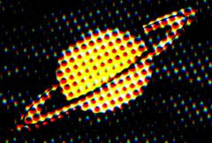

## S_HalfToneColor

使用彩色圆点图案生成源素材的版本。使用 Smooth Source 参数可去除一些细节并使圆点更加一致圆润。您可以使用 Dots 菜单将圆点图案从 CMY 反转为 RGB。

位于 Sapphire Stylize 效果子菜单中。

### Inputs:

- **Source**: 当前图层。要处理的素材。

- **Mask**: 默认为无。在结果和源输入之间进行插值。白色区域使用效果结果。黑色区域使用源素材。

### Parameters:

- **Load Preset** (Push-button)
  打开预设浏览器，浏览此效果的所有可用预设。

- **Save Preset** (Push-button)
  打开预设保存对话框，保存此效果的预设。

- **Mocha Project** (Default: 0, Range: 0 or greater)
  打开 Mocha 窗口，用于跟踪素材和生成遮罩。

- **Blur Mocha** (Default: 0, Range: 0 or greater)
  在使用前按此数值模糊 Mocha 遮罩。可用于柔化遮罩的边缘或量化伪影，并平滑时间位移。

- **Mocha Opacity** (Default: 1, Range: 0 to 1)
  控制 Mocha 遮罩的强度。较低的值会降低效果的强度。

- **Invert Mocha** (Check-box, Default: off)
  如果启用，在应用效果之前会反转 Mocha 遮罩的黑白。

- **Resize Mocha** (Default: 1, Range: 0 to 2)
  缩放 Mocha 遮罩。1.0 为原始大小。

- **Resize Rel X** (Default: 1, Range: 0 to 2)
  Mocha 遮罩的相对水平大小。

- **Resize Rel Y** (Default: 1, Range: 0 to 2)
  Mocha 遮罩的相对垂直大小。

- **Shift Mocha** (X & Y, Default: [0 0], Range: any)
  偏移 Mocha 遮罩的位置。

- **Dilate Mocha** (Default: 0, Range: -100 to 100)
  在使用前按此像素量扩展或收缩 Mocha 遮罩。

- **Dilation Quality** (Popup menu, Default: Fast)
  选择 Dilate Mocha 是在默认的 Fast 模式下快速调整，还是在 High 质量模式下获得更好的效果。
  - **Fast**: 在 Fast 模式下扩展 Mocha 遮罩，用于快速调整。
  - **High**: 在 High 质量模式下扩展 Mocha 遮罩，获得更好的遮罩形状。

- **Bypass Mocha** (Check-box, Default: off)
  忽略 Mocha 遮罩，将效果应用到整个源素材。

- **Show Mocha Only** (Check-box, Default: off)
  绕过效果，仅显示 Mocha 遮罩本身。

- **Combine Masks** (Popup menu, Default: Union)
  当两个遮罩同时提供给效果时，决定如何组合 Mocha 遮罩和输入遮罩。
  - **Union**: 使用两个遮罩共同覆盖的区域。
  - **Intersect**: 使用两个遮罩之间重叠的区域。
  - **Mocha Only**: 忽略输入遮罩，仅使用 Mocha 遮罩。

- **Dots Color** (Popup menu, Default: CMY)
  选择圆点的颜色模式。
  - **CMY**: 在白色背景上使用青色、品红色和黄色圆点。
  - **RGB**: 在黑色背景上使用红色、绿色和蓝色圆点。

- **Dots Frequency** (Default: 50, Range: 0 or greater)
  圆点图案的频率。增大可获得更细的圆点，减小可获得更大的圆点。

- **Dots Angle** (Default: 30, Range: any)
  整体圆点图案的角度（度）。

- **Dots Rel Width** (Default: 1, Range: 0.01 or greater)
  圆点的相对宽度。增大可获得更宽的圆点，减小可获得更高的圆点。

- **Dots Sharpness** (Default: 4, Range: 0 or greater)
  缩放圆点边缘的锐利度。

- **Dots Lighten** (Default: 0, Range: any)
  增大可使生成的圆点图案变亮。

- **Smooth Source** (Default: 0, Range: 0 or greater)
  如果为正值，在应用半色调之前按此数值模糊源。可用于去除圆点中的一些细节，使其更加一致圆润。

- **Saturation** (Default: 1, Range: -2 to 10)
  缩放颜色饱和度。增大可获得更强烈的颜色。设为 0 可获得单色效果。

- **Dots Shift** (X & Y, Default: [0 0], Range: any)
  圆点图案的水平和垂直平移。

- **Shift Red** (X & Y, Default: [0 0.5], Range: any)
  红色通道的平移。

- **Shift Green** (X & Y, Default: [0 0], Range: any)
  绿色通道的平移。

- **Shift Blue** (X & Y, Default: [0 -0.5], Range: any)
  蓝色通道的平移。

- **Opacity** (Popup menu, Default: Normal)
  确定处理不透明度/透明度的方法。
  - **All Opaque**: 当输入图像完全不透明且没有透明度（alpha=1）时，使用此选项可稍微加快渲染速度。
  - **Normal**: 正常处理不透明度。
  - **As Premult**: 按图像已为预乘形式处理（颜色已按不透明度缩放）。此选项的渲染速度也略快于 Normal 模式，但结果也将为预乘形式，这有时不太准确。

- **Mask Use** (Popup menu, Default: Luma)
  确定如何使用 Mask 输入通道来生成单色遮罩。
  - **Luma**: 使用 RGB 通道的亮度。
  - **Alpha**: 仅使用 Alpha 通道。

- **Blur Mask** (Default: 0.05, Range: 0 or greater)
  在使用前按此数值模糊遮罩输入。可提供遮罩区域和非遮罩区域之间更平滑的过渡。除非提供了遮罩输入，否则无效。

- **Invert Mask** (Check-box, Default: off)
  如果开启，反转遮罩输入，使效果应用于遮罩为黑色而非白色的区域。除非提供了遮罩输入，否则无效。
