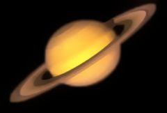

## S_EdgeAwareBlur

模糊相似颜色的区域，同时保留不同颜色区域之间的边缘。

位于 Sapphire Blur+Sharpen 效果子菜单中。

### Inputs:

- **Source**: 当前图层。要处理的素材。

- **Edge_Source**: 默认为无。用于计算边缘强度的图像。默认为源素材，但可以提供相同大小的不同图像以获得艺术效果。

- **Matte**: 默认为无。如果提供，模糊仅在此输入的亮区指定的源素材区域上执行。此遮罩外的像素不会被模糊，也不会参与遮罩内的模糊结果像素。此输入可通过 Invert Matte 或 Matte Use 参数进行调整。

### Parameters:

- **Load Preset** (Push-button)
  打开预设浏览器，浏览此效果的所有可用预设。

- **Save Preset** (Push-button)
  打开预设保存对话框，保存此效果的预设。

- **Mocha Project** (Default: 0, Range: 0 or greater)
  打开 Mocha 窗口，用于跟踪素材和生成遮罩。

- **Blur Mocha** (Default: 0, Range: 0 or greater)
  在使用前按此量模糊 Mocha 遮罩。可用于柔化遮罩的边缘或量化伪影，并平滑时间位移。

- **Mocha Opacity** (Default: 1, Range: 0 to 1)
  控制 Mocha 遮罩的强度。较低的值会降低效果的强度。

- **Invert Mocha** (Check-box, Default: off)
  如果启用，在应用效果前反转 Mocha 遮罩的黑白。

- **Resize Mocha** (Default: 1, Range: 0 to 2)
  缩放 Mocha 遮罩。1.0 为原始大小。

- **Resize Rel X** (Default: 1, Range: 0 to 2)
  Mocha 遮罩的相对水平大小。

- **Resize Rel Y** (Default: 1, Range: 0 to 2)
  Mocha 遮罩的相对垂直大小。

- **Shift Mocha** (X & Y, Default: [0 0], Range: any)
  偏移 Mocha 遮罩的位置。

- **Dilate Mocha** (Default: 0, Range: -100 to 100)
  在使用前按此像素量膨胀或腐蚀 Mocha 遮罩。

- **Dilation Quality** (Popup menu, Default: Fast)
  选择 Dilate Mocha 是在默认的 Fast 模式下快速调整，还是在 High 质量模式下获得更好的效果。
  - **Fast**: 在 Fast 模式下膨胀 Mocha 遮罩，便于快速调整。
  - **High**: 在 High 质量模式下膨胀 Mocha 遮罩，获得更好的遮罩形状。

- **Bypass Mocha** (Check-box, Default: off)
  忽略 Mocha 遮罩，将效果应用于整个源素材。

- **Show Mocha Only** (Check-box, Default: off)
  跳过效果，只显示 Mocha 遮罩本身。

- **Combine Masks** (Popup menu, Default: Union)
  当同时提供 Mocha 遮罩和输入遮罩时，确定如何组合它们。
  - **Union**: 使用两个遮罩共同覆盖的区域。
  - **Intersect**: 使用两个遮罩之间重叠的区域。
  - **Mocha Only**: 忽略输入遮罩，只使用
Mocha 遮罩。

- **Blur Amount** (Default: 0.4, Range: 0 or greater)
  缩放模糊的宽度。此参数可通过 Blur Amount Widget 调整。

- **Blur Rel** (X & Y, Default: [1 1], Range: 0 or greater)
  相对水平和垂直模糊宽度。将 Blur Rel X 设为 0 可仅进行垂直模糊，将 Blur Rel Y 设为 0 可仅进行水平模糊。此参数可通过 Blur Amount Widget 调整。

- **Edge Threshold** (Default: 0.1, Range: 0 or greater)
  被大于此值的边缘分隔的颜色区域不会相互模糊。

- **Edge Smooth** (Default: 0, Range: 0 or greater)
  在计算边缘强度前按此量模糊 Edge Source。

- **Use Alpha Edges** (Check-box, Default: off)
  在计算边缘强度时包含 Alpha 通道。

- **Blur Type** (Popup menu, Default: Sharp Edges)
  确定模糊效果的风格。
  - **Sharp Edges**: 强化强边缘，产生水彩画或卡通般的效果。
  - **Soft Edges**: 不强调边缘，产生更自然的模糊效果。
  - **Softer Edges**: 稍微模糊边缘附近的像素，产生类似柔焦的效果。

- **Filter** (Popup menu, Default: Gauss)
  用于模糊的卷积滤波器类型。
  - **Box**: 使用矩形滤波器。
  - **Triangle**: 更平滑，使用金字塔形滤波器。
  - **Gauss**: 最平滑，使用高斯形滤波器。
  - **Smooth**: 重复应用高斯滤波器以消除边缘产生的伪影。

- **Subpixel** (Check-box, Default: on)
  启用亚像素量的模糊。使用此选项可使 Blur Amount 或 Blur Rel 参数的动画更平滑。仅影响 Sharp Edges 模糊类型。

- **Invert Matte** (Check-box, Default: off)
  如果开启，反转 Matte 输入，使效果应用于 Matte 为黑色而非白色的区域。除非提供了 Matte 输入，否则无效。

- **Matte Use** (Popup menu, Default: Luma)
  确定如何使用 Matte 输入通道来生成单色遮罩。
  - **Luma**: 使用 RGB 通道的亮度。
  - **Alpha**: 仅使用 Alpha 通道。

- **Opacity** (Popup menu, Default: Normal)
  确定处理不透明度/透明度的方法。
  - **All Opaque**: 当输入图像完全不透明且无透明度 (alpha=1) 时，使用此选项可稍微加快渲染速度。
  - **Normal**: 正常处理不透明度。
  - **As Premult**: 按图像已为预乘形式处理（颜色已按不透明度缩放）。此选项的渲染速度也比 Normal 模式稍快，但结果也将是预乘形式，有时可能不太准确。

- **Show Blur Amount** (Check-box, Default: on)
  打开或关闭用于调整模糊量参数的屏幕用户界面。此参数仅在 AE 和 Premiere 中出现，这些软件支持屏幕控件。

