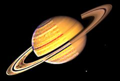

## S_Sharpen

放大源素材中的高频信息，如边缘和细节。增大 Sharpen Width 参数以锐化更多的中频信息，并调整 Sharpen Amp 来控制应用的锐化量。

位于 Sapphire Blur+Sharpen 效果子菜单中。

### Inputs:

- **Source**: 当前图层。要处理的素材。

- **Matte**: 默认为无。在结果和 Source 输入之间进行插值。白色区域使用效果的结果。黑色区域使用 Source 素材。

### Parameters:

- **Load Preset** (Push-button)
  打开预设浏览器，浏览此效果的所有可用预设。

- **Save Preset** (Push-button)
  打开预设保存对话框，保存此效果的预设。

- **Quality** (Popup menu, Default: Best)
  要应用的锐化滤波器。
  - **Best**: 高级锐化滤波器，伪影显著更少。
  - **Fast**: 经典锐化滤波器。

- **Mocha Project** (Default: 0, Range: 0 or greater)
  打开 Mocha 窗口，用于跟踪素材和生成遮罩。

- **Blur Mocha** (Default: 0, Range: 0 or greater)
  在使用前按此量模糊 Mocha 遮罩。可用于柔化遮罩的边缘或量化伪影，并平滑时间位移。

- **Mocha Opacity** (Default: 1, Range: 0 to 1)
  控制 Mocha 遮罩的强度。较低的值会降低效果的强度。

- **Invert Mocha** (Check-box, Default: off)
  如果启用，在应用效果前反转 Mocha 遮罩的黑白。

- **Resize Mocha** (Default: 1, Range: 0 to 2)
  缩放 Mocha 遮罩。1.0 为原始大小。

- **Resize Rel X** (Default: 1, Range: 0 to 2)
  Mocha 遮罩的相对水平大小。

- **Resize Rel Y** (Default: 1, Range: 0 to 2)
  Mocha 遮罩的相对垂直大小。

- **Shift Mocha** (X & Y, Default: [0 0], Range: any)
  偏移 Mocha 遮罩的位置。

- **Dilate Mocha** (Default: 0, Range: -100 to 100)
  在使用前按此像素量膨胀或收缩 Mocha 遮罩。

- **Dilation Quality** (Popup menu, Default: Fast)
  选择 Dilate Mocha 是在默认的 Fast 模式下快速调整，还是在 High 质量模式下获得更好的效果。
  - **Fast**: 在 Fast 模式下膨胀 Mocha 遮罩，用于快速调整。
  - **High**: 在 High 质量模式下膨胀 Mocha 遮罩，以获得更好的遮罩形状。

- **Bypass Mocha** (Check-box, Default: off)
  忽略 Mocha 遮罩并将效果应用于整个源素材。

- **Show Mocha Only** (Check-box, Default: off)
  绕过效果并显示 Mocha 遮罩本身。

- **Combine Masks** (Popup menu, Default: Union)
  当同时为效果提供 Mocha 遮罩和输入遮罩时，确定如何组合它们。
  - **Union**: 使用两个遮罩共同覆盖的区域。
  - **Intersect**: 使用两个遮罩之间重叠的区域。
  - **Mocha Only**: 忽略输入遮罩，仅使用 Mocha 遮罩。

- **Sharpen Amp** (Default: 1, Range: any)
  要应用的锐化量。

- **Edge Threshold** (Default: 0.15, Range: 0 or greater)
  强于此值的边缘将不会被锐化。对于标准动态范围素材（非 HDR），Edge Threshold 在 0.05 到 0.3 之间通常会产生良好的效果。增大阈值会导致更强的效果（更多边缘将被锐化），但可能会在物体周围引入暗带。

- **Small Detail Size** (Default: 0.01, Range: 0 or greater)
  小细节的像素大小。此参数可以使用 Small Detail Size 控件进行调整。

- **Scale Tiny Details** (Default: 3, Range: 0 or greater)
  小于 1 的值会使微小细节不太可见，大于 1 的值会使它们更加可见。微小细节大约是小细节大小的一半。

- **Scale Small Details** (Default: 1.5, Range: 0 or greater)
  小于 1 的值会使小细节不太可见，大于 1 的值会使它们更加可见。

- **Scale Medium Details** (Default: 1, Range: 0 or greater)
  小于 1 的值会使中等细节不太可见，大于 1 的值会使它们更加可见。中等细节大约是小细节大小的两倍。

- **Scale Large Details** (Default: 2, Range: 0 or greater)
  小于 1 的值会使大细节不太可见，大于 1 的值会使它们更加可见。大细节大约是小细节大小的四倍。

- **Sharpen Width** (Default: 0.112, Range: 0 or greater)
  执行锐化的像素宽度。增大以锐化较柔和的边缘，减小以仅锐化较锐利的边缘。

- **Sharpen Luma** (Default: 1, Range: 0 or greater)
  应用于源素材亮度的相对锐化量。

- **Sharpen Chroma** (Default: 1, Range: 0 or greater)
  应用于源素材色度的相对锐化量。

- **Sharpen Red** (Default: 1, Range: any)
  应用于红色通道的相对锐化量。

- **Sharpen Green** (Default: 1, Range: any)
  应用于绿色通道的相对锐化量。

- **Sharpen Blue** (Default: 1, Range: any)
  应用于蓝色通道的相对锐化量。

- **Opacity** (Popup menu, Default: Normal)
  确定处理不透明度/透明度的方法。
  - **All Opaque**: 当输入图像完全不透明且没有透明度（alpha=1）时，使用此选项可以稍快地渲染。
  - **Normal**: 正常处理不透明度。
  - **As Premult**: 按预乘形式处理图像（颜色已按不透明度缩放）。此选项的渲染速度也比 Normal 模式稍快，但结果也将以预乘形式呈现，这有时不太正确。

- **Mask Use** (Popup menu, Default: Luma)
  确定如何使用 Mask 输入通道来生成单色遮罩。
  - **Luma**: 使用 RGB 通道的亮度。
  - **Alpha**: 仅使用 Alpha 通道。

- **Blur Mask** (Default: 0.05, Range: 0 or greater)
  在使用前按此量模糊 Matte 输入。这可以在遮罩区域和非遮罩区域之间提供更平滑的过渡。除非提供了 Matte 输入，否则此参数无效。

- **Invert Mask** (Check-box, Default: off)
  如果开启，反转 Matte 输入，使效果应用于 Matte 为黑色而非白色的区域。除非提供了 Matte 输入，否则此参数无效。

- **Show Small Detail Size** (Check-box, Default: on)
  开启或关闭用于调整 Small Detail Size 参数的屏幕用户界面。此参数仅在 AE 和 Premiere 中出现，这些平台支持屏幕控件。
