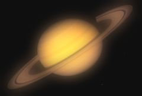

## S_SoftFocus

将源素材的模糊版本与原始素材混合，产生"柔焦"效果。调整 Width 和 Mix 参数可获得不同的外观效果。

位于 Sapphire Blur+Sharpen 效果子菜单中。

### Inputs:

- **Source**: 当前图层。要处理的素材。

- **Mask**: 默认为无。如果提供，模糊仅在此输入的亮区指定的源素材区域上执行。此遮罩外的像素不会被模糊，也不会参与遮罩内的模糊结果像素。此输入可通过 Invert Mask 或 Mask Use 参数进行调整。

### Parameters:

- **Load Preset** (Push-button)
  打开预设浏览器，浏览此效果的所有可用预设。

- **Save Preset** (Push-button)
  打开预设保存对话框，保存此效果的预设。

- **Mocha Project** (Default: 0, Range: 0 or greater)
  打开 Mocha 窗口，用于跟踪素材和生成遮罩。

- **Blur Mocha** (Default: 0, Range: 0 or greater)
  在使用前按此量模糊 Mocha 遮罩。可用于柔化遮罩的边缘或量化伪影，并平滑时间位移。

- **Mocha Opacity** (Default: 1, Range: 0 to 1)
  控制 Mocha 遮罩的强度。较低的值会降低效果的强度。

- **Invert Mocha** (Check-box, Default: off)
  如果启用，在应用效果前反转 Mocha 遮罩的黑白。

- **Resize Mocha** (Default: 1, Range: 0 to 2)
  缩放 Mocha 遮罩。1.0 为原始大小。

- **Resize Rel X** (Default: 1, Range: 0 to 2)
  Mocha 遮罩的相对水平大小。

- **Resize Rel Y** (Default: 1, Range: 0 to 2)
  Mocha 遮罩的相对垂直大小。

- **Shift Mocha** (X & Y, Default: [0 0], Range: any)
  偏移 Mocha 遮罩的位置。

- **Dilate Mocha** (Default: 0, Range: -100 to 100)
  在使用前按此像素量膨胀或收缩 Mocha 遮罩。

- **Dilation Quality** (Popup menu, Default: Fast)
  选择 Dilate Mocha 是在默认的 Fast 模式下快速调整，还是在 High 质量模式下获得更好的效果。
  - **Fast**: 在 Fast 模式下膨胀 Mocha 遮罩，便于快速调整。
  - **High**: 在 High 质量模式下膨胀 Mocha 遮罩，获得更好的遮罩形状。

- **Bypass Mocha** (Check-box, Default: off)
  忽略 Mocha 遮罩并将效果应用于整个源素材。

- **Show Mocha Only** (Check-box, Default: off)
  绕过效果并显示 Mocha 遮罩本身。

- **Combine Masks** (Popup menu, Default: Union)
  当同时提供 Mocha 遮罩和输入遮罩时，确定如何组合它们。
  - **Union**: 使用两个遮罩共同覆盖的区域。
  - **Intersect**: 使用两个遮罩之间重叠的区域。
  - **Mocha Only**: 忽略输入遮罩，只使用 Mocha 遮罩。

- **Soft Width** (Default: 0.224, Range: 0 or greater)
  缩放柔焦模糊的宽度。此参数可通过 Soft Width Widget 调整。

- **Width Rel** (X & Y, Default: [1 1], Range: 0 or greater)
  相对水平和垂直模糊宽度。将 Width Rel X 设为 0 可获得仅垂直方向的模糊，或将 Width Rel Y 设为 0 可获得仅水平方向的模糊。此参数可通过 Soft Width Widget 调整。

- **Mix With Blurred** (Default: 0, Range: 0 to 1)
  如果为正值，混入更多的源素材模糊版本。

- **Mix With Source** (Default: 0, Range: 0 to 1)
  如果为正值，增加结果中原始源素材的比例。

- **Brightness** (Default: 1, Range: 0 or greater)
  缩放结果的亮度。

- **Offset Darks** (Default: 0, Range: -8 to 2)
  将此灰度值添加到结果的较暗区域。可以为负值以增加对比度。

- **Subpixel** (Check-box, Default: on)
  启用亚像素级别的模糊。用于使 Width 参数的动画更平滑。

- **Opacity** (Popup menu, Default: Normal)
  确定处理不透明度/透明度的方法。
  - **All Opaque**: 当输入图像完全不透明且无透明度（alpha=1）时，使用此选项可略微加快渲染速度。
  - **Normal**: 正常处理不透明度。
  - **As Premult**: 按预乘形式处理图像（颜色已按不透明度缩放）。此选项的渲染速度也比 Normal 模式略快，但结果也将是预乘形式，有时可能不太准确。

- **Mask Use** (Popup menu, Default: Luma)
  确定如何使用 Mask 输入通道生成单色遮罩。
  - **Luma**: 使用 RGB 通道的亮度。
  - **Alpha**: 仅使用 Alpha 通道。

- **Blur Mask** (Default: 0.05, Range: 0 or greater)
  在使用前按此量模糊遮罩输入。这可以在遮罩区域和非遮罩区域之间提供更平滑的过渡。除非提供了遮罩输入，否则无效。

- **Invert Mask** (Check-box, Default: off)
  如果启用，反转遮罩输入，使效果应用于遮罩为黑色而非白色的区域。除非提供了遮罩输入，否则无效。

- **Show Soft Width** (Check-box, Default: on)
  打开或关闭用于调整 Soft Width 参数的屏幕用户界面。此参数仅在 AE 和 Premiere 中出现，因为它们支持屏幕控件。
