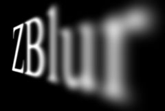

## S_ZBlur

根据 ZBuffer 输入的深度值，对源素材的不同区域施加不同强度的模糊。将输入按深度分成若干层，并依据各层的深度应用不同的模糊量。还可以将线性雾效混合到结果中。使用此效果时，首先根据你的 Z 缓冲设置 ZBuffer: Black Is Near 或 White Is Near，然后调整焦点深度与景深参数以获得所需外观。为便于设置焦点深度，可使用 Show: In Focus Zone。

位于 Sapphire Blur+Sharpen 效果子菜单中。

### Inputs:

- **Source**: 当前图层。要处理的素材。

- **ZBuffer**: 默认为无。包含每个 Source 像素深度值的输入素材。取值应在黑到白之间，且最好不要抗锯齿。通常黑色表示最远处，白色表示最近处，可通过 Z Buffer 参数进行调整。

### Parameters:

- **Load Preset** (Push-button)
  打开预设浏览器，浏览此效果的所有可用预设。

- **Save Preset** (Push-button)
  打开预设保存对话框，保存此效果的预设。

- **Focal Depth** (Default: 0, Range: any)
  焦平面的深度；0 为近，1 为远。具有该 Z 值的区域将处于对焦状态。接近该深度的物体是否清晰取决于 Depth of Field。可用 Show: In Focus Zone 辅助调节。若该参数视觉效果与预期相反，可用 Z Buffer 参数反转深度值。

- **Depth Of Field** (Default: 0.1, Range: 0 to 1)
  指定 Focal Depth 附近被视为清晰的深度范围宽度。例如 Focal Depth=0.5 且 Depth of Field=0.2 时，Z 值在 0.4–0.6 的物体都会清晰。设为 0 则只有恰好在焦点深度处的物体清晰。可用 Show: In Focus Zone 辅助调节。

- **Blur Width** (Default: 0.168, Range: 0 or greater)
  缩放整体模糊量。此参数可通过 Blur Width Widget 调整。

- **Blur Rel** (X & Y, Default: [1 1], Range: 0 or greater)
  相对水平与垂直模糊宽度。将 Blur Rel X 设为 0 得到仅垂直模糊，或将 Blur Rel Y 设为 0 得到仅水平模糊。

- **Z Buffer Type** (Popup menu, Default: White is Near)
  解释 Z 缓冲中的取值方式。
  - **Black is Near**: Z 缓冲中黑色表示近处，白色表示远处。
  - **White is Near**: Z 缓冲中白色表示近处，黑色表示远处。

- **Show** (Popup menu, Default: Result)
  选择输出类型。
  - **Result**: 显示效果的常规结果。
  - **In Focus Zone**: 高亮显示图像中的对焦区域，以便选择焦点与深度。

- **Layers** (Integer, Default: 5, Range: 2 to 50)
  将源素材按深度分层的层数。层数越多处理越慢，但 Z 方向过渡更平滑。有时需要更多层以避免层间接缝可见。

- **Layer Mode** (Popup menu, Default: Interp)
  确定不同模糊层的合成方式。
  - **Comp**: 近处层合成在远处层之上。若不同深度的物体相互遮挡且深度图存在不连续，此方式通常更好，但可能更慢，且偶尔会看到层间伪影。
  - **Interp**: 依据深度图对各层进行插值。层间过渡更平滑，通常在深度图无剧烈变化时更佳。

- **Width Rel Near** (Default: 1, Range: 0 or greater)
  缩放焦平面近侧区域的模糊宽度。

- **Width Rel Far** (Default: 1, Range: 0 or greater)
  缩放焦平面远侧区域的模糊宽度。

- **Fog Near** (Default: 0, Range: 0 to 1)
  近处（靠近镜头）雾效强度。

- **Fog Far** (Default: 0, Range: 0 to 1)
  远处雾效强度。

- **Fog Color** (Default rgb: [0.5 0.5 0.5])
  雾的颜色通常应与源素材的天空或背景相匹配。灰色用于薄雾，棕色用于烟尘，蓝色用于水下等。

- **Zbuffer Use** (Popup menu, Default: Luma)
  决定如何由 ZBuffer 输入通道生成单通道深度图。
  - **Luma**: 使用 RGB 通道的亮度。
  - **Alpha**: 仅使用 Alpha 通道。

- **Soft Borders** (Check-box, Default: off)
  若启用，在处理前为输入图像添加透明边框，从而允许结果包含超出原始图像尺寸的柔和边缘。关闭时效果仅在画面内发生，结果边缘将保留边界。

- **Opacity** (Popup menu, Default: Normal)
  决定处理不透明度/透明度的方法。
  - **All Opaque**: 当输入完全不透明（alpha=1）时可稍微加快渲染。
  - **Normal**: 正常处理不透明度。
  - **As Premult**: 按已预乘形式处理（颜色已按不透明度缩放）。渲染略快于 Normal，但结果也将是预乘形式，某些情况下精确性较差。

- **Show Blur Width** (Check-box, Default: on)
  打开或关闭用于调整 Blur Width 的屏幕控件。此参数仅在支持屏幕控件的 AE 与 Premiere 中出现。
