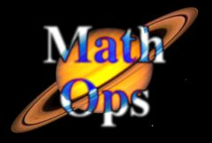

## S_MathOps

使用多种数学运算之一组合两个片段。每个输入的颜色也可以通过亮部、暗部和饱和度参数进行调整。

在 Sapphire Composite 效果子菜单中。

### Inputs:

- **SourceA**: 当前图层。要处理的第一个输入片段。

- **SourceB**: 默认为无。要处理的第二个输入片段。

- **Mask**: 默认为无。在结果和源输入之间进行插值。白色区域使用效果结果。黑色区域使用源片段。

### Parameters:

- **Load Preset** (Push-button)
  打开预设浏览器，浏览此效果的所有可用预设。

- **Save Preset** (Push-button)
  打开预设保存对话框，保存此效果的预设。

- **Operation** (Popup menu, Default: Add)
  确定使用哪种数学运算来组合两个源输入的像素颜色。
  - **Add**: A + B。
  - **Subtract**: A - B。
  - **Multiply**: A * B。可用作遮罩图像的"交集"操作。结果仅在两个输入都为白色的地方包含白色。
  - **Divide**: A / B。可用于通过将遮罩作为第二个输入来"取消预乘"图像。
  - **Screen**: A + B - AB。可用于组合两个片段的亮部区域。也可用作遮罩图像的"并集"操作。任一输入图像为白色的地方结果都为白色。
  - **Average**: (A + B) / 2。
  - **Overlay**: 使用叠加函数将 A 合成到 B 之上。
  - **Minimum**: 每个像素每个颜色通道的最小值。也可用作"交集"操作，结果与 Multiply 略有不同。
  - **Maximum**: 每个像素每个颜色通道的最大值。也可用作"并集"操作，结果与 Screen 略有不同。
  - **Difference**: 类似于 Subtract，但使用结果的绝对值，这往往会使更多结果颜色保持在范围内。可用于选择两个遮罩图像中一个为白色而另一个不为白色的区域。
  - **Xor**: 对源片段的颜色执行"异或"操作。也可用于选择两个遮罩图像中一个为白色而另一个不为白色的区域，结果与 Difference 略有不同。
  - **Xor Bits**: 对源片段的颜色执行按位异或操作。可以产生一些有趣的轮廓效果，但结果通常难以预测。
  - **And Bits**: 对源片段的颜色执行按位逻辑与操作。类似于 XorBits，但倾向于产生较暗的结果。
  - **Or Bits**: 对源片段的颜色执行按位逻辑或操作。类似于 XorBits，但倾向于产生较亮的结果。
  - **Mod**: 给出第一个源片段的颜色除以第二个的余数。将 A Scale 参数设为较高值可获得一些不寻常的像素条带效果。
  - **Round**: 使用第二个输入的值作为步长大小对第一个源片段的颜色进行四舍五入。
  - **Bounce**: 类似于 Mod，但结果包含更少的锯齿边缘。将 A Scale 参数设为较高值可获得一些条纹效果。

- **Mocha Project** (Default: 0, Range: 0 or greater)
  打开 Mocha 窗口，用于跟踪素材和生成遮罩。

- **Blur Mocha** (Default: 0, Range: 0 or greater)
  在使用前按此量模糊 Mocha 遮罩。这可用于柔化遮罩的边缘或量化伪影，并平滑时间位移。

- **Mocha Opacity** (Default: 1, Range: 0 to 1)
  控制 Mocha 遮罩的强度。较低的值会降低效果的强度。

- **Invert Mocha** (Check-box, Default: off)
  如果启用，则在应用效果之前反转 Mocha 遮罩的黑白。

- **Resize Mocha** (Default: 1, Range: 0 to 2)
  缩放 Mocha 遮罩。1.0 为原始大小。

- **Resize Rel X** (Default: 1, Range: 0 to 2)
  Mocha 遮罩的相对水平大小。

- **Resize Rel Y** (Default: 1, Range: 0 to 2)
  Mocha 遮罩的相对垂直大小。

- **Shift Mocha** (X & Y, Default: [0 0], Range: any)
  偏移 Mocha 遮罩的位置。

- **Dilate Mocha** (Default: 0, Range: -100 to 100)
  在使用前按此像素量膨胀或收缩 Mocha 遮罩。

- **Dilation Quality** (Popup menu, Default: Fast)
  选择 Dilate Mocha 是在默认的快速模式下快速调整，还是在高质量模式下获得更好的效果。
  - **Fast**: 在快速模式下膨胀 Mocha 遮罩，用于快速调整。
  - **High**: 在高质量模式下膨胀 Mocha 遮罩，以获得更好的遮罩形状。

- **Bypass Mocha** (Check-box, Default: off)
  忽略 Mocha 遮罩，将效果应用于整个源片段。

- **Show Mocha Only** (Check-box, Default: off)
  绕过效果，仅显示 Mocha 遮罩本身。

- **Combine Masks** (Popup menu, Default: Union)
  确定当两个遮罩同时提供给效果时，如何组合 Mocha 遮罩和输入遮罩。
  - **Union**: 使用两个遮罩共同覆盖的区域。
  - **Intersect**: 使用两个遮罩之间重叠的区域。
  - **Mocha Only**: 忽略输入遮罩，仅使用 Mocha 遮罩。

- **Swap Inputs** (Check-box, Default: off)
  如果启用，则有效地交换 A 和 B 源输入，对于减法等非交换操作很有帮助。请注意，这也会导致标记为"A"的参数影响"B"输入，反之亦然。

- **A Lights** (Default: 1, Range: 0 or greater)
  在执行操作之前缩放 SourceA 的亮度。

- **A Darks** (Default: 0, Range: any)
  在执行效果之前偏移第一个输入的较暗区域。可以为负值以增加对比度。

- **A Saturation** (Default: 1, Range: 0 or greater)
  在执行操作之前调整 SourceA 的色彩强度。0.0 使其变为单色，1.0 无效果。

- **B Lights** (Default: 1, Range: 0 or greater)
  在执行操作之前缩放 SourceB 的亮度。

- **B Darks** (Default: 0, Range: any)
  在执行效果之前偏移第二个输入的较暗区域。可以为负值以增加对比度。

- **B Saturation** (Default: 1, Range: 0 or greater)
  在执行操作之前调整 SourceB 的色彩强度。0.0 使其变为单色，1.0 无效果。

- **Dest Lights** (Default: 1, Range: 0 or greater)
  在执行操作之后缩放结果的亮度。

- **Dest Darks** (Default: 0, Range: any)
  在执行效果之后偏移结果的较暗区域。可以为负值以增加对比度。

- **Dest Saturation** (Default: 1, Range: 0 or greater)
  在执行操作之后缩放结果的色彩强度。0.0 使其变为单色，1.0 无效果。

- **Opacity** (Popup menu, Default: Normal)
  确定处理不透明度/透明度的方法。
  - **All Opaque**: 当输入图像完全不透明且没有透明度（alpha=1）时，使用此选项可稍快地渲染。
  - **Normal**: 正常处理不透明度。
  - **As Premult**: 按照图像已经是预乘形式（颜色已按不透明度缩放）来处理。此选项的渲染速度也比普通模式稍快，但结果也将是预乘形式，有时不太准确。

- **Mask Use** (Popup menu, Default: Luma)
  确定如何使用遮罩输入通道来生成单色遮罩。
  - **Luma**: 使用 RGB 通道的亮度。
  - **Alpha**: 仅使用 Alpha 通道。

- **Blur Mask** (Default: 0.05, Range: 0 or greater)
  在使用前按此量模糊遮罩输入。这可以提供遮罩区域和非遮罩区域之间更平滑的过渡。除非提供了遮罩输入，否则无效。

- **Invert Mask** (Check-box, Default: off)
  如果开启，则反转遮罩输入，使效果应用于遮罩为黑色而非白色的区域。除非提供了遮罩输入，否则无效。
