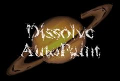

## S_DissolveAutoPaint

淡入起始素材的"画笔绘制"版本。降低绘画的复杂度直到只剩几种颜色，然后转场到第二个素材的"画笔绘制"版本，该版本随后在颜色和复杂度上逐渐增加，直到第二个素材淡入。

在 Sapphire Transitions 效果子菜单中。

### Inputs:

- **Foreground**: 当前图层。以此素材开始转场。

- **Background**: 默认为无。以此素材结束转场。

### Parameters:

- **Load Preset** (Push-button)
  打开预设浏览器，浏览此效果的所有可用预设。

- **Save Preset** (Push-button)
  打开预设保存对话框，保存此效果的预设。

- **Transition Dir** (Popup menu, Default: Dissolve Off to Bg)
  选择转场的方向。
  - **Dissolve Off to Bg**: 从当前图层转场到背景。
  - **Dissolve On from Bg**: 从背景转场到当前图层。

- **Auto Trans** (Popup YES-NO, Default: No)
  如果启用，将在图层的第一帧和最后一帧之间自动执行转场。如果关闭，则通过动画 Dissolve Percent 参数手动执行转场。

- **Dissolve Percent** (Default: 0, Range: 0 to 1)
  必须禁用 Auto Trans 才能使用此参数。它决定前景和背景输入之间的转场比例，通常从 0 动画到 100 以执行完整的转场。可以调整控制此参数的曲线，以更精细地控制溶解的时间。

- **Dissolve Speed** (Default: 3, Range: 1 or greater)
  从一个素材到另一个素材的溶解速度。设为 1 时，溶解在效果的整个持续时间内进行。设为更高值时，溶解更短，但辉光的渐入和渐出仍占据整个持续时间。设为 10 可使转场更快捷，更像闪帧切换。

- **Paint Fade** (Default: 0.25, Range: 0 to 1)
  在转场的两端，将绘画效果淡入到起始素材上所需的时间比例。

- **Style** (Popup menu, Default: Van Gogh)
  选择画笔笔触的风格。
  - **Van Gogh**: 笔触方向与图像中发现的边缘对齐。
  - **Hairy Paint**: 笔触垂直于图像中的边缘。
  - **Pointalize**: 笔触为无方向的蜂窝状尖形。

- **Min Brush Size** (Default: 0.04, Range: 0.0025 to 1)
  转场中间的画笔大小。

- **Max Brush Size** (Default: 0.4, Range: 0.0025 to 1)
  转场开始和结束时的画笔大小。

- **Stroke Length** (Default: 2, Range: any)
  决定画笔笔触沿源素材边缘方向的长度。如果为负值，可以在 VanGogh 和 HairyPaint 风格之间切换。

- **Stroke Align** (Default: 0.2, Range: 0 or greater)
  增大可平滑笔触的方向，使附近的笔触更加平行。

- **Smooth Colors** (Default: 0, Range: 0 or greater)
  在生成画笔笔触之前按此数值模糊源素材。增大可使附近笔触的颜色更一致。

- **Seed** (Default: 0, Range: 0 or greater)
  用于初始化随机数生成器。实际种子值本身不重要，但不同的种子会产生不同的结果，相同的值应产生可重复的结果。

- **Jitter Frames** (Integer, Default: 0, Range: 0 or greater)
  如果为 0，笔触的位置在每一帧处理时保持不变。如果为 1，笔触位置在每帧重新随机化。如果为 2，则每两帧重新随机化一次，依此类推。

- **Sharpen** (Default: 1, Range: 0 or greater)
  应用的后处理锐化量。

- **Sharpen Width** (Default: 0.2, Range: 0 or greater)
  应用后处理锐化滤镜的宽度，相对于笔触大小。较高的值影响边缘更宽的区域，较低的值仅影响锐利边缘附近的区域。
