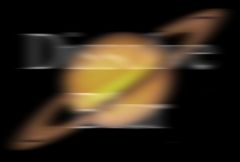

## S_DissolveBlur

在两个输入素材之间转场，同时对每个素材应用模糊。第一个素材被模糊并淡出，第二个素材取消模糊并淡入。应通过动画 Dissolve Percent 参数来控制转场速度。

在 Sapphire Transitions 效果子菜单中。

### Inputs:

- **Foreground**: 当前图层。以此素材开始转场。

- **Background**: 默认为无。以此素材结束转场。

### Parameters:

- **Load Preset** (Push-button)
  打开预设浏览器，浏览此效果的所有可用预设。

- **Save Preset** (Push-button)
  打开预设保存对话框，保存此效果的预设。

- **Transition Dir** (Popup menu, Default: Dissolve Off to Bg)
  选择转场的方向。
  - **Dissolve Off to Bg**: 从当前图层转场到背景。
  - **Dissolve On from Bg**: 从背景转场到当前图层。

- **Auto Trans** (Popup YES-NO, Default: No)
  如果启用，将在图层的第一帧和最后一帧之间自动执行转场。如果关闭，则通过动画 Dissolve Percent 参数手动执行转场。

- **Dissolve Percent** (Default: 0, Range: 0 to 1)
  必须禁用 Auto Trans 才能使用此参数。它决定前景和背景输入之间的转场比例，通常从 0 动画到 100 以执行完整的转场。可以调整控制此参数的曲线，以更精细地控制溶解的时间。

- **Blur Amount** (Default: 2, Range: 0 or greater)
  缩放模糊的宽度。

- **Blur Rel** (X & Y, Default: [1 0], Range: 0 or greater)
  相对水平和垂直模糊宽度。将 Blur Rel X 设为 0 可获得仅垂直方向的模糊，将 Blur Rel Y 设为 0 可获得仅水平方向的模糊。

- **Blur Rel From** (Default: 1, Range: 0 or greater)
  缩放应用于第一个素材的模糊量。设为 0 可在没有模糊的情况下淡出。

- **Blur Rel To** (Default: 1, Range: 0 or greater)
  缩放应用于第二个素材的模糊量。设为 0 可在没有模糊的情况下淡入。

- **Blur Filter** (Popup menu, Default: Gauss)
  用于模糊的卷积滤镜类型。
  - **Box**: 使用矩形滤镜。
  - **Triangle**: 更平滑，使用金字塔形滤镜。
  - **Gauss**: 最平滑，使用高斯形滤镜。

- **Opacity** (Popup menu, Default: Normal)
  决定处理不透明度/透明度的方法。
  - **All Opaque**: 当输入图像完全不透明且没有透明度 (alpha=1) 时使用此选项可稍微加快渲染速度。
  - **Normal**: 正常处理不透明度。
  - **As Premult**: 按图像已经是预乘形式（颜色已按不透明度缩放）来处理。此选项的渲染速度也比 Normal 模式稍快，但结果也将是预乘形式，有时不太准确。
