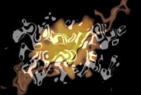

## S_DissolveBubble

使用气泡扭曲功能在两个输入素材之间转场。第一个素材被扭曲并淡出，第二个素材被反扭曲到位并淡入。应通过动画 Dissolve Percent 参数来控制转场速度。

在 Sapphire Transitions 效果子菜单中。

### Inputs:

- **Foreground**: 当前图层。以此素材开始转场。

- **Background**: 默认为无。以此素材结束转场。如果未提供此输入，将使用完全透明的背景，显示其后面的内容。请注意，除非提供了此输入，否则背景在转场过程中无法被扭曲。

### Parameters:

- **Load Preset** (Push-button)
  打开预设浏览器，浏览此效果的所有可用预设。

- **Save Preset** (Push-button)
  打开预设保存对话框，保存此效果的预设。

- **Transition Dir** (Popup menu, Default: Dissolve Off to Bg)
  选择转场的方向。
  - **Dissolve Off to Bg**: 从当前图层转场到背景。
  - **Dissolve On from Bg**: 从背景转场到当前图层。

- **Auto Trans** (Popup YES-NO, Default: No)
  如果启用，将在图层的第一帧和最后一帧之间自动执行转场。如果关闭，则通过动画 Dissolve Percent 参数手动执行转场。

- **Dissolve Percent** (Default: 0, Range: 0 to 1)
  必须禁用 Auto Trans 才能使用此参数。它决定前景和背景输入之间的转场比例，通常从 0 动画到 100 以执行完整的转场。可以调整控制此参数的曲线，以更精细地控制溶解的时间。Slow In 和 Slow Out 参数如果为正值，也会在内部调整转场比例，以获得更平滑的转场开始和/或结束。

- **Frequency** (Default: 8, Range: 0.01 or greater)
  气泡扭曲图案的频率。增大可获得更小的气泡，减小可获得更大的气泡。

- **Frequency Rel Y** (Default: 1, Range: 0.01 or greater)
  气泡的相对垂直频率。减小可获得更高的气泡，增大可获得更宽的气泡。

- **Octaves** (Integer, Default: 1, Range: 1 to 10)
  噪声叠加层的数量。每个八度是前一个的两倍频率和一半振幅。单个八度产生平滑的纹理。增加八度使结果趋近于分形 (1/f) 噪声纹理。

- **Seed** (Default: 0.23, Range: 0 or greater)
  用于初始化随机数生成器。实际种子值本身不重要，但不同的种子会产生不同的结果，相同的值应产生可重复的结果。

- **Amplitude** (Default: 1, Range: any)
  缩放扭曲变形的量。

- **Rel Amp2** (Default: -1, Range: any)
  第二个输入素材扭曲变形的相对振幅。如果为正值而非负值，素材将从相反方向反扭曲。

- **Slow In** (Default: 0.5, Range: 0 to 1)
  如果为正值，使转场开始更加渐进。

- **Slow Out** (Default: 0.5, Range: 0 to 1)
  如果为正值，使转场结束更加渐进。

- **Wrap** (X & Y, Popup menu, Default: [ Reflect Reflect ])
  决定访问源图像边界外部区域时的方法。
  - **No**: 边界外显示黑色。
  - **Tile**: 重复图像的副本。
  - **Reflect**: 重复图像的镜像副本。使用此方法时边缘通常不太明显。

- **Filter** (Check-box, Default: on)
  用于模糊的卷积滤镜类型。

- **Opacity** (Popup menu, Default: Normal)
  决定处理不透明度/透明度的方法。
  - **All Opaque**: 当输入图像完全不透明且没有透明度 (alpha=1) 时使用此选项可稍微加快渲染速度。
  - **Normal**: 正常处理不透明度。
  - **As Premult**: 按图像已经是预乘形式（颜色已按不透明度缩放）来处理。此选项的渲染速度也比 Normal 模式稍快，但结果也将是预乘形式，有时不太准确。

- **Crop Input Parameters** (Default: 0, Range: 0 or greater)
  这 4 个参数，Crop Top、Crop Bottom、Crop Left 和 Crop Right，允许选择输入图像的矩形子区域进行处理。如果 Wrap 参数设为 "No"，暴露的边框将是透明的。如果 Wrap 为 "Tile" 或 "Reflect"，源图像将在新裁剪的边框上进行环绕以填充画面。这可以更容易地避免因扭曲边缘不良的图像而产生的伪影。
