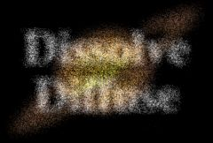

## S_DissolveDiffuse

通过在 Max Amount 决定的区域内打乱输入像素，在两个输入素材之间转场。第一个素材被扩散消失，第二个素材被扩散到位。应通过动画 Dissolve Percent 参数来控制转场速度。此效果的像素化外观取决于图像分辨率，因此建议在处理前测试最终分辨率。

在 Sapphire Transitions 效果子菜单中。

### Inputs:

- **Foreground**: 当前图层。以此素材开始转场。

- **Background**: 默认为无。以此素材结束转场。如果未提供此输入，将使用完全透明的背景，显示其后面的内容。请注意，除非提供了此输入，否则背景在转场过程中无法被扩散。

### Parameters:

- **Load Preset** (Push-button)
  打开预设浏览器，浏览此效果的所有可用预设。

- **Save Preset** (Push-button)
  打开预设保存对话框，保存此效果的预设。

- **Transition Dir** (Popup menu, Default: Dissolve Off to Bg)
  选择转场的方向。
  - **Dissolve Off to Bg**: 从当前图层转场到背景。
  - **Dissolve On from Bg**: 从背景转场到当前图层。

- **Auto Trans** (Popup YES-NO, Default: No)
  如果启用，将在图层的第一帧和最后一帧之间自动执行转场。如果关闭，则通过动画 Dissolve Percent 参数手动执行转场。

- **Dissolve Percent** (Default: 0, Range: 0 to 1)
  必须禁用 Auto Trans 才能使用此参数。它决定前景和背景输入之间的转场比例，通常从 0 动画到 100 以执行完整的转场。可以调整控制此参数的曲线，以更精细地控制溶解的时间。

- **Max Amount** (Default: 0.2, Range: 0 or greater)
  缩放扩散距离的幅度。

- **Rel Amount** (X & Y, Default: [1 1], Range: 0 or greater)
  缩放水平和垂直扩散的相对量。

- **Wrap** (X & Y, Popup menu, Default: [ Reflect Reflect ])
  决定访问源图像边界外部区域时的方法。
  - **No**: 边界外显示黑色。
  - **Tile**: 重复图像的副本。
  - **Reflect**: 重复图像的镜像副本。使用此方法时边缘通常不太明显。

- **Crop Input Parameters** (Default: 0, Range: 0 or greater)
  这 4 个参数，Crop Top、Crop Bottom、Crop Left 和 Crop Right，允许选择输入图像的矩形子区域进行处理。如果 Wrap 参数设为 "No"，暴露的边框将是透明的。如果 Wrap 为 "Tile" 或 "Reflect"，源图像将在新裁剪的边框上进行环绕以填充画面。这可以更容易地避免因扭曲边缘不良的图像而产生的伪影。

- **Show Max Amount** (Check-box, Default: on)
  开启或关闭用于调整 Max Amount 参数的屏幕用户界面。此参数仅在 AE 和 Premiere 中出现，因为这些软件支持屏幕控件。
