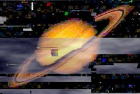

## S_DissolveDigitalDamage

使用溶解在两个输入素材之间转场，同时对溶解的素材应用 DigitalDamage 效果。应通过动画 Dissolve Percent 参数来控制转场速度。

在 Sapphire Transitions 效果子菜单中。

### Inputs:

- **Foreground**: 当前图层。以此素材开始转场。

- **Background**: 默认为无。以此素材结束转场。

### Parameters:

- **Load Preset** (Push-button)
  打开预设浏览器，浏览此效果的所有可用预设。

- **Save Preset** (Push-button)
  打开预设保存对话框，保存此效果的预设。

- **Transition Dir** (Popup menu, Default: Dissolve Off to Bg)
  选择转场的方向。
  - **Dissolve Off to Bg**: 从当前图层转场到背景。
  - **Dissolve On from Bg**: 从背景转场到当前图层。

- **Auto Trans** (Popup YES-NO, Default: No)
  如果启用，将在图层的第一帧和最后一帧之间自动执行转场。如果关闭，则通过动画 Dissolve Percent 参数手动执行转场。

- **Dissolve Percent** (Default: 0, Range: 0 to 1)
  必须禁用 Auto Trans 才能使用此参数。它决定前景和背景输入之间的转场比例，通常从 0 动画到 100 以执行完整的转场。可以调整控制此参数的曲线，以更精细地控制溶解的时间。

- **Dissolve Speed** (Default: 1, Range: 1 or greater)
  从一个素材到另一个素材的溶解速度。设为 1 时，溶解在效果的整个持续时间内进行。设为更高值时，溶解更短，但数字损伤的渐入和渐出仍占据整个持续时间。设为 10 可使转场更快捷，更像闪帧切换。

- **Slow In** (Default: 0.2, Range: 0 to 1)
  如果为正值，使转场开始更加渐进。

- **Slow Out** (Default: 0.2, Range: 0 to 1)
  如果为正值，使转场结束更加渐进。

- **Intensity** (Default: 1, Range: 0 or greater)
  损伤的整体空间强度。增大可使每帧产生更多损伤。

- **Time Intensity** (Default: 1, Range: 0 or greater)
  时间强度。通常，并非所有损伤类型都应用于每一帧。增大此值将使更多帧受到每种损伤类型的影响。

- **Damage Size** (Default: 1, Range: 0.001 or greater)
  增大可增加损伤区域的平均大小。

- **Damage Size Rel X** (Default: 1, Range: 0.001 or greater)
  增大可使损伤区域水平拉长。这不会拉伸图像，只是改变损伤区域和噪声图案的宽高比。

- **Freeze** (Check-box, Default: on)
  启用冻结帧损伤。

- **Freeze Threshold** (Default: 0.09, Range: 0 to 1)
  减小可使每帧产生更多冻结区域。

- **Freeze Saturation** (Default: 2.5, Range: 0 or greater)
  增强冻结区域的饱和度，使外观更具损伤感。

- **Freeze Quality** (Default: 0.1, Range: 0 or greater)
  降低可使冻结区域呈现 JPEG 量化外观。

- **Freeze Errs** (Default: 0.05, Range: 0 or greater)
  向冻结区域添加 JPEG 量化错误。

- **Freeze Frames** (Integer, Default: 10, Range: 0 to 20)
  每 N 帧冻结一次。这不会冻结整个图像，但当存在冻结损伤时，会使用每第 N 帧。增大可获得更极端的外观。设为 1 则不产生冻结效果。

- **Freeze Blink Freq** (Default: 15, Range: 0.1 or greater)
  控制此类损伤闪烁开关的速度。

- **Freeze Always** (Default: 0.3, Range: 0 to 1)
  控制此类损伤出现的频率。

- **Shift** (Check-box, Default: on)
  启用块偏移损伤。

- **Shift Amount** (Default: 0.1, Range: 0 or greater)
  控制块偏移损伤的强度或量。

- **Shift Threshold** (Default: 0.3, Range: 0 to 1)
  减小可使每帧产生更多块偏移区域。

- **Shift Blink Freq** (Default: 10, Range: 0.1 or greater)
  控制此类损伤闪烁开关的速度。

- **Shift Always** (Default: 0.3, Range: 0 to 1)
  控制此类损伤出现的频率。

- **Brights Noise** (Check-box, Default: on)
  启用出现在图像亮部区域的噪声。

- **Brights Threshold** (Default: 0.6, Range: 0 to 1)
  亮度超过此值的区域将受到亮部噪声的影响。

- **Brights Band Threshold** (Default: 0.4, Range: 0 to 1)
  此损伤类型以条带形式出现；增大此参数可产生更多损伤条带，从而增加整体损伤量。

- **Brights Band Freq** (Default: 6, Range: 0.1 or greater)
  控制损伤条带的平均高度；减小可获得更大的条带，增大可获得更短、更精细的条带。

- **Brights Blink Freq** (Default: 10, Range: 0.1 or greater)
  控制此类损伤闪烁开关的速度。

- **Brights Always** (Default: 0.23, Range: 0 to 1)
  控制此类损伤出现的频率。

- **Pixelate** (Check-box, Default: on)
  启用像素化损伤。

- **Pixelate Frequency** (Default: 40, Range: 1 or greater)
  控制块状像素的大小。增大可获得更多、更小的像素；减小可获得更少、更大的像素。

- **Pixelate Hold** (Default: 0.95, Range: 0 to 1)
  控制像素化损伤区域的移动方式。增大可使损伤区域在更多帧上保持在同一位置；减小可使其更随机。

- **Pixelate Threshold** (Default: 0.1, Range: 0 to 1)
  减小可增加每帧的整体像素化；增大可减少。

- **Pixelate Overdrive** (Default: 1.6, Range: 0 or greater)
  像素化损伤可以反转和扭曲受损区域；增大此参数可使外观更具损伤感。

- **Pixelate Blink Freq** (Default: 10, Range: 0.1 or greater)
  控制此类损伤闪烁开关的速度。

- **Pixelate Always** (Default: 0.15, Range: 0 to 1)
  控制此类损伤出现的频率。

- **Block Noise** (Check-box, Default: on)
  启用块状噪声损伤；这在卫星电视传输不良时常见。噪声的条带和块叠加并与源素材交互。

- **Blocks Intensity** (Default: 1, Range: 0 or greater)
  增加块状损伤的强度。

- **Blocks Threshold** (Default: 0.4, Range: 0 to 1)
  减小可增加每帧的整体损伤；增大可减少。

- **Blocks Softness** (Default: 0.2, Range: 0 or greater)
  此参数在增大时会柔化损伤图案。

- **Blocks Chroma** (Default: 0.95, Range: 0 to 1)
  增大可过度驱动块状噪声的色度，使外观更具损伤感。

- **Blocks Blink Freq** (Default: 10, Range: 0.1 or greater)
  控制此类损伤闪烁开关的速度。

- **Blocks Always** (Default: 0.15, Range: 0 to 1)
  控制此类损伤出现的频率。

- **Blocks Affect Alpha** (Default: 0, Range: 0 or greater)
  控制块状噪声是否影响输出的 Alpha 通道。通常在文字图层或键上使用时应将此设为零，这样块状效果不会出现在最终结果的整个图像上，而是保持在文字范围内。

- **Invert** (Check-box, Default: on)
  启用图像反转损伤，反转并重新着色图像的条带。

- **Invert Threshold** (Default: 0.35, Range: 0 to 1)
  减小可增加每帧的整体损伤；增大可减少。

- **Invert Darken** (Default: 0.4, Range: 0 or greater)
  增大可使反转区域更暗；使其更突出，看起来更具损伤感。

- **Invert Pattern Freq** (Default: 2, Range: 0.1 or greater)
  控制反转损伤图案的空间频率。增大可使反转区域图案更精细；减小可获得更大的损伤区域。

- **Invert Blink Freq** (Default: 10, Range: 0.1 or greater)
  控制此类损伤闪烁开关的速度。

- **Invert Always** (Default: 0.21, Range: 0 to 1)
  控制此类损伤出现的频率。

- **Flow** (Check-box, Default: on)
  启用图像流损伤，类似于 MPEG I 帧丢失。图像的某些区域有时会冻结并开始作为整块移动。

- **Flow Block Freq** (Default: 4, Range: 0.1 or greater)
  控制流损伤图案的空间频率。增大可使流动区域更小；减小可获得更大的损伤区域。

- **Flow Damage Amount** (Default: 1, Range: 0 or greater)
  控制流动区域中色度损伤的量。

- **Flow Threshold** (Default: 0.6, Range: 0 to 1)
  减小可增加每帧的整体损伤；增大可减少。

- **Flow Speed** (Default: 1, Range: 0 or greater)
  控制流动区域的运动速度。

- **Flow Blink Freq** (Default: 8, Range: 0.1 or greater)
  控制此类损伤闪烁开关的速度。

- **Flow Always** (Default: 0.2, Range: 0 to 1)
  控制此类损伤出现的频率。

- **Seed** (Default: 1.23, Range: 0 or greater)
  用于初始化随机数生成器。实际种子值本身不重要，但不同的种子会产生不同的结果，相同的值应产生可重复的结果。

- **Opacity** (Popup menu, Default: Normal)
  决定处理不透明度/透明度的方法。
  - **All Opaque**: 当输入图像完全不透明且没有透明度 (alpha=1) 时使用此选项可稍微加快渲染速度。
  - **Normal**: 正常处理不透明度。
  - **As Premult**: 按图像已经是预乘形式（颜色已按不透明度缩放）来处理。此选项的渲染速度也比 Normal 模式稍快，但结果也将是预乘形式，有时不太准确。
