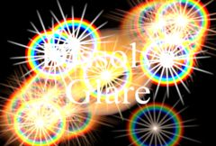

## S_DissolveGlare

使用动画眩光在两个输入素材之间转场。素材相互溶解，并在结果中添加眩光。眩光的大小和亮度在效果持续时间内渐入和渐出。

在 Sapphire Transitions 效果子菜单中。

### Inputs:

- **Foreground**: 当前图层。以此素材开始转场。

- **Background**: 默认为无。以此素材结束转场。

### Parameters:

- **Load Preset** (Push-button)
  打开预设浏览器，浏览此效果的所有可用预设。

- **Save Preset** (Push-button)
  打开预设保存对话框，保存此效果的预设。

- **Transition Dir** (Popup menu, Default: Dissolve Off to Bg)
  选择转场的方向。
  - **Dissolve Off to Bg**: 从当前图层转场到背景。
  - **Dissolve On from Bg**: 从背景转场到当前图层。

- **Auto Trans** (Popup YES-NO, Default: No)
  如果启用，将在图层的第一帧和最后一帧之间自动执行转场。如果关闭，则通过动画 Dissolve Percent 参数手动执行转场。

- **Dissolve Percent** (Default: 0, Range: 0 to 1)
  必须禁用 Auto Trans 才能使用此参数。它决定前景和背景输入之间的转场比例，通常从 0 动画到 100 以执行完整的转场。可以调整控制此参数的曲线，以更精细地控制溶解的时间。

- **Dissolve Speed** (Default: 3, Range: 1 or greater)
  从一个素材到另一个素材的溶解速度。设为 1 时，溶解在效果的整个持续时间内进行。设为更高值时，溶解更短，但边缘光线的渐入和渐出仍占据整个持续时间。设为 10 可使转场更快捷，更像闪帧切换。

- **Size** (Default: 2.4, Range: 0 or greater)
  缩放眩光的大小。

- **Rel Height** (Default: 1, Range: 0 or greater)
  缩放眩光的垂直尺寸，使其变为椭圆形而非圆形。

- **Style** (Default: 0, Range: 0 or greater)
  要应用的眩光风格。也可以通过编辑 "s_glares.text" 文件来创建自定义眩光类型或修改现有类型。

- **Convolve** (Check-box, Default: off)
  决定将眩光应用于背景的方法。

- **Threshold** (Default: 0.5, Range: 0 or greater)
  从源素材中亮度超过此值的位置生成溶解效果。值为 0.9 时仅在最亮的位置产生效果。值为 0 时在每个非黑色区域都产生效果。

- **Threshold Add Color** (Default rgb: [0 0 0])
  可用于提高特定颜色的阈值，从而减少源素材中包含该颜色的区域所产生的溶解效果。

- **Threshold Blur** (Default: 0, Range: 0 or greater)
  增大可平滑产生溶解效果的区域。可用于消除由小斑点产生的溶解效果或简单地柔化溶解效果。增大此值可能会使更多高光低于阈值并使结果变暗，但可以降低 Threshold 参数来补偿。

- **Brightness** (Default: 3, Range: 0 or greater)
  缩放所有溶解效果的亮度。

- **Scale Colors** (Default rgb: [1 1 1])
  缩放溶解效果的颜色。溶解效果的颜色和亮度也受源素材和遮罩输入的影响。

- **Saturation** (Default: 1, Range: -2 to 8)
  缩放眩光元素的颜色饱和度。增大可获得更强烈的颜色。设为 0 可获得单色眩光。

- **Rotate** (Default: 0, Range: any)
  旋转眩光的光线元素（如果有），以度为单位。

- **Rays Num Scale** (Default: 1, Range: 0 or greater)
  增加或减少光线的数量。

- **Rays Length** (Default: 1, Range: 0 or greater)
  调整光线的长度而不改变其粗细。

- **Rays Thickness** (Default: 1, Range: 0 or greater)
  调整单条光线的粗细。

- **Blur Glare** (Default: 0, Range: 0 or greater)
  眩光在与背景合成之前按此数值进行模糊。

- **Hue Shift** (Default: 0, Range: any)
  偏移眩光的色相，以从红到绿到蓝到红的旋转为单位。

- **Glare Res** (Popup menu, Default: Full)
  选择眩光的分辨率系数。较高的分辨率产生更锐利的眩光，较低的分辨率产生更平滑的眩光和更快的处理速度。此"Res"系数仅影响眩光：背景仍以全分辨率与眩光合成。
  - **Full**: 使用全分辨率。
  - **Half**: 眩光以半分辨率计算。
  - **Quarter**: 眩光以四分之一分辨率计算。

- **Affect Alpha** (Default: 1, Range: 0 or greater)
  如果此值为正，输出的 Alpha 通道将包含来自溶解效果的一些不透明度。红、绿、蓝溶解亮度的最大值按此值缩放，并在每个像素处与背景 Alpha 合成。

- **Glare From Alpha** (Default: 0, Range: 0 to 1)
  设为 1 可从源输入的 Alpha 通道而非 RGB 通道生成溶解效果。在这种情况下，溶解效果不会从源素材获取颜色，通常会更亮。0 到 1 之间的值在使用 RGB 和 Alpha 之间插值。

- **Expand Borders** (Check-box, Default: off)
  如果启用，在处理前向输入图像添加透明边框。这允许结果包含超出原始图像大小的柔和边缘。关闭时，效果仅在画面内发生，结果将在边界处保留硬边。

- **Show Size** (Check-box, Default: on)
  开启或关闭用于调整 Size 和 Rel Height 参数的屏幕用户界面控件。此参数仅在 AE 和 Premiere 中出现，因为这些软件支持屏幕控件。
