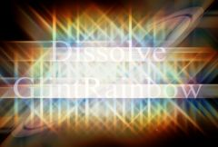

## S_DissolveGlintRainbow

使用明亮发光的闪点在两个输入素材之间转场。素材相互溶解，同时每个素材都会获得一个在效果持续时间内渐入和渐出的闪点。应通过动画 Dissolve Percent 参数来控制转场速度。

在 Sapphire Transitions 效果子菜单中。

### Inputs:

- **Foreground**: 当前图层。以此素材开始转场。

- **Background**: 默认为无。以此素材结束转场。

### Parameters:

- **Load Preset** (Push-button)
  打开预设浏览器，浏览此效果的所有可用预设。

- **Save Preset** (Push-button)
  打开预设保存对话框，保存此效果的预设。

- **Transition Dir** (Popup menu, Default: Dissolve Off to Bg)
  选择转场的方向。
  - **Dissolve Off to Bg**: 从当前图层转场到背景。
  - **Dissolve On from Bg**: 从背景转场到当前图层。

- **Auto Trans** (Popup YES-NO, Default: No)
  如果启用，将在图层的第一帧和最后一帧之间自动执行转场。如果关闭，则通过动画 Dissolve Percent 参数手动执行转场。

- **Dissolve Percent** (Default: 0, Range: 0 to 1)
  必须禁用 Auto Trans 才能使用此参数。它决定前景和背景输入之间的转场比例，通常从 0 动画到 100 以执行完整的转场。可以调整控制此参数的曲线，以更精细地控制溶解的时间。

- **Dissolve Speed** (Default: 3, Range: 1 or greater)
  从一个素材到另一个素材的溶解速度。设为 1 时，溶解在效果的整个持续时间内进行。设为更高值时，溶解更短，但闪点的渐入和渐出仍占据整个持续时间。设为 10 可使转场更快捷，更像闪帧切换。

- **Glint Brightness** (Default: 1.5, Range: 0 or greater)
  转场中间闪点的最大亮度。

- **Glint Threshold** (Default: 0.7, Range: 0 or greater)
  从 From 和 To 素材中亮度超过此值的位置生成闪点。值为 0.9 时仅在最亮的位置产生闪点。值为 0 时在每个非黑色区域都产生闪点。

- **Glint Threshold Blur** (Default: 0.0896, Range: 0 or greater)
  增大可平滑产生闪点的区域。可用于消除由小斑点产生的闪点或简单地柔化闪点。增大此值可能会使更多高光低于阈值并使结果变暗，但可以降低 Threshold 参数来补偿。

- **Glint Scale Colors** (Default rgb: [1 1 1])
  缩放闪点的颜色。闪点的颜色和亮度也受 From 和 To 输入的影响。

- **Brightness X** (Default: 1, Range: 0 or greater)
  缩放水平闪点光线的亮度。

- **Brightness Y** (Default: 1, Range: 0 or greater)
  缩放垂直闪点光线的亮度。

- **Brightness Diag1** (Default: 1, Range: 0 or greater)
  缩放从右上到左下方向对角线光线的亮度。

- **Brightness Diag2** (Default: 1, Range: 0 or greater)
  缩放从左上到右下方向对角线光线的亮度。

- **Glint Size** (Default: 2, Range: 0 or greater)
  转场中间闪点的最大大小。

- **Glint Shrink** (Default: 0.8, Range: 0 to 1)
  在转场开始和结束时闪点大小缩减的比例。

- **Size X** (Default: 1, Range: 0 or greater)
  缩放水平闪点光线的长度。

- **Size Y** (Default: 1, Range: 0 or greater)
  缩放垂直闪点光线的长度。

- **Size Diag1** (Default: 0.75, Range: 0 or greater)
  缩放从左上到右下方向对角线光线的长度。

- **Size Diag2** (Default: 0.75, Range: 0 or greater)
  缩放从右上到左下方向对角线光线的长度。

- **Shift Out** (Default: 1, Range: any)
  将闪点光线从其源高光处向外偏移，偏移量相对于闪点大小。

- **Shift Red** (Default: 0.3, Range: any)
  将闪点的红色分量相对于蓝色向内或向外偏移。绿色位于蓝色和红色之间以形成完整光谱。

- **Shift Blue** (Default: -0.3, Range: any)
  将闪点的蓝色分量相对于红色和绿色向内或向外偏移。可与 Shift Red 一起使用来调整闪点中的色相范围。

### Rel From Parameters:

Rel From Brightness:
*Default:
*1,
*Range:
*0 or greater.出场 (From) 素材上闪点的相对亮度。

Rel From Size:
*Default:
*1,
*Range:
*0 or greater.出场 (From) 素材上闪点的相对大小。

From Offset Threshold:
*Default:
*0,
*Range:
*any.应用于出场 (From) 素材闪点的额外阈值。

Rel From Color:
*Default rgb:
*[1 1 1].
出场 (From) 素材上闪点的相对颜色。

### Rel To Parameters:

Rel To Brightness:
*Default:
*1,
*Range:
*0 or greater.入场 (To) 素材上闪点的相对亮度。

Rel To Size:
*Default:
*1,
*Range:
*0 or greater.入场 (To) 素材上闪点的相对大小。

To Offset Threshold:
*Default:
*0,
*Range:
*any.应用于入场 (To) 素材闪点的额外阈值。

Rel To Color:
*Default rgb:
*[1 1 1].入场 (To) 素材上闪点的相对颜色。

Affect Alpha:
*Default:
*1,
*Range:
*0 or greater.如果此值为正，输出的 Alpha 通道将包含来自溶解效果的一些不透明度。红、绿、蓝溶解亮度的最大值按此值缩放，并在每个像素处与背景 Alpha 合成。

Expand Borders:
*Check-box, Default:
*off.如果启用，在处理前向输入图像添加透明边框。这允许结果包含超出原始图像大小的柔和边缘。关闭时，效果仅在画面内发生，结果将在边界处保留硬边。

Opacity:
*Popup menu, Default: Normal
*.决定处理不透明度/透明度的方法。
*All Opaque:
*当输入图像完全不透明且没有透明度 (alpha=1) 时使用此选项可稍微加快渲染速度。*Normal:
*正常处理不透明度。*As Premult:
*按图像已经是预乘形式（颜色已按不透明度缩放）来处理。此选项的渲染速度也比 Normal 模式稍快，但结果也将是预乘形式，有时不太准确。

Swap Diagonals:
*Check-box, Default:
*off.如需保持一致的外观，可垂直翻转闪点。

Show Glint Size:
*Check-box, Default:
*on.
开启或关闭用于调整 Glint Size 参数的屏幕用户界面。此参数仅在 AE 和 Premiere 中出现，因为这些软件支持屏幕控件。
