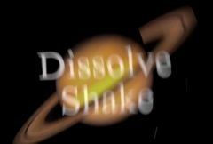

## S_DissolveShake

通过对两个素材施加抖动运动以及快速溶解来实现转场。
抖动使用平移、缩放和/或旋转。它是随机的但可重复的，因此使用相同的参数每次都会生成相同的抖动运动。
开启 Motion Blur 并调整 Mo Blur Length 可获得不同程度的模糊。
调整 Amplitude 和 Frequency 可获得不同的抖动速度和幅度。
Rand 参数可精细控制随机非周期性抖动，Wave 参数可调整规律性周期抖动。
X、Y、Z 和 Tilt 参数分别控制水平、垂直、缩放和旋转的抖动量。

在 Sapphire Transitions 效果子菜单中。

### Inputs:

- **Foreground**: 当前图层。以此素材开始转场。

- **Background**: 默认为无。以此素材结束转场。

### Parameters:

- **Load Preset** (Push-button)
  打开预设浏览器，浏览此效果的所有可用预设。

- **Save Preset** (Push-button)
  打开预设保存对话框，保存此效果的预设。

- **Transition Dir** (Popup menu, Default: Dissolve Off to Bg)
  选择转场的方向。
  - **Dissolve Off to Bg**: 从当前图层转场到背景。
  - **Dissolve On from Bg**: 从背景转场到当前图层。

- **Auto Trans** (Popup YES-NO, Default: No)
  如果启用，将在图层的第一帧和最后一帧之间自动执行转场。如果关闭，则通过动画 Dissolve Percent 参数手动执行转场。

- **Dissolve Percent** (Default: 0, Range: 0 to 1)
  必须禁用 Auto Trans 才能使用此参数。它决定前景和背景输入之间的转场比例，通常从 0 动画到 100 以执行完整的转场。可以调整控制此参数的曲线，以更精细地控制溶解的时间。

- **Dissolve Speed** (Default: 3, Range: 1 or greater)
  From 和 To 素材之间的溶解速度。设为 1 时，溶解在效果的整个持续时间内进行。设为更高值时，溶解时间更短，但抖动仍在整个持续时间内发生。

- **Amplitude** (Default: 3, Range: 0 or greater)
  缩放抖动运动的幅度。

- **Frequency** (Default: 10, Range: 0 or greater)
  增加可获得更快的抖动，减少可获得更慢的抖动。（如果对频率值进行动画处理，请注意，所产生的抖动频率也会受该值变化率的影响。）

- **Motion Blur** (Check-box, Default: on)
  抖动运动的运动模糊选项。

- **Mo Blur Length** (Default: 0.5, Range: 0 or greater)
  缩放运动模糊的量。处理场时使用约 0.5，处理帧时使用 1.0，可获得真实的运动模糊。如果 Motion Blur 为 No，此参数无效。

- **Seed** (Default: 0, Range: 0 or greater)
  用于初始化随机数生成器。实际种子值并不重要，但不同的种子会给出不同的结果，相同的值应给出可重复的结果。

- **Wrap** (X & Y, Popup menu, Default: [ Reflect Reflect ])
  决定访问源图像边界之外区域的方法。
  - **No**: 边界外呈现黑色。
  - **Tile**: 重复图像的副本。
  - **Reflect**: 重复镜像副本。此方法通常边缘不太明显。

### X Shake Parameters:

X Rand Amp:
*Default:
*0.2,
*Range:
*0 or greater.水平随机抖动的幅度。

X Rand Freq:
*Default:
*1,
*Range:
*0 or greater.水平随机抖动的频率。

X Wave Amp:
*Default:
*0,
*Range:
*0 or greater.水平规律波形抖动的幅度。

X Wave Freq:
*Default:
*0.5,
*Range:
*0 or greater.水平规律波形抖动的频率，单位为每秒循环数。

X Phase:
*Default:
*0,
*Range:
*any.
水平抖动的时间偏移。

### Y Shake Parameters:

Y Rand Amp:
*Default:
*0.1,
*Range:
*0 or greater.垂直随机抖动的幅度。

Y Rand Freq:
*Default:
*1,
*Range:
*0 or greater.垂直随机抖动的频率。

Y Wave Amp:
*Default:
*0,
*Range:
*0 or greater.垂直规律波形抖动的幅度。

Y Wave Freq:
*Default:
*0.5,
*Range:
*0 or greater.垂直规律波形抖动的频率，单位为每秒循环数。

Y Phase:
*Default:
*0,
*Range:
*any.
垂直抖动的时间偏移。

### Z Shake Parameters:

Z Rand Amp:
*Default:
*0,
*Range:
*0 or greater.缩放随机抖动的幅度。

Z Rand Freq:
*Default:
*1,
*Range:
*0 or greater.缩放随机抖动的频率。

Z Wave Amp:
*Default:
*0,
*Range:
*0 or greater.缩放规律波形抖动的幅度。

Z Wave Freq:
*Default:
*0.5,
*Range:
*0 or greater.缩放规律波形抖动的频率，单位为每秒循环数。

Z Phase:
*Default:
*0,
*Range:
*any.
缩放抖动的时间偏移。

### Tilt Shake Parameters:

Tilt Rand Amp:
*Default:
*0,
*Range:
*0 or greater.旋转随机抖动的幅度，单位为度。

Tilt Rand Freq:
*Default:
*1,
*Range:
*0 or greater.旋转随机抖动的频率。

Tilt Wave Amp:
*Default:
*0,
*Range:
*0 or greater.旋转规律波形抖动的幅度，单位为度。

Tilt Wave Freq:
*Default:
*0.5,
*Range:
*0 or greater.旋转规律波形抖动的频率，单位为每秒循环数。

Tilt Phase:
*Default:
*0,
*Range:
*any.
旋转抖动的时间偏移。

### Channels Parameters:

Red Amplitude:
*Default:
*1,
*Range:
*0 or greater.红色通道抖动的相对量。将此值从默认值更改将导致红色通道比其他颜色通道移动更多或更少，从而产生色彩边缘或通道分离效果。

Green Amplitude:
*Default:
*1,
*Range:
*0 or greater.绿色通道抖动的相对量。

Blue Amplitude:
*Default:
*1,
*Range:
*0 or greater.蓝色通道抖动的相对量。

Red Phase:
*Default:
*0,
*Range:
*any.红色通道的相对相位。正值使红色通道在时间上超前于其他通道，导致它先移动而其他通道跟随。负值产生相反效果，导致红色通道落后于其他通道。小值通常产生最佳效果。

Green Phase:
*Default:
*0,
*Range:
*any.绿色通道的相对相位。

Blue Phase:
*Default:
*0,
*Range:
*any.蓝色通道的相对相位。

RGB Randomness:
*Default:
*0,
*Range:
*0 or greater.每个颜色通道中随机运动的量。调高此参数可使所有三个颜色通道在不同路径上随机移动，独立于整体抖动。此运动由 X Rand Amp、Y Rand Amp、Z Rand Amp 和 Tilt Rand Amp 缩放。

RGB Frequency:
*Default:
*2,
*Range:
*0 or greater.
随机颜色通道抖动的频率。

### Other Parameters:

Opacity:
*Popup menu, Default: Normal
*.决定处理不透明度/透明度的方法。
*All Opaque:
*当输入图像完全不透明且没有透明度 (alpha=1) 时使用此选项可稍微加快渲染速度。*Normal:
*正常处理不透明度。*As Premult:
*按图像已经是预乘形式（颜色已按不透明度缩放）来处理。此选项的渲染速度也比 Normal 模式稍快，但结果也将是预乘形式，有时不太准确。
