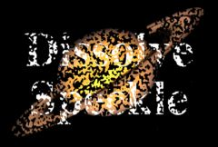

## S_DissolveSpeckle

使用斑点噪声图案在两个输入素材之间进行转场。
应对 Dissolve Percent 参数进行动画处理以控制转场速度。

在 Sapphire Transitions 效果子菜单中。

### Inputs:

- **Foreground**: 当前图层。以此素材开始转场。

- **Background**: 默认为无。以此素材结束转场。

### Parameters:

- **Load Preset** (Push-button)
  打开预设浏览器，浏览此效果的所有可用预设。

- **Save Preset** (Push-button)
  打开预设保存对话框，保存此效果的预设。

- **Transition Dir** (Popup menu, Default: Dissolve Off to Bg)
  选择转场的方向。
  - **Dissolve Off to Bg**: 从当前图层转场到背景。
  - **Dissolve On from Bg**: 从背景转场到当前图层。

- **Auto Trans** (Popup YES-NO, Default: No)
  如果启用，将在图层的第一帧和最后一帧之间自动执行转场。如果关闭，则通过动画 Dissolve Percent 参数手动执行转场。

- **Dissolve Percent** (Default: 0, Range: 0 to 1)
  必须禁用 Auto Trans 才能使用此参数。它决定前景和背景输入之间的转场比例，通常从 0 动画到 100 以执行完整的转场。可以调整控制此参数的曲线，以更精细地控制溶解的时间。

- **Frequency** (Default: 40, Range: 0.01 or greater)
  斑点图案的频率。增加可获得更小的斑点，减少可获得更大的斑点。

- **Frequency Rel Y** (Default: 1, Range: 0.01 or greater)
  斑点图案的相对垂直频率。增加可获得更宽的斑点，减少可获得更高的斑点。

- **Octaves** (Integer, Default: 1, Range: 1 to 10)
  叠加噪声层的数量。每个倍频程的频率是前一个的两倍，幅度是前一个的一半。单个倍频程产生平滑纹理。增加倍频程使结果趋近于分形 (1/f) 噪声纹理。

- **Seed** (Default: 0.23, Range: 0 or greater)
  用于初始化随机数生成器。实际种子值并不重要，但不同的种子会给出不同的结果，相同的值应给出可重复的结果。

- **Opacity** (Popup menu, Default: Normal)
  决定处理不透明度/透明度的方法。
  - **All Opaque**: 当输入图像完全不透明且没有透明度 (alpha=1) 时使用此选项可稍微加快渲染速度。
  - **Normal**: 正常处理不透明度。
  - **As Premult**: 按图像已经是预乘形式（颜色已按不透明度缩放）来处理。此选项的渲染速度也比 Normal 模式稍快，但结果也将是预乘形式，有时不太准确。

- **Edge Softness** (Default: 0, Range: 0 or greater)
  转场边缘的宽度。较大的值将使擦除图案的边缘更柔和、不那么明显。
