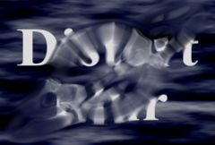

## S_DistortBlur

沿 Lens 输入片段梯度方向对源输入片段进行模糊处理。当透镜图像仅包含几个简单形状时，效果最为明显。

在 Sapphire Distort 效果子菜单中。

### Inputs:

- **Source**: 当前图层。要处理的片段。

- **Lens**: 默认为无。使用此输入片段的亮度值对源进行扭曲。

- **Matte**: 默认为无。如果提供，透镜扭曲的程度将按此输入进行缩放，因此在 Matte 为黑色的区域源不受影响。此输入可以通过 Blur Matte、Invert Matte 或 Matte Use 参数进行调整。

### Parameters:

- **Load Preset** (Push-button)
  打开预设浏览器，浏览此效果的所有可用预设。

- **Save Preset** (Push-button)
  打开预设保存对话框，保存此效果的预设。

- **Mocha Project** (Default: 0, Range: 0 or greater)
  打开 Mocha 窗口，用于跟踪素材和生成遮罩。

- **Blur Mocha** (Default: 0, Range: 0 or greater)
  在使用前按此数值模糊 Mocha 遮罩。可用于柔化遮罩的边缘或量化伪影，并平滑时间位移。

- **Mocha Opacity** (Default: 1, Range: 0 to 1)
  控制 Mocha 遮罩的强度。较低的值会降低效果的强度。

- **Invert Mocha** (Check-box, Default: off)
  如果启用，Mocha 遮罩的黑白将在应用效果前反转。

- **Resize Mocha** (Default: 1, Range: 0 to 2)
  缩放 Mocha 遮罩。1.0 为原始大小。

- **Resize Rel X** (Default: 1, Range: 0 to 2)
  Mocha 遮罩的相对水平大小。

- **Resize Rel Y** (Default: 1, Range: 0 to 2)
  Mocha 遮罩的相对垂直大小。

- **Shift Mocha** (X & Y, Default: [0 0], Range: any)
  偏移 Mocha 遮罩的位置。

- **Dilate Mocha** (Default: 0, Range: -100 to 100)
  在使用前按此像素数值膨胀或腐蚀 Mocha 遮罩。

- **Dilation Quality** (Popup menu, Default: Fast)
  选择 Dilate Mocha 是在默认的快速模式下快速调整，还是在高质量模式下获得更好的效果。
  - **Fast**: 在快速模式下膨胀 Mocha 遮罩，用于快速调整。
  - **High**: 在高质量模式下膨胀 Mocha 遮罩，获得更好的遮罩形状。

- **Bypass Mocha** (Check-box, Default: off)
  忽略 Mocha 遮罩，将效果应用于整个源片段。

- **Show Mocha Only** (Check-box, Default: off)
  跳过效果，仅显示 Mocha 遮罩本身。

- **Combine Masks** (Popup menu, Default: Union)
  当两个遮罩都提供给效果时，确定如何组合 Mocha 遮罩和输入遮罩。
  - **Union**: 使用两个遮罩共同覆盖的区域。
  - **Intersect**: 使用两个遮罩之间重叠的区域。
  - **Mocha Only**: 忽略输入遮罩，仅使用 Mocha 遮罩。

- **Blur Amount** (Default: 1, Range: 0 or greater)
  模糊扭曲的幅度。

- **Warp Amount** (Default: 0, Range: any)
  如果不为零，添加一些额外的非模糊透镜扭曲。

- **Blur Lens** (Default: 0.4, Range: 0 or greater)
  在使用前按此数值平滑透镜图像中的边缘。

- **Rotate Blur Dir** (Default: 0, Range: any)
  将模糊方向旋转指定度数。如果不为零，可以为模糊效果添加一些不寻常的扭转效果。

- **Amount Rel** (X & Y, Default: [1 1], Range: 0 or greater)
  水平和垂直扭曲的相对量。除非 Amount 为正值，否则此参数无效。

- **Wrap** (X & Y, Popup menu, Default: [ Reflect Reflect ])
  确定访问源图像边界外部区域的方法。
  - **No**: 边界外显示黑色。
  - **Tile**: 重复图像的副本。
  - **Reflect**: 重复图像的镜像副本。使用此方法时边缘通常不太明显。

- **Subpixel** (Check-box, Default: on)
  如果启用，使用质量更好但稍慢的方法执行模糊。

- **Blur Matte** (Default: 0, Range: 0 or greater)
  在使用前按此数值模糊 Matte 输入。这可以在遮罩区域和非遮罩区域之间提供更平滑的过渡。除非提供了 Matte 输入，否则无效。

- **Invert Matte** (Check-box, Default: off)
  如果开启，反转 Matte 输入，使效果应用于 Matte 为黑色而非白色的区域。除非提供了 Matte 输入，否则无效。

- **Matte Use** (Popup menu, Default: Luma)
  确定如何使用 Matte 输入通道来生成单色遮罩。
  - **Luma**: 使用 RGB 通道的亮度。
  - **Alpha**: 仅使用 Alpha 通道。

- **Opacity** (Popup menu, Default: Normal)
  确定处理不透明度/透明度的方法。
  - **All Opaque**: 当输入图像完全不透明且无透明度（alpha=1）时，使用此选项可稍微加快渲染速度。
  - **Normal**: 正常处理不透明度。
  - **As Premult**: 按照图像已经是预乘形式（颜色已按不透明度缩放）来处理。此选项的渲染速度也比普通模式稍快，但结果也将是预乘形式，有时不太准确。

- **Crop Input Parameters** (Default: 0, Range: 0 or greater)
  这 4 个参数——Crop Top、Crop Bottom、Crop Left 和 Crop Right——允许选择输入图像的矩形子区域进行处理。如果 Wrap 参数设为 "No"，则暴露的边界将是透明的。如果 Wrap 为 "Tile" 或 "Reflect"，则源图像将在新的裁剪边界上进行包裹以填充画面。这可以更容易地避免因扭曲边缘不佳的图像而产生的伪影。
