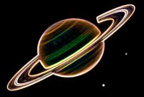

## S_EdgeDetect

查找源素材中的边缘。增大 Edge Smooth 参数可获得更粗的边缘。选择 Mono 或 Chroma 模式可仅显示亮度或色度中的边缘。

在 Sapphire Stylize 效果子菜单中。

### Inputs:

- **Source**: 当前图层。要处理的素材。

- **Mask**: 默认为无。在结果和 Source 输入之间进行插值。白色区域使用效果结果，黑色区域使用 Source 素材。

### Parameters:

- **Load Preset** (Push-button)
  打开预设浏览器，浏览该效果的所有可用预设。

- **Save Preset** (Push-button)
  打开预设保存对话框，保存该效果的预设。

- **Mode** (Popup menu, Default: RGB Edges)
  在效果的不同变体之间进行选择。
  - **RGB Edges**: 查找全彩色边缘。
  - **Chroma Edges**: 忽略亮度边缘，仅查找源素材色度中的边缘。此选项有时可用于遮罩提取。
  - **Mono Edges**: 仅查找亮度边缘并给出单色结果。

- **Mocha Project** (Default: 0, Range: 0 or greater)
  打开 Mocha 窗口，用于跟踪素材和生成遮罩。

- **Blur Mocha** (Default: 0, Range: 0 or greater)
  在使用之前按此数值模糊 Mocha 遮罩。可用于柔化遮罩的边缘或量化伪影，并平滑时间位移。

- **Mocha Opacity** (Default: 1, Range: 0 to 1)
  控制 Mocha 遮罩的强度。较低的值会降低效果的强度。

- **Invert Mocha** (Check-box, Default: off)
  如果启用，在应用效果之前会反转 Mocha 遮罩的黑白。

- **Resize Mocha** (Default: 1, Range: 0 to 2)
  缩放 Mocha 遮罩。1.0 为原始大小。

- **Resize Rel X** (Default: 1, Range: 0 to 2)
  Mocha 遮罩的相对水平大小。

- **Resize Rel Y** (Default: 1, Range: 0 to 2)
  Mocha 遮罩的相对垂直大小。

- **Shift Mocha** (X & Y, Default: [0 0], Range: any)
  偏移 Mocha 遮罩的位置。

- **Dilate Mocha** (Default: 0, Range: -100 to 100)
  在使用之前按此像素值扩展或收缩 Mocha 遮罩。

- **Dilation Quality** (Popup menu, Default: Fast)
  选择 Dilate Mocha 在默认的 Fast 模式下快速调整，还是在 High 质量模式下获得更好的效果。
  - **Fast**: 在 Fast 模式下扩展 Mocha 遮罩，用于快速调整。
  - **High**: 在 High 质量模式下扩展 Mocha 遮罩，获得更好的遮罩形状。

- **Bypass Mocha** (Check-box, Default: off)
  忽略 Mocha 遮罩，将效果应用于整个源素材。

- **Show Mocha Only** (Check-box, Default: off)
  跳过效果，仅显示 Mocha 遮罩本身。

- **Combine Masks** (Popup menu, Default: Union)
  当两个遮罩同时提供给效果时，决定如何组合 Mocha 遮罩和输入遮罩。
  - **Union**: 使用两个遮罩共同覆盖的区域。
  - **Intersect**: 使用两个遮罩之间重叠的区域。
  - **Mocha Only**: 忽略输入遮罩，仅使用 Mocha 遮罩。

- **Edge Smooth** (Default: 0.0224, Range: 0 or greater)
  增大此值可获得更粗、更平滑的边缘。

- **Subpixel Smooth** (Check-box, Default: on)
  启用按亚像素级别平滑边缘。使用此选项可使 Edge Smooth 参数的动画更加平滑。

- **Brightness** (Default: 1, Range: 0 or greater)
  缩放结果的亮度。

- **Saturation** (Default: 1, Range: -2 to 10)
  缩放结果的色彩饱和度。增大可获得更浓烈的颜色。设为 0 可获得单色效果。

- **Threshold** (Default: 0, Range: 0 or greater)
  从结果中减去此值。增大可去除来自次要边缘的不需要的噪声。

- **Weight Red** (Default: 1, Range: 0 or greater)
  缩放红色源通道的边缘。

- **Weight Green** (Default: 1, Range: 0 or greater)
  缩放绿色源通道的边缘。

- **Weight Blue** (Default: 1, Range: 0 or greater)
  缩放蓝色源通道的边缘。

- **Opacity** (Popup menu, Default: Normal)
  决定处理不透明度/透明度的方法。
  - **All Opaque**: 当输入图像完全不透明且没有透明度（alpha=1）时，使用此选项可略微加快渲染速度。
  - **Normal**: 正常处理不透明度。
  - **As Premult**: 按预乘形式处理图像（颜色已按不透明度缩放）。此选项的渲染速度也比 Normal 模式略快，但结果也将是预乘形式，有时可能不够准确。

- **Mask Use** (Popup menu, Default: Luma)
  决定如何使用 Mask 输入通道来生成单色遮罩。
  - **Luma**: 使用 RGB 通道的亮度。
  - **Alpha**: 仅使用 Alpha 通道。

- **Blur Mask** (Default: 0.05, Range: 0 or greater)
  在使用之前按此数值模糊 Matte 输入。可在遮罩区域和非遮罩区域之间提供更平滑的过渡。除非提供了 Matte 输入，否则无效。

- **Invert Mask** (Check-box, Default: off)
  如果开启，反转 Matte 输入，使效果应用于 Matte 为黑色而非白色的区域。除非提供了 Matte 输入，否则无效。
