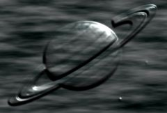

## S_EmbossShiny

使用 Bumps 输入作为浮雕贴图对源素材进行浮雕处理。使用的光照模型包含镜面反射的高光效果。增大 Bumps Smooth 参数可获得更粗犷的凹凸效果，调整 Light Dir 可从不同角度照亮凹凸表面。

在 Sapphire Stylize 效果子菜单中。

### Inputs:

- **Source**: 当前图层。要处理的素材。

- **Bumps**: 默认为无。用于浮雕的凹凸贴图。仅使用此输入的亮度信息。

- **Matte**: 默认为无。如果提供，浮雕效果仅应用于此输入指定的区域。此输入可通过 Blur Matte、Invert Matte 或 Matte Use 参数进行调整。

### Parameters:

- **Load Preset** (Push-button)
  打开预设浏览器，浏览此效果的所有可用预设。

- **Save Preset** (Push-button)
  打开预设保存对话框，保存此效果的预设。

- **Mocha Project** (Default: 0, Range: 0 or greater)
  打开 Mocha 窗口，用于跟踪素材和生成遮罩。

- **Blur Mocha** (Default: 0, Range: 0 or greater)
  在使用前按此数值模糊 Mocha 遮罩。可用于柔化遮罩的边缘或量化伪影，并平滑时间位移。

- **Mocha Opacity** (Default: 1, Range: 0 to 1)
  控制 Mocha 遮罩的强度。较低的值会降低效果的强度。

- **Invert Mocha** (Check-box, Default: off)
  如果启用，在应用效果之前反转 Mocha 遮罩的黑白。

- **Resize Mocha** (Default: 1, Range: 0 to 2)
  缩放 Mocha 遮罩。1.0 为原始大小。

- **Resize Rel X** (Default: 1, Range: 0 to 2)
  Mocha 遮罩的相对水平大小。

- **Resize Rel Y** (Default: 1, Range: 0 to 2)
  Mocha 遮罩的相对垂直大小。

- **Shift Mocha** (X & Y, Default: [0 0], Range: any)
  偏移 Mocha 遮罩的位置。

- **Dilate Mocha** (Default: 0, Range: -100 to 100)
  在使用前按此像素值膨胀或收缩 Mocha 遮罩。

- **Dilation Quality** (Popup menu, Default: Fast)
  选择 Dilate Mocha 是在默认的快速模式下快速调整，还是在高质量模式下获得更好的效果。
  - **Fast**: 在快速模式下膨胀 Mocha 遮罩，用于快速调整。
  - **High**: 在高质量模式下膨胀 Mocha 遮罩，获得更好的遮罩形状。

- **Bypass Mocha** (Check-box, Default: off)
  忽略 Mocha 遮罩，将效果应用于整个源素材。

- **Show Mocha Only** (Check-box, Default: off)
  跳过效果，仅显示 Mocha 遮罩本身。

- **Combine Masks** (Popup menu, Default: Union)
  当两个遮罩同时提供给效果时，确定如何组合 Mocha 遮罩和输入遮罩。
  - **Union**: 使用两个遮罩共同覆盖的区域。
  - **Intersect**: 使用两个遮罩之间重叠的区域。
  - **Mocha Only**: 忽略输入遮罩，仅使用 Mocha 遮罩。

- **Light Dir** (X & Y, Default: [-0.5 0.361], Range: any)
  光源的方向向量。表面着色根据此方向的光照射到 Bumps 输入上来计算。此参数可通过 Light Dir 控件进行调整。

- **Brightness** (Default: 1, Range: 0 or greater)
  缩放结果的亮度。

- **Light Color** (Default rgb: [1 1 1])
  创建浮雕效果的光源颜色。

- **Bumps Scale** (Default: 1, Range: any)
  缩放凹凸贴图的振幅。

- **Bumps Threshold** (Default: 0, Range: 0 or greater)
  在使用 Bumps 输入之前从中减去此值。

- **Bumps Smooth** (Default: 0.01, Range: 0 or greater)
  如果为正值，在使用前按此数值模糊 Bumps 输入。增大此值可获得更柔和的浮雕效果。

- **Subpixel Smooth** (Check-box, Default: on)
  如果启用，Bumps 输入的预平滑将以亚像素精度执行。当 Bumps Smooth 值很小或正在设置动画时，此功能会有所帮助。除非 Bumps Smooth 为正值，否则此参数无效。

- **Hilight Brightness** (Default: 0.8, Range: 0 to 1)
  缩放镜面高光的亮度。

- **Hilight Size** (Default: 0.5, Range: 0.1 or greater)
  调整镜面高光的大小。

- **Blur Matte** (Default: 0, Range: 0 or greater)
  在使用前按此数值模糊 Matte 输入。可以在遮罩区域和非遮罩区域之间提供更平滑的过渡。除非提供了 Matte 输入，否则无效。

- **Invert Matte** (Check-box, Default: off)
  如果开启，反转 Matte 输入，使效果应用于 Matte 为黑色而非白色的区域。除非提供了 Matte 输入，否则无效。

- **Matte Use** (Popup menu, Default: Luma)
  确定如何使用 Matte 输入通道来生成单色遮罩。
  - **Luma**: 使用 RGB 通道的亮度。
  - **Alpha**: 仅使用 Alpha 通道。

- **Opacity** (Popup menu, Default: Normal)
  确定处理不透明度/透明度的方法。
  - **All Opaque**: 当输入图像完全不透明且没有透明度（alpha=1）时，使用此选项可略微加快渲染速度。
  - **Normal**: 正常处理不透明度。
  - **As Premult**: 按预乘形式处理图像（颜色已按不透明度缩放）。此选项的渲染速度也比 Normal 模式略快，但结果也将为预乘形式，有时可能不够准确。

- **Crop Input Parameters** (Default: 0, Range: 0 or greater)
  这 4 个参数（Crop Top、Crop Bottom、Crop Left 和 Crop Right）允许选择输入图像的矩形子区域进行处理。如果 Wrap 参数设置为"No"，则暴露的边框将为透明。如果 Wrap 为"Tile"或"Reflect"，则源图像在新裁剪边框上进行环绕以填充画面。这可以更容易地避免因扭曲边缘不良的图像而产生的伪影。

- **Show Light Dir** (Check-box, Default: on)
  开启或关闭用于调整 Light Dir 参数的屏幕用户界面。此参数仅在 AE 和 Premiere 中出现，因为这些软件支持屏幕控件。
